# TODO
## Model + Animation: 
- mixamo
- retarget animation
- Blender basic navigation
- Blender modelling 

## Unreal Engine:
- Post Processing
- point light from user
    - not cast shadow
    - specular - off - no light reflection
- model -> difference b - a

<br></br><br></br><br></br><br></br>
# Study Unreal
## Naming Convention
- BP_Actor
    - BP_ for blueprints

## Static Mesh
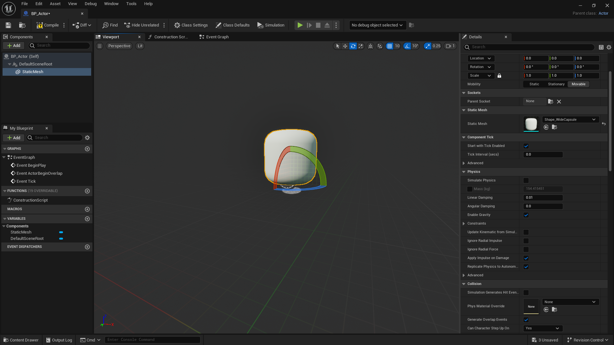
- Static mesh to add object

## Event Graph
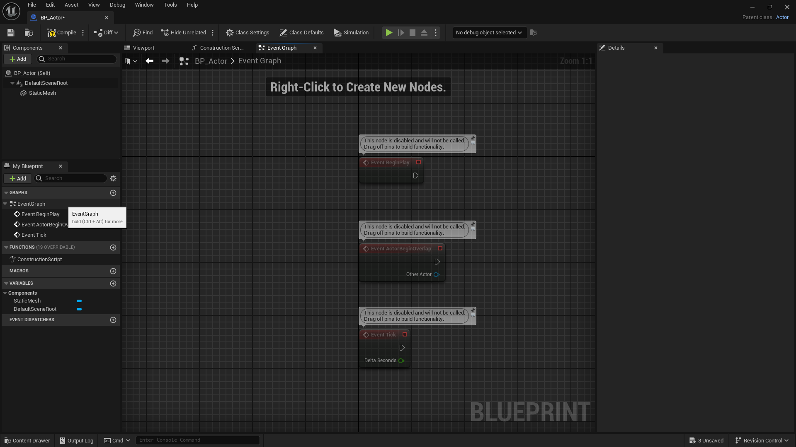
- Event graph (Blueprints)
    - Blue print is flow control

## Event Begin Play
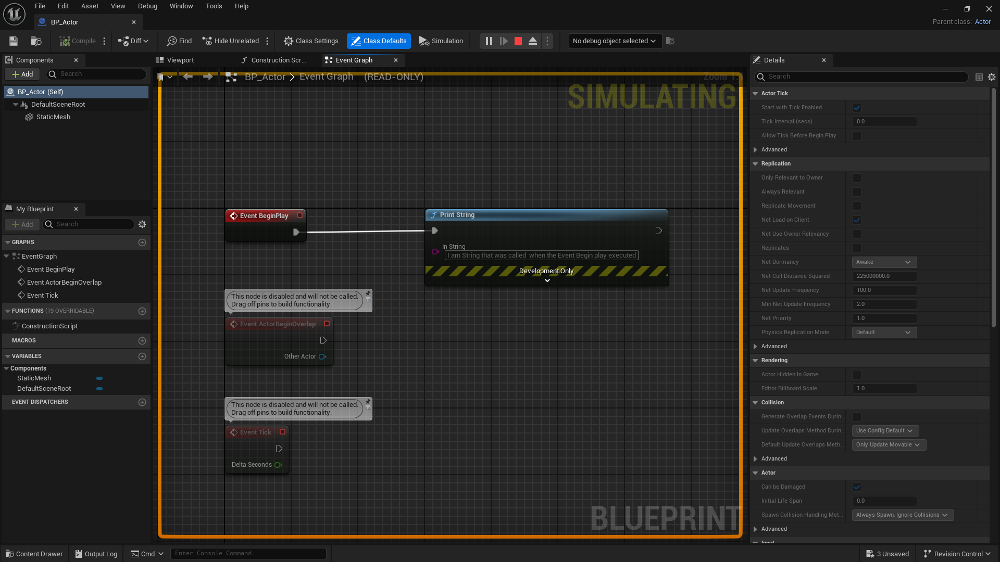
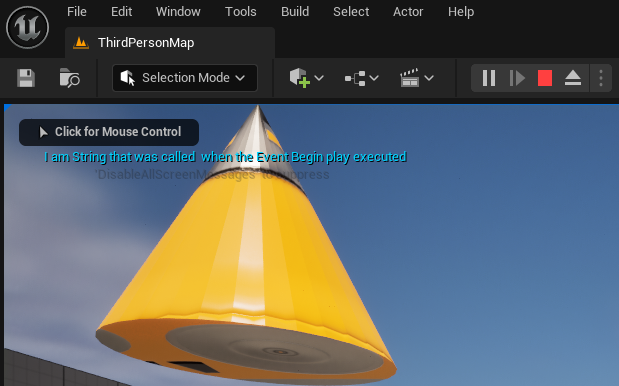
- Things connected to this block will run upon object initiated

## Variables
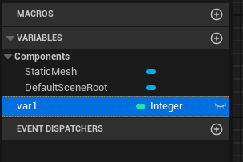

## Structure (Struct)
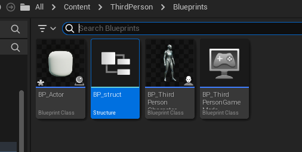
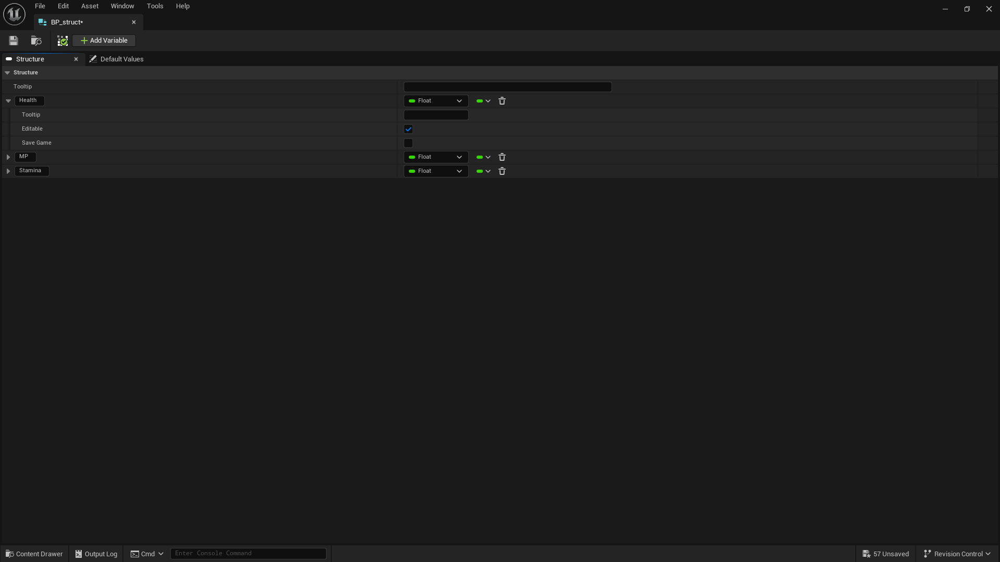

## Vectors
- Direction

### Rotation
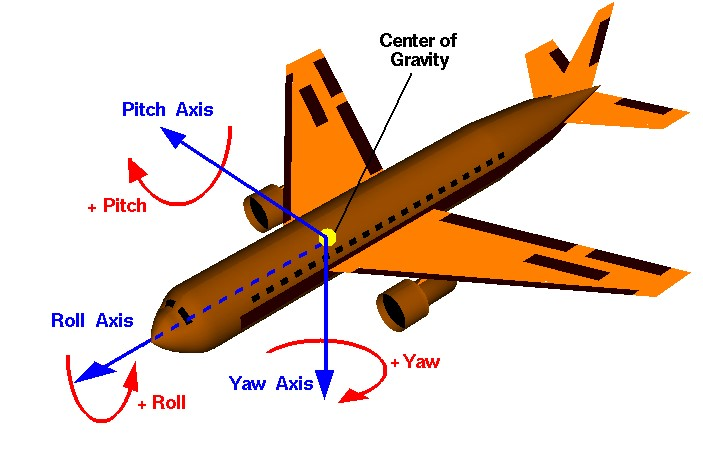

### Gimbal lock Problem
- Lock your rotation
- Solved with quaternion rotation to fix
- FPS game 

### Transformation
- Transform location

    
# Game Instance
- Singleton
- Can have more than one but only one BP running
- Like having Online Game Instance and Offline Game Instance

# Game Mode
- Rules and flows for a specific level
- Binded with level
- Ensures essential parts(objects) are loaded in the level
- Ex Mode : Main menu, Stage1, Stage2, Stage3
- Change level = current game mode instance is destroyed
- Value, Property, Field cached is destroyed with the game mode.
- Have to save them in game instance
- Level create Game mode

# Game Mode Setting
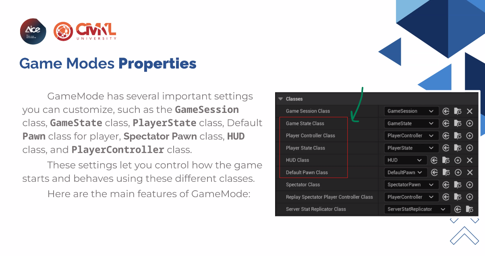
- Main classes that will be loaded to the level

## Default Pawn Class
- Default pawn for player to control
- Spawn the pawn when game mode initiated

## Player Controller Class
- Handle input from player to the pawn that it possess
- 1 class can control 1 pawn
    - 100 pawn = 100 object

> There are 2 kinds of controllers, Player Controller and Ai Controller

## Game State Class
- Game mode create game state
- Ensures clients are synchronized with the current game state
    - Collect data on what's happening
- Used for multiplayer but can't be none, so you have to spawn it
- not needed for single player game
- Imagine playing catch, if A catches B, Game state tells every clients that A catches B

## Player State
- Kinda Game state but only for a pecific player
- Again, not needed for single player game

## Game session
- used to handle multiplayer session

## HUD Class(Heads-Up Diaplay)
- Draws UI elements on the screen, such as health bar, ammo count, crosshair
    - Control Showing / not on each ui
    - If you die, disable UI
- Created only in the client side, in multiplayer
- FPS hands are objects and not HUD
    - Hide on Processes will hide the arm when process

## Spectator Class
- class for when player is in spectator mode
- Has setting in project property > game mode > start as spectator

# Save Game
- Serialization : Serialize the save to .sav binary file
- Store / retrieve data persistently acreoos game session
- SaveGameToSlot() / LoadGameToSlot()

# Pawn and Controller
- Pawn is an actor that represents a controllable entity in tha game
- Can be used by player of AI characters
- AI controller uses behavior tree
- Controller manages the logic that directs the behavior of a pawn

## Player Controller
- Controller that controls player input
- Contains HUD for player

## AI Controller
- designs for non-player characters(NPC) or AI-driven pawns
- Behavior Tree
- Inherits from player class
- No need HUD

# Possession
- Controller posesses a pawn
- Logic is at the Controller not the character
- Possess / Unpossess

# Idea
- Possess 2 characters at the same time
- Puzzle
- Collect items to switch view to see what's happening with the clone

# 3Cs (Character, Chamera, Control)
- Make the gmae satisfying for player's experience
- How player interact with the game mechanics
- 

## Character
- If you can know who the character is by the silhouette = good charcter design
- Looks and feeling
- Movements & Physics
- Animations
- Abilities & Actions

## Camera
- First Person / Third Person etc.
- Perspective
- Camera Behavior
- Field of View & Angles

# Control
- Ergonomics
- Think about how player will hold the controller
- How it feels to control the character
- Input methods and schenes used to manipulate the character and camera
- Input mapping : define key mapping for inputs
- Responsiveness : VR / AR thing
- Customization

# Asset management
## Basic Filder Structure
```
Content
|
|-- Blueprints
|   - Characters
|   - Controllers
|   - Gameplay
|
|-- Materials
|   - Characters
|   - Environments
|   - UI
|
|-- Textures
|   - Characters
|   - Environments
|   - UI
|
|-- Meshes
|   - Characters
|   - Environments
|
|-- Audio
|   - SoundEffects
|   - Music
|   - Voice
|
|-- UI 
|   - Widgets
|   -
|   -
```
## Folder Hierarchy
- Path length no more than 255 character or unreal goes retard

## Naming Convention
- BP_ : Blueprints
- WBP_ : Widget Blueprints
- M_ : Materials

`https://dev.epicgames.com/documentation/en-us/unreal-engine/recommended-asset-naming-conventions-in-unreal-engine-projects`

# Data Assets
- Inherits from `Primary Data Assets` parent class
- Used to keep variables instead of saving in cahracter blueprints
    - So we can call them from other classes too
- Create BP from Primary Data Assets
    - Miscellaneous -> Data Assets
- Imagine wanting to save exp data assets (how much exp needed for each level up)

## Primary Data Assets
- Primary Data Assets BP class and Actual Data Assets
- One data asset for one character

## Best Practice for data assets
- DA_ : Naming Convention
- No use Data Assets for temporary or changable data
    - Won't change in the next sessions, will return to default values
- Create central data assets, only change one place

# Data Tables
- Work like spreadsheets
- Row and column
- The engine won't knkow which cells is what
- BP -> Structure : Create a struct
    - Miscellaneous -> Data Table
        - Pick row structure, choose previously made struct
        - Change values in Row editor
- Better than Data Assets in some case
- Can import / export csv files from outside (Behind the scene is json)
- Can handle file outside UE
- If data lost on git, can re import
- In the end 1 row is one data assets
- Unlike Data Assets which can use the data directly, Data Tables have to use `get data table row`. Query data by row

## Best Practice for data table
- DT_ : Naming Convention
- Use simple, consistent names
- Can use soft reference

# String Tables
- Store Texts despite the name String Table
- Mostly useful for saving UI
- For supporting multiple languages
- Miscellaneous -> String 
- Create variable text


# GPU code (shader code)
- Glsl
- directx 12 -> Unreal
- vulcan -> unreal can use
- opengv

## What made up Material?
- texture 
- uv
- coordination
- etc.

# Materials

## Surface
- Most used in game engine
- Many kinds
- may or may not collect light, calculate shadow, normal(calculate where light hit surface)

### Surface blend mode
- Opaque : solid material with no transparency
- Masked : allow parts of material to be masked out
- Translucent : Allow light to pass through. For water, glass
- Additive : Purely add color to material
- Modulus : Like Additive but subtract

## Surface Material Shading model
- Lit
    - For realistic material
    - calculate light   
- Unlit
    - When lighting is not required

## Decal
- Project material on lit material. 
- Like a sticker
- Ex. Graffiti, bullet holes, blood splatter
- Also have Lit / Unlit
- Has to be Translucent, Modulate and Alpha Composite
- Circle shadow under ur feet in old games

## Light Function
- Modifies behavior of light
- Real life light fn. like, where light hit for specific light pattern

## Post Process Material
- Full screen effects
- Ex. Distortion, Filters
- How entire screen is rendered after all objects are drawn
- Unlit shading model, they don't interact with light

## Volume Material
- Cloud, Fog Smoke
- Area effects that fill a 3D space

## User Interface Material
- UI / Widgets 
- Material for 2D elements in UI like button or texts or images
- unlit, they don't require light or shading
- Use with Widget BP

### Widget BP
- UE designed to apply use with HUD actor
- Can also put in player controller

# Material Instance
- Inherit from Material for less memory usage
- Same code in all material
- Code run in material, Material instance just inherit loaded Material
- Share same shader code

> Zoom in material to not have whitespaces in the material to avoid  bad performance(rendering whitespacce eat resources)

# Material Functions
- Reuse function to use in another material
- reuse node-base graphs(blueprints)

# Textures
- Albedo(color)
    - The base color / Texture
- PBR(Physical Base Material)
    - Metallic, Specular, Roughness
    - R maybe Metallic, Specular, Roughness
    - Have to check what artist use for each channel
- normal
    - ความนูน
    - Use RGB channel

# Mesh
- 3D Geometry
- Model
- Shape and Appearance of an object
- Composed of :
    - `Vertex` - many vertices = edge
        - Every corners of a polygon
        - Map to UVs coordinates
        - **Number of vertices affect performance**
    - `Edge` - many edges = face
        - Line Segment
        - **Edge Loops**
            - connect edges in a loop for skeleton
            - Bad edge loop = might onfluence mesh's deformation when moving ankles during animation
        - **Edge Flow**
            - Way the edges flow
            - Don't need to know if not make assets
    - `Face` - many faces = polygon
        - Most faces are triangles, unreal like triangle
        - Game side use triangle, while animation side uses rectangles
        - Unreal don't like quad-based modelling(rectangle), might display wrong faces
        - Consider `Polygon count`, more triangles(polygon) = worse performance

## UVs
- Two coordinates used to map 2D textures to 3D models
- U - Horizontal
- V - Vertical
- Texture coordination

## Static Mesh
- No skeleton or bone
- No deformation
- Non animated object

## Instanced Static Mesh
- If we have many static mesh actor, lots of memory needed
- This help having multiple copies(instances) of the same static mesh
- Instead of drawing individually, the engine batches them into a single draw call
- Reduce CPU, GPU overhead
- Moving grasses are Instanced static mesh.
    - They just use shader to change the offset of the grass
    - no deformation

## Skeletal Mesh
- 3D models that have skeleton rig that allows the object to deform and animate
- Bones and joints
- Stretchable tables use joints

### Rigging
- Moving the bones

### Animation
- Animate the model using bones and joints
- UE combines keyframe animation, Animation BP, IK, physics to create smooth, responsive, lifelike animation

### Animation BP
- Controlling or managing a character's animation
- Calculate animation
- Can have many states
    - Ex. idle state, walking state
- Process data and save to character then character reads it and Move
- Ex. Velocity 0 = no move = state idle

## Key Components in Animation BP 
### Animation graph
### Event Graph 
### State machine
### Transition
- 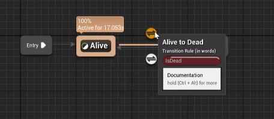
- 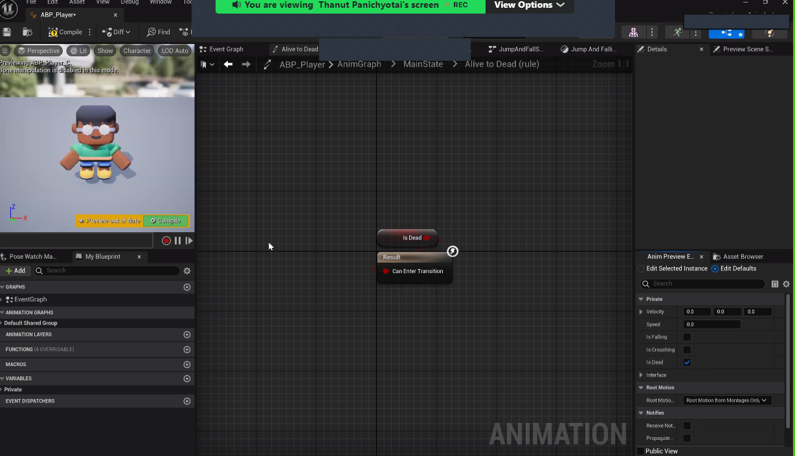
### Blend Space
- 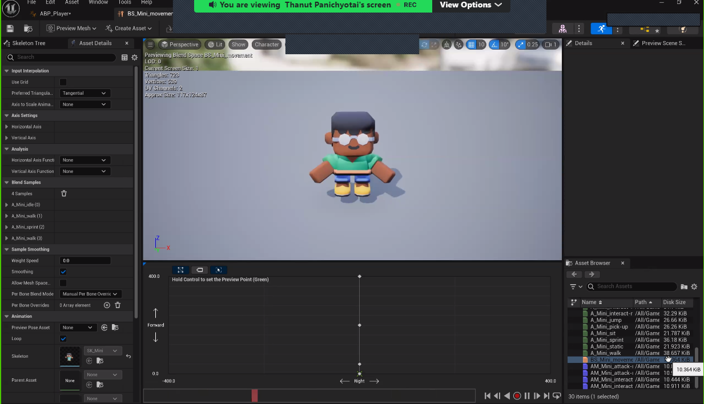
- Blend animations together so it doesn't snap
- 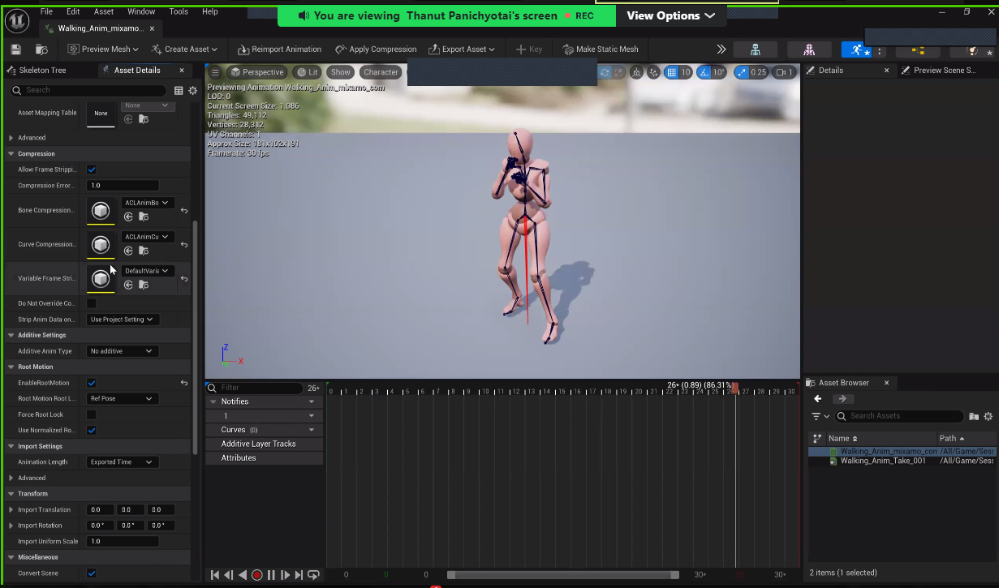
- `Blend Spaces are assets that allow multiple animations or poses to be blended by plotting them onto either a one or two-dimensional graph.`
- Y axis is forward animation, more y = walk fast
- X axis left / right direction

### Inverse Kinematic (IK)
- Play animation in only some part, while the other parts are still doing their animation
- Ex. walking by hitting, legs still walk, hands hit

### Root Motion
- Root bone position at the ground
- When moving, move this bone to move the whole mesh
- Root is at the animation. When moving, will not snap back
