<style>
img {
  width: 400px;
}
</style>

# Frequently Asked questions
## Midterm
- explain acid property with some exception

# Recall from last lecture
Each company car must have an employee in charge

Tx {  
&emsp;insert car row            - R1 is violated since the new car is not assigned yet <br />
&emsp;insert car assign row <br />
}

During transaction, integrity rule can be violated, R1 is deferred to after the transaction

>**Deferable** - delay the rule enforcement

# ACID properties of transaction
- Good and recommended properties of transaction
- Are properties and not definitions. (Just recommendation, it is not needed on all transactions)

## Atomicity
- Either all operations of the transaction are properly reflected in the database or none are.	
- If the operation fails during the transaction, the execution will  get rolled back automatically.
- Automicity is a good property, but it may not be suitable for a `long duration transaction`. It is the case where we don't need the ACID properties

> **A long duration transaction** is a transaction with human interventions.
```
      x
Ex. A —> B


Update T1
Set bloodgroup = ‘Z’
Where bloodgroup = ‘A’

Begin Tx
    A = A - x
    B = B + x      fails, then roll back to Begin Tx
End Tx
```

**A classic principle regarding transactions :**<br />
- *Do not use transactions in the interactive SQL mode, do it in an embeded mode.
- If you forget to commit your changes, other people who share the database are likely(many DB locks them) to be locked out until you commits
```
Set autocommit off
    update T1
    update T2
    Delete from T3
commit
```
> long duration transaction problem : 
- not suitable for `atomicity` property
- 90% work done and transaction fails
- We need to go beck to the place before the transaction failure

**Solution for `long duration transactions` :** nested Txs or Txs with eventual consistency. Means they are not committed together, but will eventually be all committed
```
Begin Tx <-- Sync point
    [        <-- Smaller sync point
    ]        <-- Smaller sync point
    [        <-- Smaller sync point
    ]        <-- Smaller sync point 
    [        <-- Smaller sync point   <-- failure happens here, rollback to end of previous sync point
    ]        <-- Smaller sync point
End Tx   <-- Sync point
```


## Consistency
- Execution of a transaction in isolation preserves the consistency of the Database

### Levels of consistency in SQL -92 (1992) or isolation levels

```
|---------T1----------| <- Sum(Acc)
    |--T2--|            <- update(Acc)
        |--T3--|        <- insert(New Acc)
```

##### Serializable 
- default, in practice is not the default
- Concurrent transactions give the same result as running them in sequence

`Sum does not see T2 and T3`

##### Repeatable read
- Only committed records can be read, repeated reads of the same record must return same value.
- However, a transaction may not be serializable 
    - It may find some records inserted by a transaction but not find others

`Sum(T1) does not see T2(update) but may see T3(insert)`

##### Read committed 
- Only committed records can be read. Successive reads may return different(but committed) values

`Sum(T1) see T2 and T3 only when they are committed`

##### Read uncommitted
- even uncommitted records can be read

`Sum(T1) see T2 and T3 even if they are uncommitted`

### ***Lowest level gives fastest response time because it has no protection at all. Only useful for approximate information(don't care about correctness)**

## Isolation
- Although multiple transactions may execute concurrently, each transaction must be unaware of other concurrently executing transactions. Intermediate transaction results must be hidden from other concurrently executed transasctions.
    - That is, for every pair of transactions Ti and Tj, it appears to Ti that either Tj finished transaction before Ti started, or Tj started execution after tj finished

```
Concurrent Tx
|------Ti------|
        |-------------Tj--------------|
Tx1
|------Ti------| |-------------Tj--------------|
Tx2
|-------------Tj--------------| |------Ti------|
```
The Concurrent Tx will only be correct if the result is the same as if we were running sequence(serial) transaction (Tx1 and Tx2). Which is tough to obtain / hard for the DBMS to handle. 
> "That is, for every pair of transactions Ti and Tj, it appears to Ti that either Tj finished transaction before Ti started, or Tj started execution after tj finished."

***Can be relaxed based on the isolation level** (but bad if low isolation level)

Some DBMS that can't handle this, will allow you to run this despite being incorrect. A lot faster but bad

```
|---------Tj----------| <- Sum(Acc)
    |--T1--|            <- update
        |--T2--|        <- insert
            |--T3--|    <- update
```
Nowadays `Isolation level` can be set to obtain desired result<br/><br/>
- Tj can see the other transactions, which is **not a good isolation principle** <br/>
- In good principle, Tj should not see T1, T2, T3
- But if we turn isolation level to highest, this design won't work because Sum transaction have to see the other transactions in order to work.

*Good transactions should have good isolation design. Nowadays design have concurrently running transactions, which is bad. Good isolation principle is hard to obtain
## Duarability
- **The only one without compromise** 
- Have to handle the system properly
- After a transaction completes successfully, the changes it has made to the database persists, even if there are system failures

# Transaction State

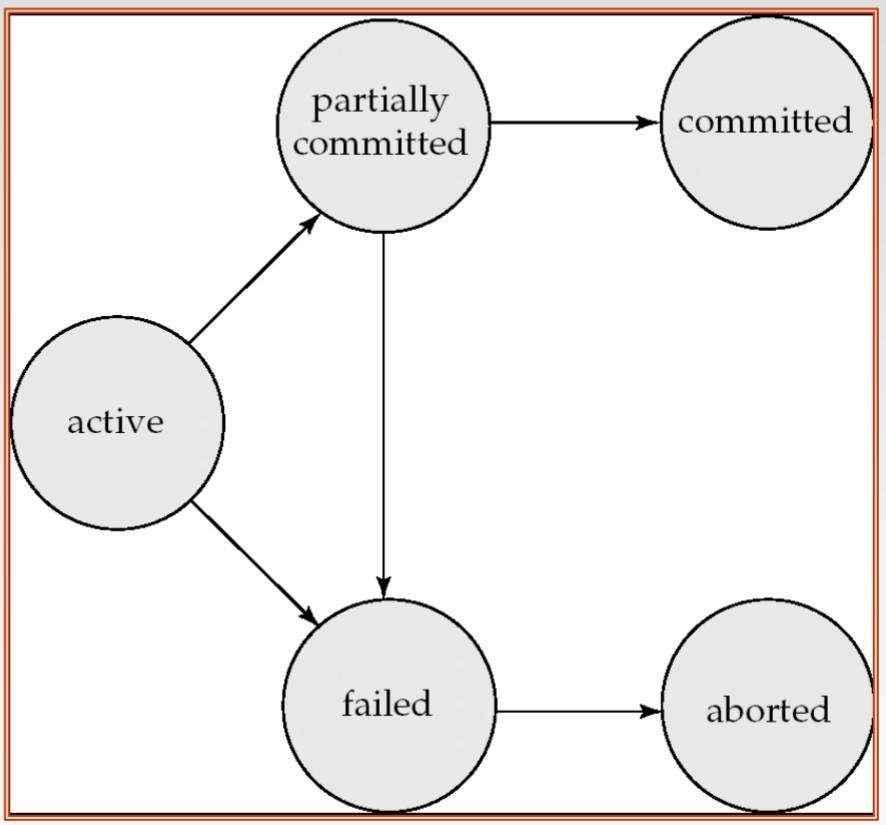

## Active
- The initial state; the transaction stays in this state while it is executing
## Partially Committed
- After the final statement has been executed
## Failed
- Transaction can no longer proceed
- After the discovery that normal execurion can no longer proceed
## Aborted
- or roll back
- After the transaction has been rolled back and the DB restored to its state prior to the start of the transaction.
- Two options after it has been aborted
    - restart the transaction; can be done only if no internal logical error
    - kill the transaction

## Committed
- After successful completion
- Don't confuse committed with database transfer

# Transaction recovery
## Transaction Failure
- Individual transaction failure
- **Logical errors** : Transaction cannot complete due to some internal error condition. Bad coding / bad input
- **System errors** : The DB system must terminate an active transaction due to an error condition (eg. deadlock). 

## System Crash
- Server failure
- power failure or HW failure or SW failure causes the system to crash
- **Fail-stop assumption**
    - mass storage(non-volatile storage contents) survive (not be corrupted)
    - **only lose DB buffer**
    - DB system have many integrity checks to prevent corruption of disk data

## Disk Failure
- Need people to handle this failure
- only failure that needs back up to fix
- A head crash or similar disk failure destroys all or part of disk storage
    - Destruction is assumed to be detectable : disk drives use checksums to detect failuress

## Example case
#### Transaction error [System error] (individual transaction failure)
40 unrelated SQL statements in one transaction. Involving million of rows update. Transaction 90% done overnight. Error at 5 am. The DB rolled back. 

They treated the SQL transaction as a batch file, misunderstood the definition of transaction. 

The system must keep before update version for rollback as a tempfile

The tempfile that is supposed to handle the old data is full and forced rollback.

Solution : 
- Since the 40 transactions are unrelated, you can just run them separately. So the system can recycle the tempm file.

# Storage Structure
## Volatile Storage
- Power down - lose the content

## Non-Volatile Storage
- Power down - content remains
- Survives system crash
- But may still fail, losing data

## Stable Storage
- **Mythical** form of storage that survives all failures
- not real
- Approximated by maintaining multiple copies on distinct nonvolatile media

Some DBMS implement stable storage for you
- Oracle write to several memory instead of one place (for back up)

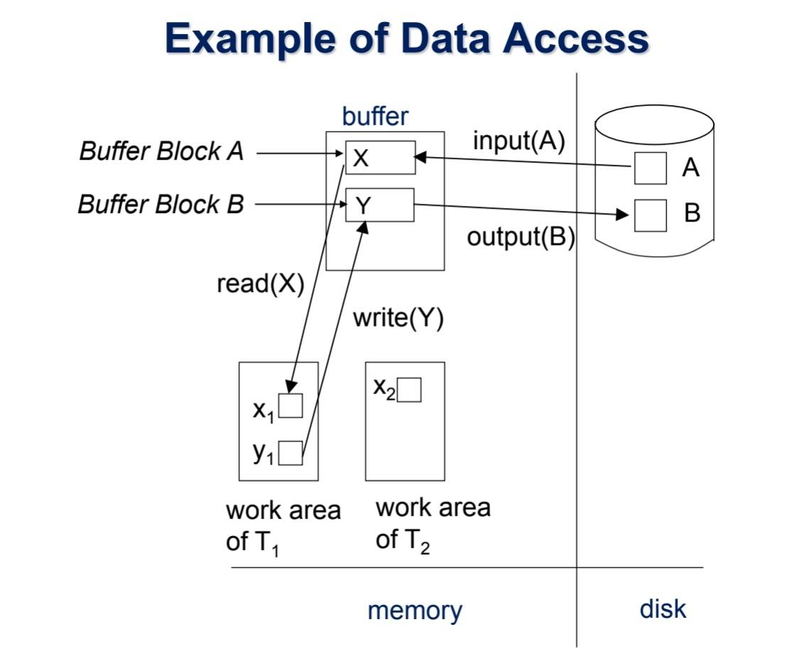

- X and Y refers to DB items

- x and y are program variable

- Select X from table T2, the DBMS will look for X in the buffer. 

- If it's already there, DBMS will read from buffer to transaction work area without disk access.

- Read / Write is **within** main memory

- If not in buffer, need to load from the disk (mass storage) to memory (DB buffer)

- Input / Output handle by DBMS or Os (disk) **between** disk and main memory

Case 1 Money adding
- Transaction may commit before output

Case 2 Blood group update
- Output may take place before commmit <br/>

**Be clear of commit and output. Different**
```
Commit write on Buffer
output write on DB
```


# Problem Statements

## Problem 1
### There are committed transaction whose modified buffer values are not yet outputted to the DB space on the disk (secondary storage).
### What if failure occurs, how does those committed transaction be recovered and permanent on the DB space?

## Problem 2
### There are uncimmitted transaction whose modified buffer values already outputed to the DB space.
### If failure take place, how to cancel the modified values out of the DB space?

# Log-based Recovery

### Problem 1
- Committed transaction
- No DB modification
### Problem 2
- Uncommitted transaction
- DB modified

***Output** - Move from buffer to DB space </br>
***Database Modification** - More formal term of output </br>

### Log file
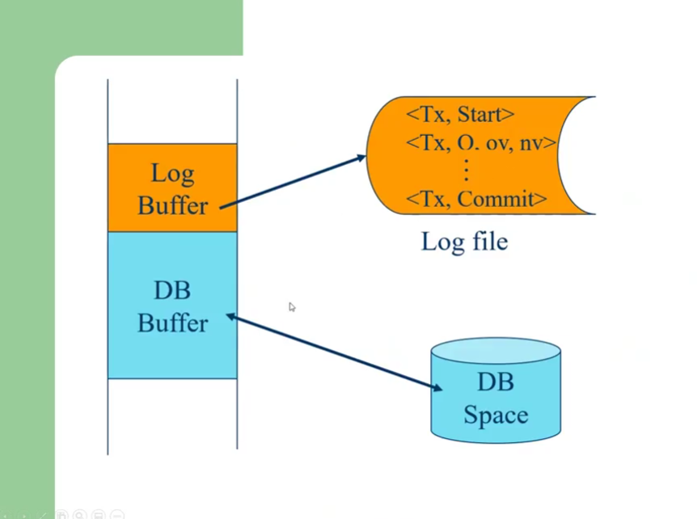
**Log file** keeps **log record**, which is the activities like **transaction ID**, generated at transaction start (begin transaction). The ID will be kept in the log buffer first, before moving to the log file.

**Q is the position of the data in the database. Table name, column name, primary key value .... At least 3 values in order to address these old and new values** </br></br>
**ov and nv are old and new values.** </br>

Physical commit is when the Commit record ( last line in the orange box) is saved to the log file.

Officially considered commit when it is saved to the log file

**Note that** when the data record is outputted to the logfile, the real data may still be in the DB buffer, or may already be outputted to the DB space. They are **independent**. They are **pararell processes**

### How it works : Log records
1. **<Tx, start>** : issure transaction ID
2. **<Tx, Q, ov, nv>** : in some system, they keep the row id as the Q instead of the 3 values. Only work if row ids are unique (the row id is internal and created by the sql. there's no column for id) </br>
> Q is the position of the data in the database. Table name, column name, primary key value .... At least 3 values in order to address these old and new values
3. **<Tx, commit>** : The actual commit takes place when this is output to the log file.

## Transaction Recovery Process
- **System crashes** : Maybe power failure, HW failure
- Original problem is fixed for the failure
- Restart the OS
- Restart the DBMS
- System (DBMS) knows that it is not shut down properly. It knows that failure occurs.
- Starts the recovery process
1. Recovery manager of DBMS(A module) scan the log file from the back to determine which transaction are committed or failed
2. TxID of committed transactions are kept in a list called **redo list**
TxID of failed transactions are kept in the **undo list**.
> Undo list should be smaller than redo list, since there should be only a few transactions that failed.
3. For each failed transactions in the undo list, **old values** are applied to the DB space. **Solves problem 2** Not committed but modified the DB. Use old values to cancel the transaction. </br> **Undo the modified values of uncommitted transactions**

> 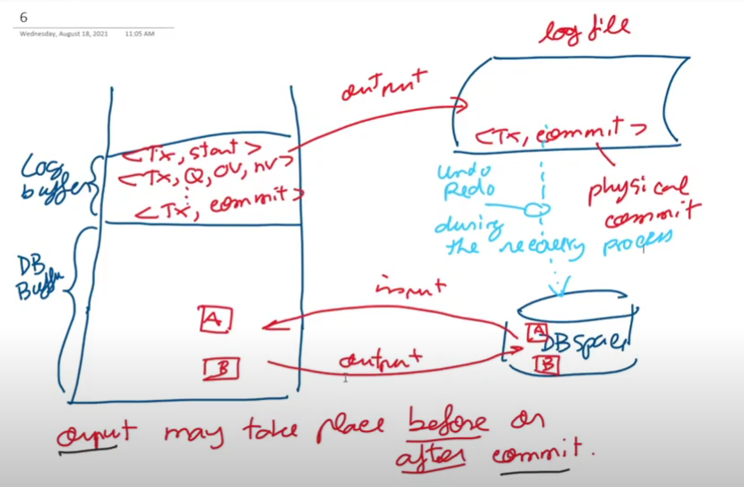
4. For each transactions in the redo list, **new values** are applied to the DB space. **Solves problem 1** Committed but the DB stays unchanged. (not outputted from buffer yet)

### When is the content of the log file written to DB space?
- The content of the logfile are not written to the DB space on normal operations. The only time the content of the log file needsd to be written onto the DB space is during transaction recovery (number 3 and 4)
> 3. For each failed transactions in the undo list, **old values** are applied to the DB space. **Solves problem 2** Not committed but modified the DB. Use old values to cancel the transaction. </br> **Undo the modified values of uncommitted transactions**
> 4. For each transactions in the redo list, **new values** are applied to the DB space. **Solves problem 1** Committed but the DB stays unchanged. (not outputted from buffer yet)


***From the transaction POV, during normal opoeration, your transaction workspace could be somewhere on the main memory of the server, somewhere on your device. The transaction communicates directly to the DB buffer.**

### *The log file is more important than the DB space. So the log file maintenance is a must. If log file is full, and the system breaks. You simply lost the system.

## Two approaches using logs
> 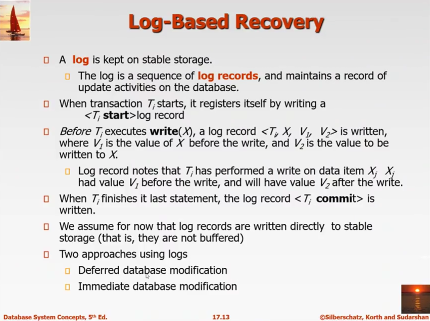
### Deferred Database Modification
- The output of DB buffer to DB space will be done **only after commit**. 
- Commit first, then defer the DB modification later to after commit
> *Defer means* postpone

> *DB modification* means output

### Immediate Database Modification
- The output may take place **before or after commit**

## Those are the definition from the book. His version doesn't separate DB recovery into two ways.

## His version is in term of log file


### This is a combined log, most modern DB doesn't use combined log.

**Instead, there's a separate log file that has two parts**

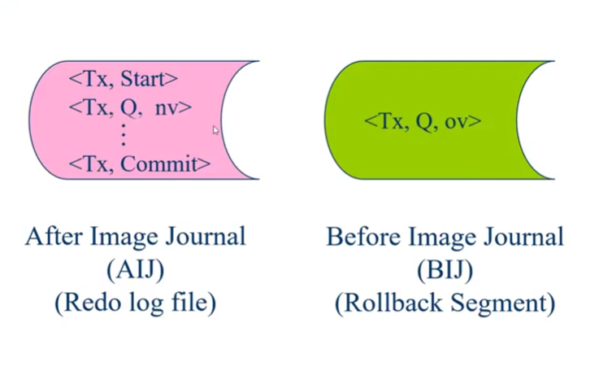

## After Image Journal
- Simply keeps the new value
- Then later commits

## Before Image Journal
- Old values are in the separate file

Only one of these will be required for recovering files, so may take less space if only 1 is needed?

**He classify them into**
- only AIJ
- only BIJ
- both

### AIJ x BIJ has limited space

#### What if BIJ is full?
- The transaction which cause the problem will be rolled back

**Solution** :
- Increase the size of BIJ so that it has enough room for the records (online?)
- Bypass the BIJ? (No log) X bad don't do
- Separate the big transaction into smaller ones which commits separately **Best solution**

#### What if AIJ is full or AIJ has been extended to the media limit?
Depends on DBMS implementation
1. This is critical, the DBMS stops working
    - The DBMS consider it too risky to proceed
> If one day DBMS stops working, **first place to look is the AIJ log file**
2. The DBMS continue working at user risk

**Cheap DBMS uses option 1**

**Expensive DBMS uses option 2** </br>
    - Keep the app running at risk instead of stopping all the progress </br>
    - The system is stable enough to not crash while someone deals with the full AIJ </br>
    - **Advanced DBMS** has better solution, to have multiple AIJ to prevent the full AIJ problem. </br>
    - Ex. fires a rocket to space, 5, 4, 3, 2, AIJ full
    - Sometimes if user does not have tecnical person to operate, they won't know how to fix it and don't want it to stop working </br>

## Incremental backup using Archive Logs
- Save the AIJ log file to Archive Logs to prevent AIJ full problem
- Archive the early version of the AIJ and shrink the size of the AIJ
- DBA needs to maintain the AIJ as the size continously grows

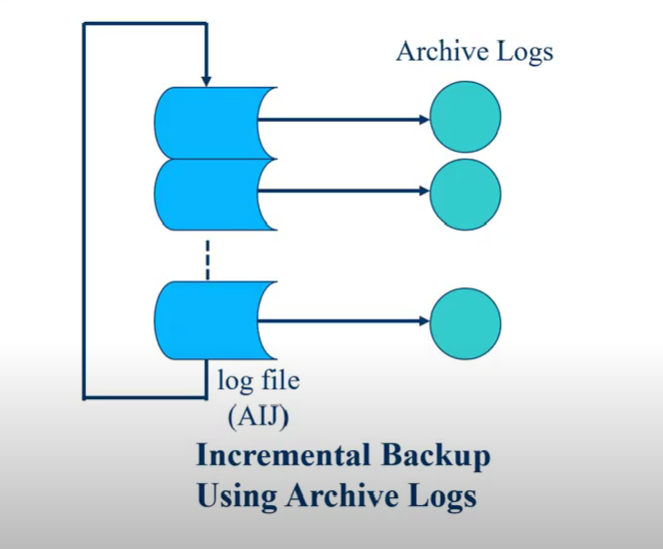

## BIJ only
- Tx commit, roll back as usual
- Both Tx recovery problem 1 and 2 are solved.
- No AIJ full problem

**How it works?**
- How to ensure phyisical commit without AIJ file?
    - Make sure that all modified buffer(changes) done by the Tx must be outputted **completely** to the DB space
    - All changes from DB buffer physically outputted to DB space(storage) is considered committed
- Consequence : **commits can be very slow** -> slow output

## AIJ only (Defer DB modification)
- defer the DB modification later to after commit
- Tx commit, roll back as usual
- Both Tx recovery problem 1 and 2 are solved.
- AIJ solves problem 1 by committing new value to log file
- **Fast commit**, very good for small Tx
- Not good with big Tx with large amt of data

**How does it solve problem 2 without BIJ?**
- The only way is to avoid the problem
- can't fix
- **Solution** : Modified DB buffer blocks are allowed to be outputted to the DB space only after Tx commits. No DB modification before commit

## Both AIJ and BIJ
- Fast commit
- Can handle big Tx with large amt of data

# Defered DB modification (AIJ only)
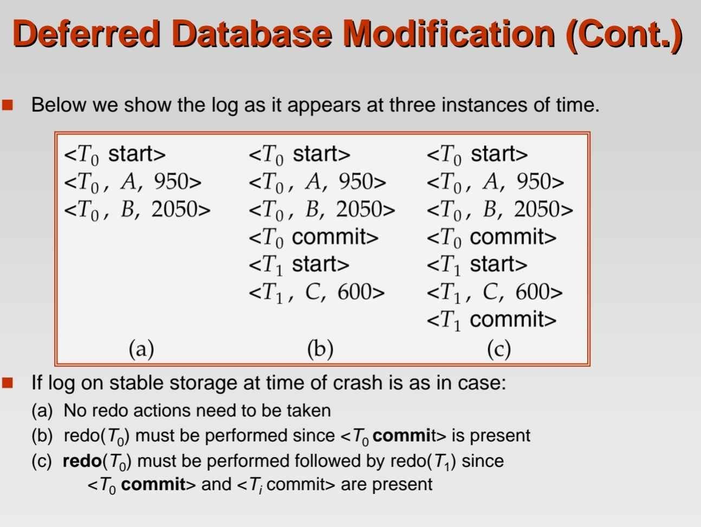
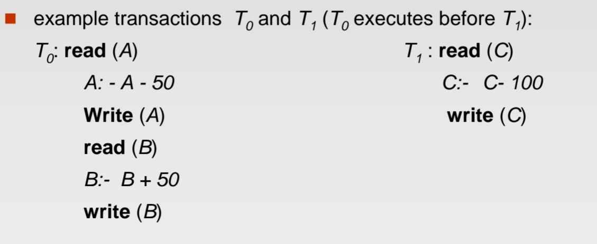

# Immediate DB modification (Both AIJ and BIJ)
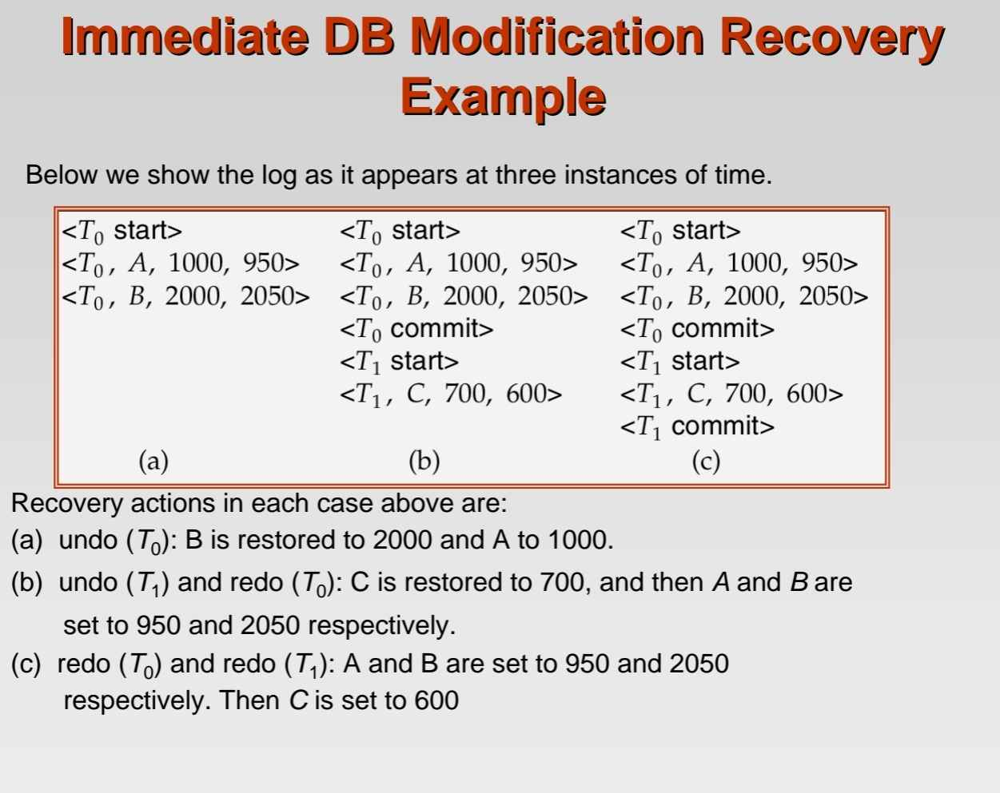
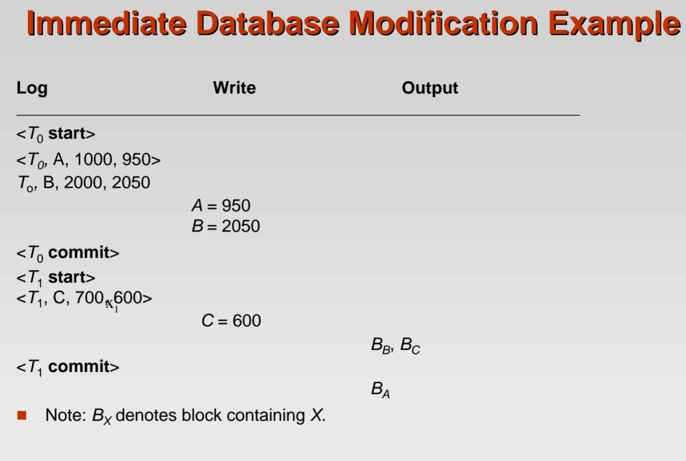

## Log based undo redo must be idempotent
> **Idempotent** : To repeat the process several times but obtain the same result as if the process is done only once.
- In principle, redo back to the last point that buffer move to the DB space
- But the recovery manager don't know when was the last time (last point) the buffer outputs to DB space
- So it redo since the start of the log file (slow)
- Needs checkpoints

## Checkpoints
- Reference point of where the last point that DB buffer's changes are outputted to the mass storage
- Main point is to reduce recovery time when redoing
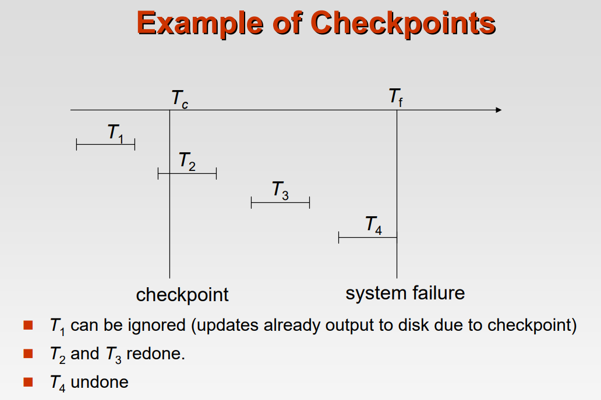
- no need to do anything(redo) with T1. Data from buffer has already been dumped to the mass storage
- only redo the part of T2 that is after the checkpoint(Tc)

# ***Log-based Recovery needs to follow a protocol called the write-ahead protocol**

> Write-ahead protocol : Log records must be outputted to the log file **before** the related modified buffer blocks are outputted ti the DB space(Mass storage)

- DBMS controls the log-based protocol
- OS outputs the logs
- So they must work together closely

### Recovery procedure of checkpointing
1. Output all log records in main memory(log buffer) onto stable storage(log file)
(according to write-ahead protocol)
2. Output all modified buffer blocks to the disk
3. Write a log record <checkpoint L> onto stable storage where L is a list of all transactions active at the time of checkpoint. (checkpoint log file)
4. All updates are stopped while doing checkpointing


- There is a compulsary checkpoint at the end of each log file
- There can be many log files anywhere though

## DB back up concept
- No need back up for system crash and Tx failure
- Because we have the log files to redo and undo
- If disk crash or mass storage crash, you needs back up
- Use archive logs to backup

### Two basic kinds of back ups
### 1. Volume Backup
- Back up everything

### 2. Incremental Backup
- Only back up changes
- Eg. Only backup part of the files that is modified the past 24 hrs, or the past week. Customer wants to recover data lost that is modified on the last friday, DB admin recover it from Tuesday's backup
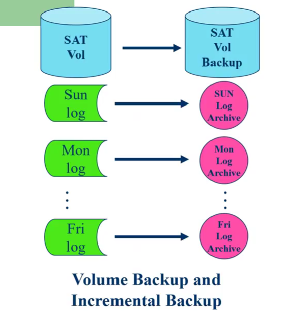
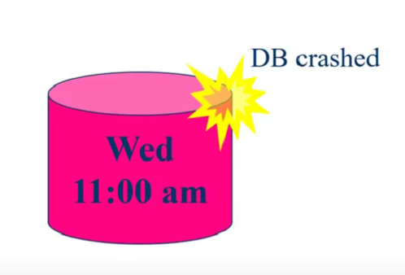
### Rollforward Activity
Weakpoints
- May take time to rebuild DB(recover) after this crash
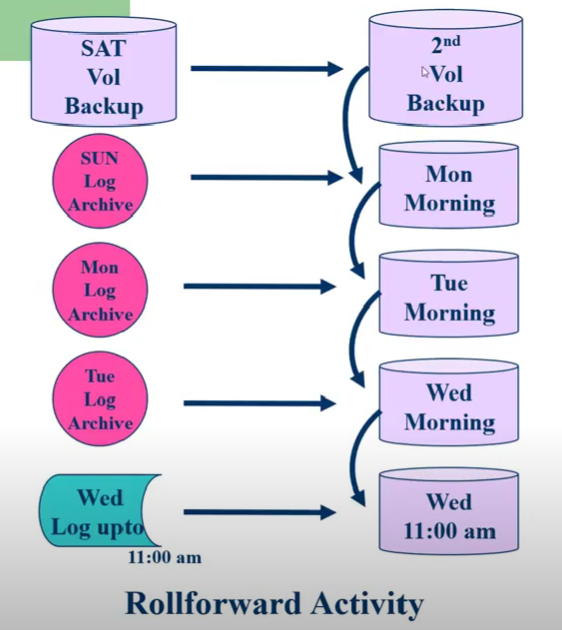

How to prevent
- **Cumulative backups**
> Cumulative backups : Rollforward in advance everyday
- Do the process everyday
- Every mon morning, create 2nd vol backup
- Create an offline backup copy Xday morning everyday

***A more expensive way is to use 2 phase commit**
- safer by keeping both online DB and offline DB.
- Have to commit on both DB
- Slower
- Most don't use this
- Cum backup better in overall

## Log record buffering
- log records are buffered in main memory, instead of being output directly to stable storage.
- Log records are output to stable storage when a block of log records in the buffer is full, or a log force operation is executed.
- Needs write-ahead protocal

## Database Buffering
1. Log record of block B1 must go to log file first with WAL(write ahead protocol)
2. B1 go from DB buffer to DB space
3. B2 go to DB buffer

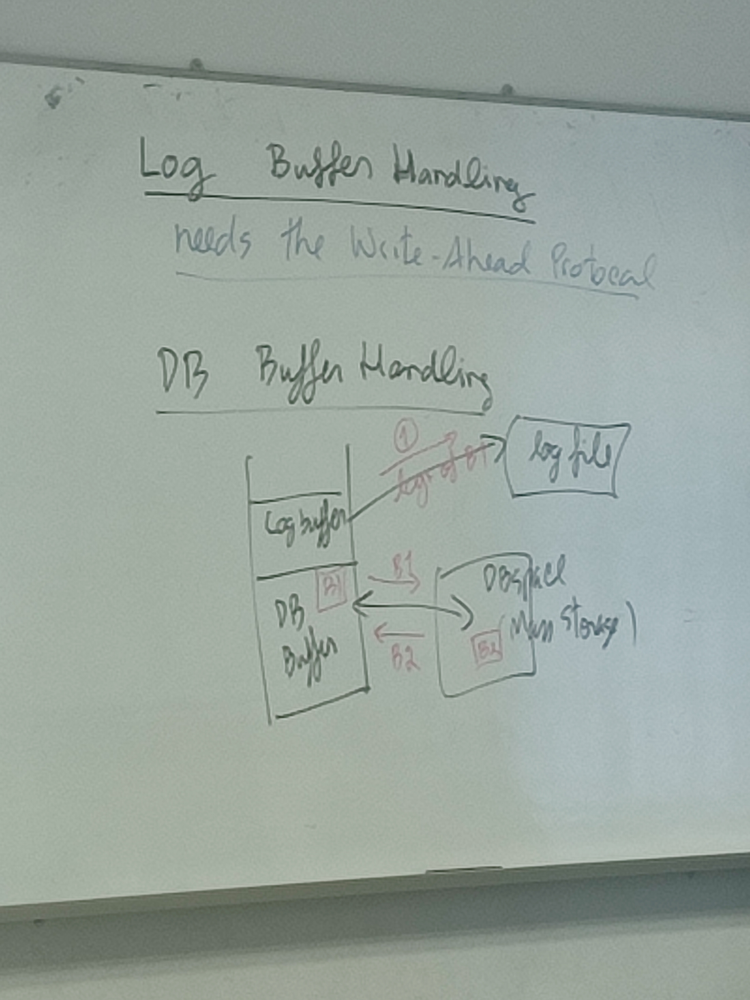

If you lost the log record in the log buffer, that transaction fails

### First approach :
- Log record should be outputted to log file as soon as possible to avoid <Tx, commit> losses
- If you output from log buffer to log file too ofter, io will be too busy
### Second approach : group commit
- output when a DB buffer block is full

## OS roles in buffer management
There are two approaches
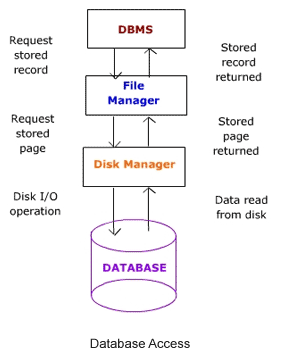
> Database System = DBMS (Author dislike term DBMS)
```
### 1. The DBMS handles DB buffer directly (raw device option)
- Reserves part of main memory to serve as buffer
- DBMS has control over reserved part rather than the OS
- Used to solve OS and DBMS compatibility problem
- size of DMBS has to be handles by DBMSadmin
- Fixed DB space size, log and DB buffer. Not flexible
- Better performance (20%)
- Good for Open systems wher OS and DBMS are not tested together (opensource / open system)
```
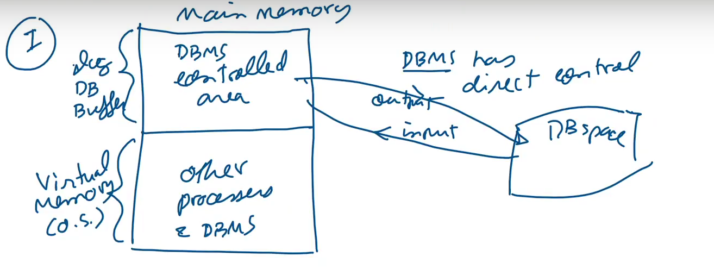
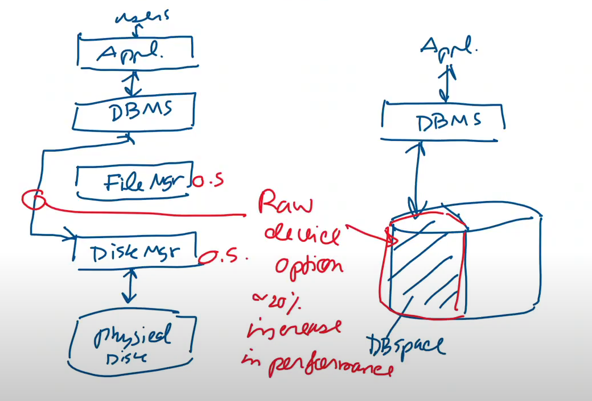
```
### 2. The DBMS uses the virtual memory of the OS handles the buffers
- DBMS implements its buffer within VM provided by OS (OS controls)
- flexible
- DB log buffer asize can be automatically adjusted according to the DB sth(can't read his handwriting???)
- Good for Open systems wher OS and DBMS are tested together
- Imagine runnning system with opensource
```


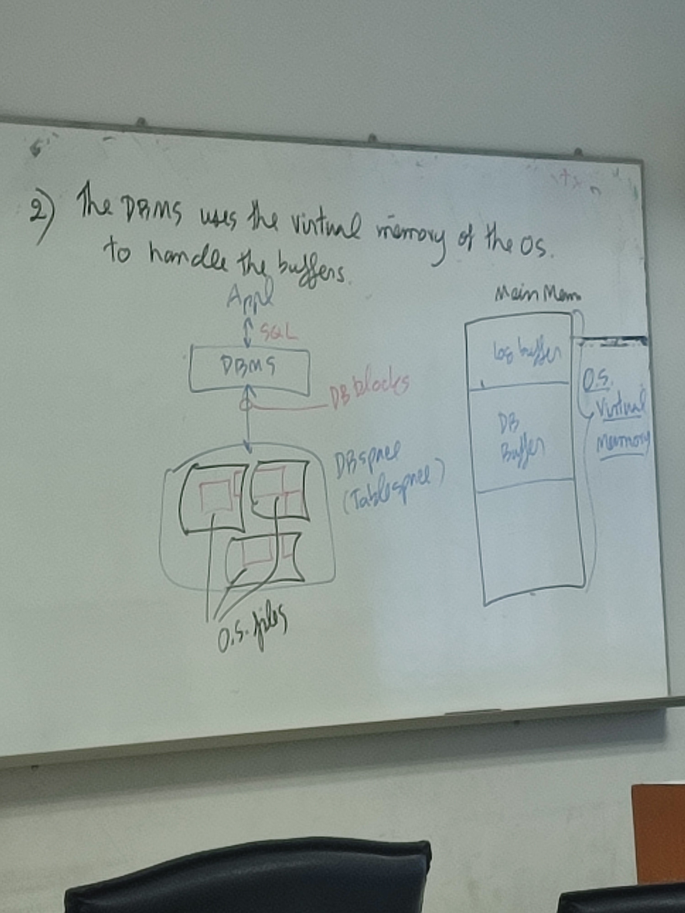
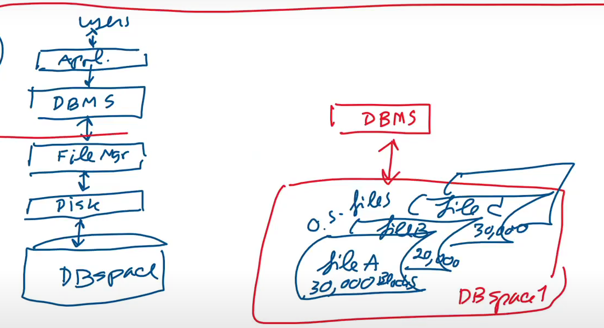


# Scheduler

### A schedule is a sequence of execution of instructions of transactions
(execution queue)
```
Ex Tx1
update ACCT
set Amount = Amount - 50
where ACC# = 'A'
update ACCT
set Amount = Amount + 50
where ACC# = 'B'
```
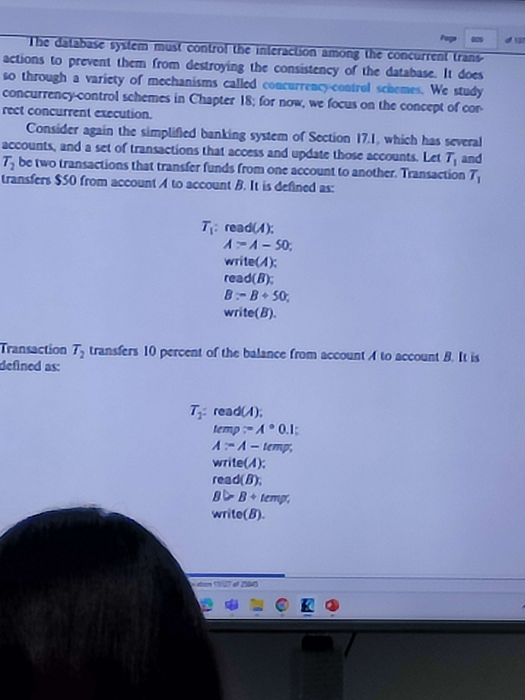
```
Concurrent Schedule
|------Ti------|
        |-------------Tj--------------|
Serial Schedules
|------Ti------| |-------------Tj--------------|
|-------------Tj--------------| |------Ti------|
```

- We want a concurrent schedule that gives the same result as the serial one (serializable concurrent schedule)
- Not all DBMS can handle this
- Serializable means concurrent schedule, not serial schedule

Concurrent 
- serializable -> same result as the serial schedule
- not serializable -> different result as the serial schedule

**DBMS can't access some of the calculations because it's inside the application code and not the SQL code**
- So we check if it's serializability / correctness via the read and write sequence
- ignore all math operations and **only consider read and write**

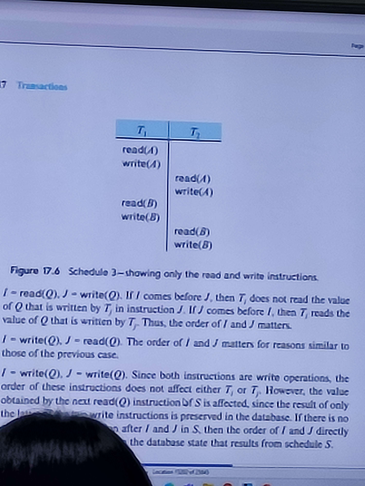
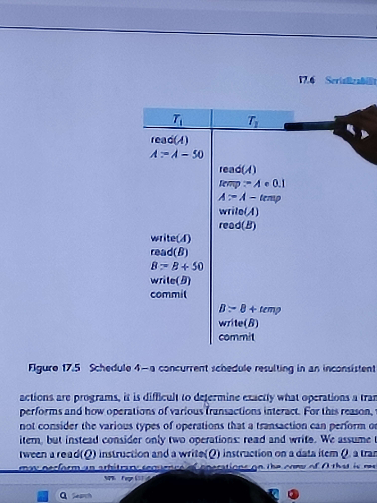

### 17.6, 17.7 , 17.8 are **conflict equivalent schedules**
> shit naming, they are equivalent when swapping **non-conflict** instructions

They can be transformed into one another by the **swaps of non-conflict** instructions (work on different data items)

### 17.8 is a serial schedule
### 17.6, 17.7 , 17.8 are **conflict serializable schedule**
> **conflict serializable schedule** is the main concept of schedule. what we want. standard of correct schedule

17.6 is conflict serializable schedule because they are conflict equivalent to 17.8 serial schedule

### Conflicting Instructions
- **Definition 1** : 2 instructions conflict if they belong to different transactions, work on the same data items, and at least one operation is a write
- **Definition 2** : We say that I and J conflict if they are operations by different Tx on the same data item, and at least one of these instructions is a write operation
- (if write instruction on variable a in T1, the read before it should also be on T1. if not, there might be conflict)

> work on the same data items means accessing the same value / variable

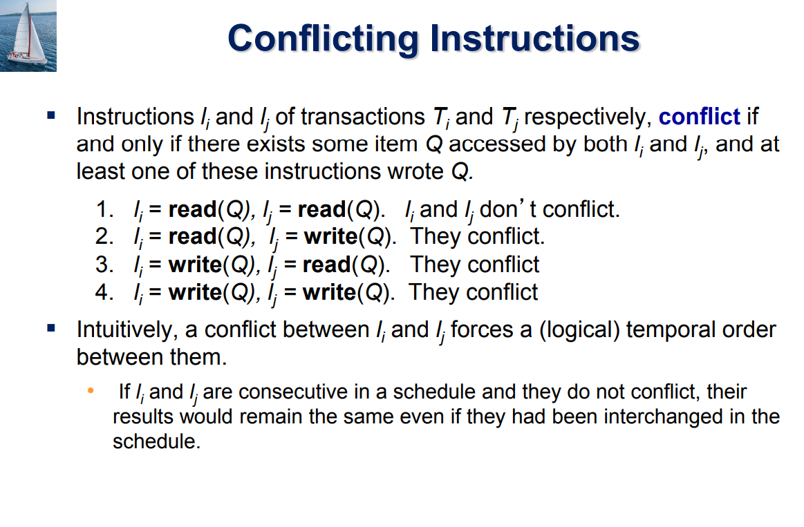
</br></br></br></br>

## *You can set level of consistency to serializable to have **conflict serializable schedule** in SQL
- Serializable has **conflict serializable schedule** as the most common standards


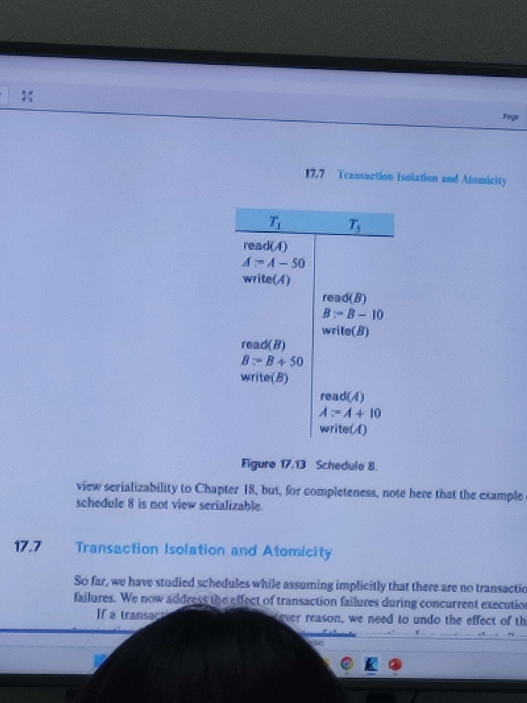
### not conflict serializable but gives the correct result

</br></br></br></br>
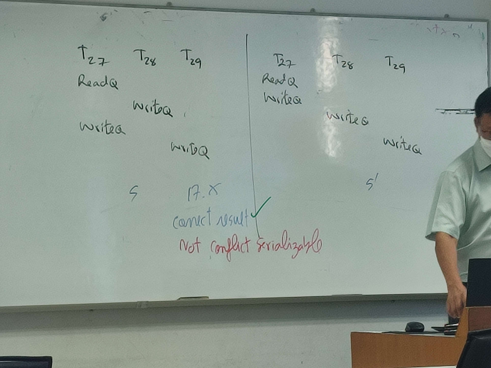


## View Serializability
- Schedule S is **view serializable** if it is view equivalent to a serial schedule
- Every conflice serializable schedule is also view serializable

> view equivalent - 


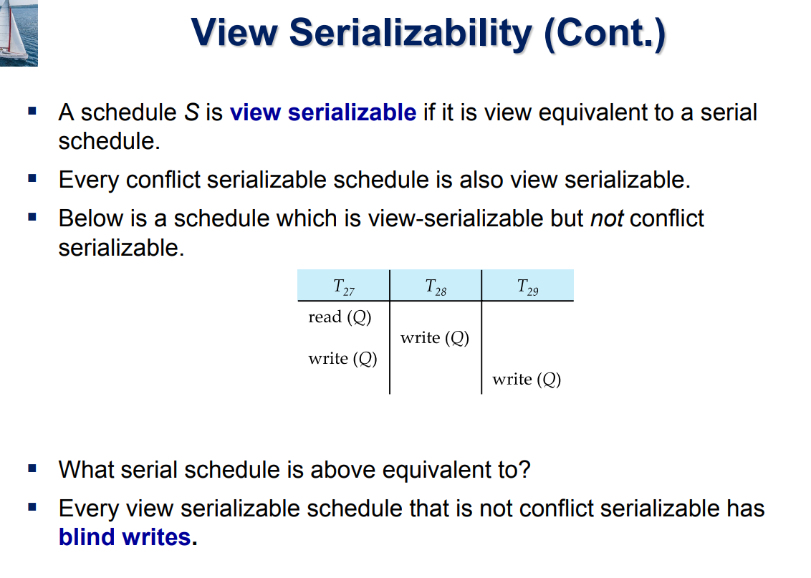
#### view serializable but not conflict serializable

Conflict serializable vs View serializable

***Every view serializable that is not conflict serializable has blind writes(write without read)**

# Midterm content ends here

## Recoverable Schedule
- The source commit before the reader could commit
- Tj reads from Ti, Ti must commit before Tj commits

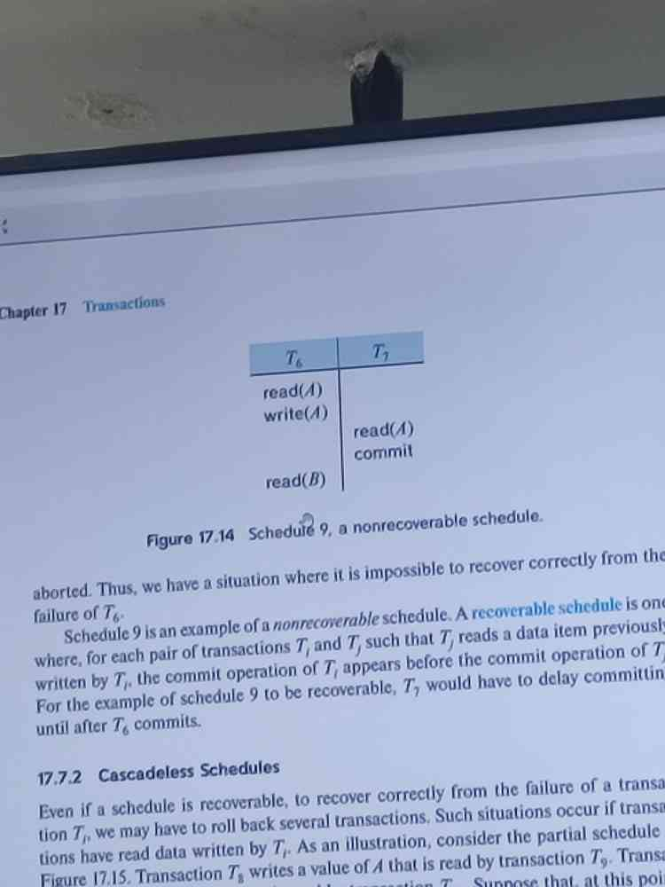
- Ti(T7) commits before Tj(T6)
- wrong, not recoverable
- T7 already read the result of T6's write. If T6 rollback to before the write, T7 will have read the wrong value


### Cascading rollback
- When T10 rollbacks, T11 and T12 must also rollback
- Should not happen, bad
- A single Tx failure, leads to a series of many Tx rollbacks
- ***It's better for T11 and T12 to just wait for the write**
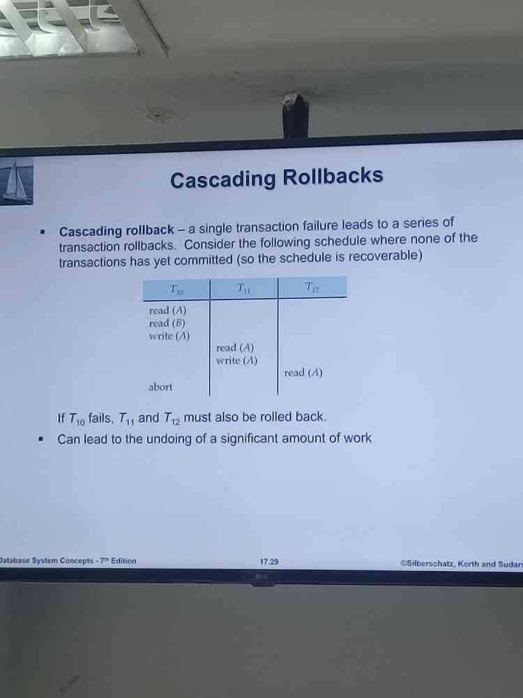

## Cascadeless Schedule
- Stronger case of recoverable schedule
- The source must commit before the reader could read
- Also recoverable


# Correct schedule = Conflict on view serializable schedules + Cascadeless schedules
- (+ no phantom phenomenons)

> Phantom Phenomenons : 


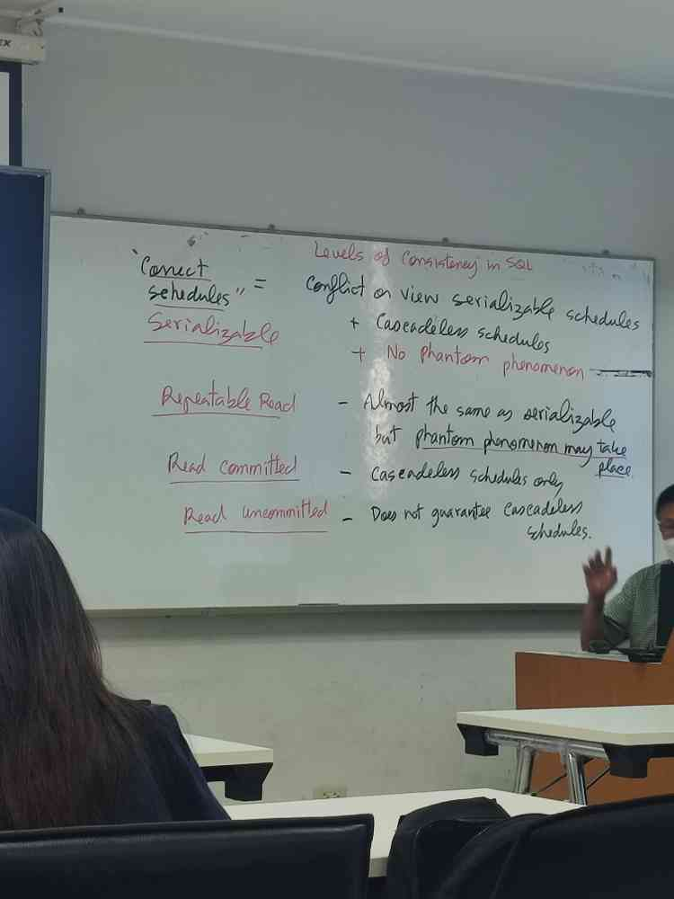


## 4 Concurrency control problems
- 3 Concurrency control problems + phantom phenomenon
- problems to the solutions(level of consistency) stated before

1. The lost update problem
    - not conflict serializable
    - 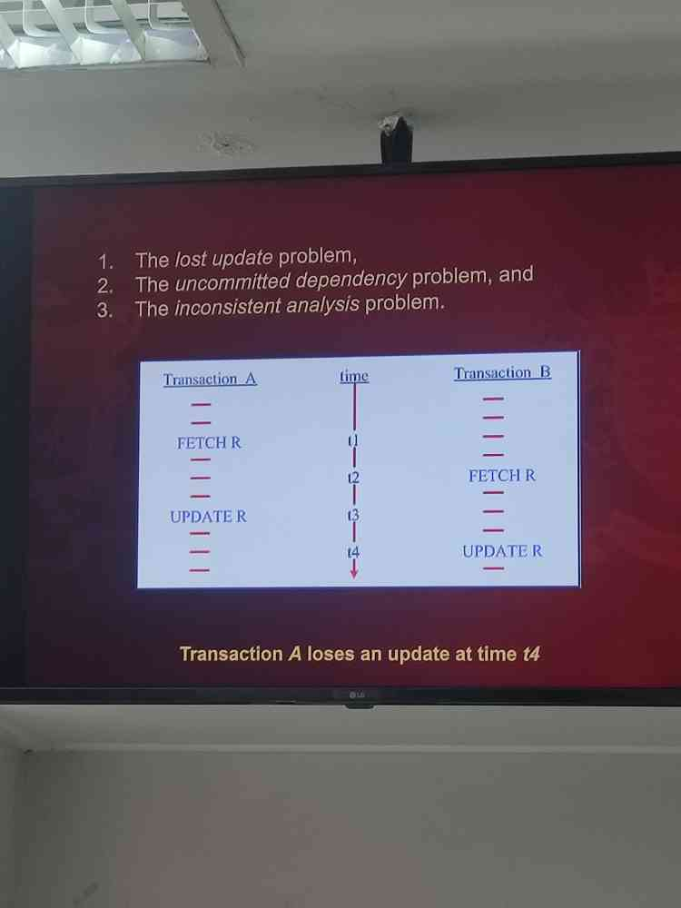
2. The uncommitted dependency problem
3. The inconsistent analysis problem
    - A is read only and is trying to calculate sth
    - B updates while A is not done calculating
    - A gets the wrong result
    - 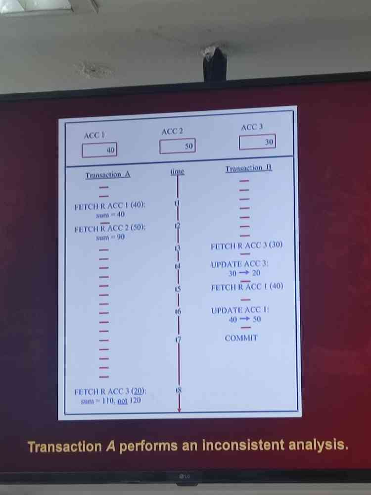

***Set level of consistency of the server to serializable to prevent lost update problem and inconsistent analysis problem**


# Lock based protocols
- Slide said there are two, there are more than two. cap
- Concurrency control mechanism

## Lock based technique comprises of
1. **Lock Primitives** : Lock mechanisms
    - Exclusive lock -> read / write
    - Shared lock -> read only

2. Compatibility matrix

Discuss lock protocol after midterm