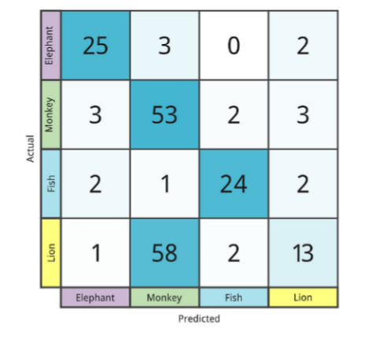
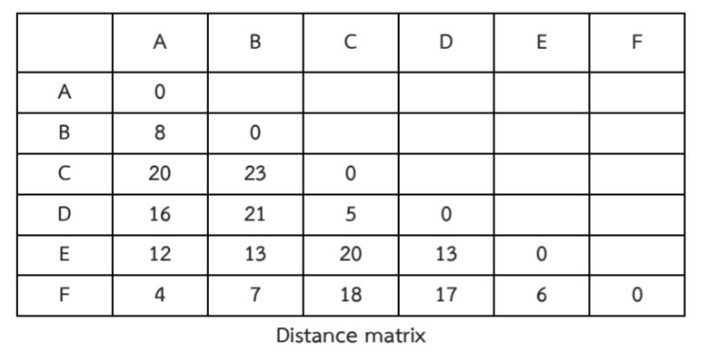
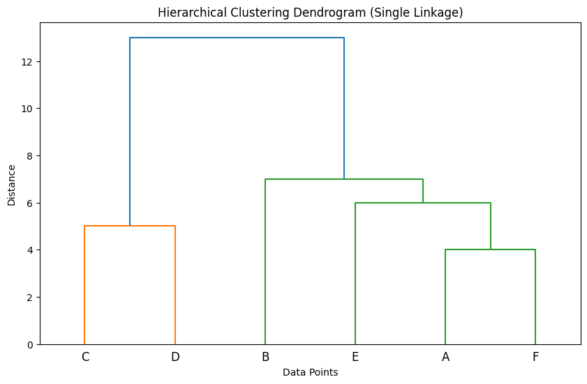
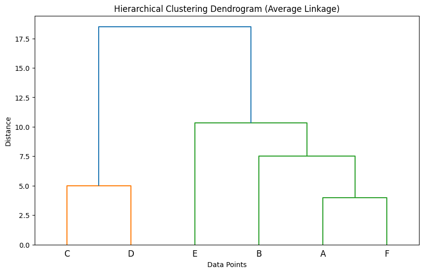
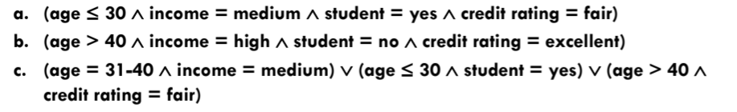

## 1. Can you classify between **supervised** and **unsupervised** learning and also between **generative** and **discriminative** of all classical machine learning models that we have been studying in the class, except for shallow neural networks, and summarize in **what scenarios they are most effective**? (Show in table form)
| Model Category              | Model                                             | Supervised / Unsupervised | Generative / Discriminative | Most Effective Scenarios                                                                                                                                                                  |
|-----------------------------|---------------------------------------------------|---------------------------|-----------------------------|---------------------------------------------------------------------------------------------------------------------------------------------------------------------------------------------|
| **Supervised Learning**     | **Linear Regression**                             | Supervised               | Discriminative              | Predicting continuous numerical outcomes, e.g., housing prices, in cases with linear relationships.                                                                                        |
|                             | **Logistic Regression**                           | Supervised               | Discriminative              | Binary or multi-class classification tasks, e.g., spam detection, where linear boundaries approximate data well.                                                                           |
|                             | **Naive Bayes**                                   | Supervised               | Generative                  | Text classification, e.g., spam detection or sentiment analysis, where independence assumption works well.                                                                                |
|                             | **Support Vector Machine (SVM)**                  | Supervised               | Discriminative              | Complex classification tasks (e.g., bioinformatics) with high-dimensional data where a clear margin is beneficial.                                                                         |
|                             | **Decision Tree**                                 | Supervised               | Discriminative              | Tasks needing interpretability (e.g., medical decisions) or categorical data with logical decision paths.                                                                                  |
|                             | **Random Forest**                                 | Supervised               | Discriminative              | Classification tasks on feature-rich datasets, e.g., fraud detection, where ensemble learning boosts accuracy and reduces overfitting.                                                    |
|                             | **Regression Tree**                               | Supervised               | Discriminative              | Regression tasks with non-linear relationships, e.g., real estate pricing, with structured, interpretable decision paths.                                                                 |
|                             | **CART (Classification and Regression Trees)**    | Supervised               | Discriminative              | Similar to decision trees but used for regression and classification; effective in healthcare or finance.                                                                                 |
|                             | **Iterative Regression / Least Squares Regression** | Supervised             | Discriminative              | Continuous data prediction, especially with minimal noise.                                                                                                                                 |
| **Unsupervised Learning**   | **k-Means Clustering**                            | Unsupervised             | -                           | Segmenting data, e.g., customer segmentation in marketing, where data can be separated into distinct clusters.                                                                            |
|                             | **Kernel K-Means**                                | Unsupervised             | -                           | Non-linearly separable data clustering, e.g., image segmentation, where simple k-means may fail.                                                              
|                             | **Hierarchical Clustering (Agglomerative, Divisive)** | Unsupervised         | -                           | Datasets requiring hierarchical relationships (e.g., taxonomy classification) or when the number of clusters is unknown.                                                                   |
|                             | **Mean Shift Clustering**                         | Unsupervised             | -                           | Applications with unknown cluster numbers, e.g., image segmentation, where density-based clustering is advantageous.                                                                     |
|                             | **Gaussian Mixture Models (GMM)**                 | Unsupervised             | Generative                  | Tasks requiring soft clustering or probabilistic cluster assignment, e.g., market segmentation with overlapping group characteristics.                                                    |
|                             | **DBSCAN (Density-Based Spatial Clustering)**     | Unsupervised             | -                           | Clustering with noise, e.g., geographical data where outliers or isolated points (noise) should be ignored.                                                                               |
|                             | **BIRCH (Balanced Iterative Reducing and Clustering)** | Unsupervised       | -                           | Efficient clustering on large datasets, e.g., very large-scale customer datasets, where memory efficiency is a priority.                                                                  |
|                             | **Partitioning Around Medoids (PAM), CLARA, CLARANS** | Unsupervised        | -                           | Clustering tasks for large datasets with distinct groups where robustness against noise is important, e.g., social network analysis.                                                     |
| **Soft Clustering**          | **Gaussian Mixture Models (GMM)**                | Unsupervised             | Generative                  | Useful in soft clustering or probabilistic assignments, e.g., scenarios with overlapping clusters, such as customer behavior segmentation.                                                |
| **Semi-Supervised Learning** | **Support Vector Machine (SVM) (modified)**      | Semi-Supervised          | Discriminative              | Effective with limited labeled data combined with a larger set of unlabeled data, e.g., text classification with high accuracy requirements and limited labels.                    

## 2. Construct a table with the same objectives as in question 1, but for all shallow neural networks, and summarize in what scenarios they are most effective.

| Model Category              | Model                              | Supervised / Unsupervised | Generative / Discriminative | Most Effective Scenarios                                                                                             |
|-----------------------------|------------------------------------|---------------------------|-----------------------------|-----------------------------------------------------------------------------------------------------------------------|
| **Shallow Neural Network**  | **Single-Layer Perceptron (SLP)** | Supervised                | Discriminative              | Binary classification tasks with linearly separable data, e.g., simple pattern recognition.                          |
|                             | **Multi-Layer Perceptron (MLP)**  | Supervised                | Discriminative              | Regression and classification tasks with non-linear relationships, e.g., credit scoring, and basic image recognition. |
|                             | **Radial Basis Function (RBF)**    | Supervised                | Discriminative              | Function approximation and time series prediction, e.g., signal processing, and control systems.                     |
|                             | **Extreme Learning Machine (ELM)** | Supervised                | Discriminative              | Fast training requirements on large datasets, e.g., real-time data analysis and large-scale text categorization.      |
|                             | **Competitive Networks**          | Unsupervised              | Generative                  | Clustering and feature extraction, e.g., customer segmentation and data compression.                                 |
|                             | **Kohonen's Self-Organizing Map (SOM)** | Unsupervised      | Generative                  | Dimensionality reduction and visualization, e.g., data clustering, and market basket analysis.                       |
|                             | **Hamming Network**               | Supervised                | Discriminative              | Pattern matching and recognition tasks, e.g., optical character recognition (OCR).                                   |

## 3. Summarize in table form all dimensional reduction and feature selection techniques that we have studied in the class and their most appropriate applications, including their strengths and weaknesses.

| Technique                         | Type                    | Most Appropriate Applications                                                                                              | Strengths                                                                                       | Weaknesses                                                                                     |
|-----------------------------------|-------------------------|----------------------------------------------------------------------------------------------------------------------------|-------------------------------------------------------------------------------------------------|------------------------------------------------------------------------------------------------|
| **Principal Component Analysis (PCA)** | Dimensionality Reduction | High-dimensional data with correlated features, e.g., image processing, genetics                                           | Reduces dimensionality by finding uncorrelated principal components; effective for noise reduction. | Linear transformation, so it may fail with non-linear data; interpretability can be challenging.|
| **Linear Discriminant Analysis (LDA)** | Dimensionality Reduction & Feature Selection | Classification tasks where class separability is needed, e.g., facial recognition                                          | Maximizes class separability; works well with labeled data.                                     | Assumes normal distribution of data; less effective with overlapping classes.                  |
| **Singular Value Decomposition (SVD)** | Dimensionality Reduction | Matrix decomposition tasks, e.g., latent semantic analysis, document clustering                                             | Effective for data compression and noise reduction; used in natural language processing (NLP).   | May discard valuable information; sensitive to noise in data.                                 |
| **t-SNE (t-Distributed Stochastic Neighbor Embedding)** | Dimensionality Reduction | Visualizing high-dimensional data in 2D or 3D, e.g., in exploratory data analysis, genomic data                             | Preserves local structure well; highly effective for clustering and visualization.              | Computationally intensive; less effective for dimensional reduction beyond visualization.      |
| **Isomap**                         | Dimensionality Reduction | Non-linear data with complex structure, e.g., image and video compression, sensor data                                      | Captures non-linear relationships well; useful for manifolds.                                  | Sensitive to noise and outliers; computationally expensive.                                   |
| **Factor Analysis**                | Dimensionality Reduction | Datasets with latent variables, e.g., survey and psychological data where underlying factors are key                         | Identifies latent factors influencing variables; useful for reducing redundancy.                | Assumes linear relationships; interpretability can be complex, as factors are sometimes abstract.|
| **Multidimensional Scaling (MDS)** | Dimensionality Reduction | Visualizing similarity or dissimilarity data, e.g., psychometric studies, marketing data                                    | Preserves distance relationships between points; effective for visualizing dissimilarities.     | Computationally intensive for large datasets; sensitive to noise and outliers.                |

## 4. Describe the strengths and weaknesses of the preprocessing technique that you have presented in the class.

The **Waterfall** and **Watershed** techniques are image segmentation methods used primarily in computer vision and image processing. While related, they have unique characteristics, strengths, and weaknesses that differentiate them.

### Watershed Technique

The **Watershed** algorithm is based on topographic interpretation, treating pixel intensity as elevation. it simulates water flooding, segmenting the image into regions by "dams" that form where different water sources meet.

**Strengths:**
- **Effective in Separating Touching Objects**: Effective for distinguishing objects that are close or overlapping.
- **Automatic Segmentation with Markers**: It can be used with automatically generated or predefined markers, allowing for controlled segmentation results.
- **Adaptability**: It is flexible, can be applied to grayscale or binary images.

**Weaknesses:**
- **Sensitivity to Noise**: Sensitive to noise or uneven gradients, may lead to over-segmentation.
- **Over-Segmentation**: Needs careful preprocessing, tor the alg might produce too many segments.
- **Dependence on Initial Markers**: Often relies on effective marker initialization, which affects final segmentation.

### Waterfall Techniques

The **Waterfall** algorithm is a refinement of the Watershed technique, designed to reduce the over-segmentation problem by merging less significant regions. It does so by evaluating the significance of basins based on the topographic map, gradually merging insignificant basins to simplify segmentation results.

**Strengths:**
- **Reduction of Over-Segmentation**: Merging smaller basins, to reduce the number of insignificant regions, making cleaner segmentation output.
- **Automatic Merging of Insignificant Regions**: Reduce user intervention in merging irrelevant segments.

**Weaknesses:**
- **Loss of Detail in Small Structures**: May overlook or combine smaller, meaningful regions, might lose important details in fine structures.
- **Computational Complexity**: Assessing and merging basins can be computationally demanding.

## 5. How can we prevent overfitting in the classical ML models, and what role does crossvalidation play? Describe all types of cross-validation techniques.
**Overfitting** occurs when a model learns noise or details specific to the training data, leading to poor performance on validation or test data. **Cross-Validation** is one of the strategies used to prevent overfitting.

**Cross-Validation**: Splitting data multiple ways to verify the model’s generalization ability (explained in detail below).

### The Role of Cross-Validation

- Cross-validation plays a key role in assessing and enhancing a model’s ability to generalize by using multiple train-test splits to evaluate model performance across different subsets of the data. 
- By averaging performance across these splits, cross-validation provides a more robust measure of the model's accuracy and reduces the likelihood of overfitting to a single train-test split.

### Types of Cross-Validation Techniques

1. **K-Fold Cross-Validation**:
   - **Process**: The dataset is split into *k* equally sized folds. For each fold, the model is trained on *k-1* folds and tested on the remaining fold. This is repeated *k* times, and the results are averaged.
   - **Best For**: General use, when the dataset is large enough to split into multiple folds without sacrificing training data.
   - **Common Choice of k**: 5 or 10.
   
2. **Stratified K-Fold Cross-Validation**:
   - **Process**: Similar to K-Fold, but ensures each fold has a similar distribution of classes (useful for imbalanced data).
   - **Best For**: Classification problems, especially with imbalanced datasets, as it maintains the class ratio across folds.

3. **Leave-One-Out Cross-Validation (LOOCV)**:
   - **Process**: A special case of K-Fold where *k* is the number of data points in the dataset. The model is trained on all data except for one data point and tested on that single point, repeated for every point.
   - **Best For**: Small datasets where using most of the data for training is important.
   - **Drawbacks**: Computationally expensive for large datasets.

4. **Leave-P-Out Cross-Validation**:
   - **Process**: Similar to LOOCV, but instead of leaving one data point out, *p* points are left out for testing in each iteration.
   - **Best For**: Small datasets, though it’s rarely used due to its high computational cost.

5. **Holdout Method**:
   - **Process**: The dataset is split into two or three subsets: a training set, a validation set (optional), and a test set. The model is trained on the training set, tuned on the validation set, and evaluated on the test set.
   - **Best For**: Quick validation, large datasets.
   - **Drawbacks**: Results can vary based on the random split, making it less stable compared to K-Fold.

6. **Repeated K-Fold Cross-Validation**:
   - **Process**: Repeats K-Fold Cross-Validation multiple times with different random splits in each repetition. The final result is the average of all iterations.
   - **Best For**: When a more robust estimate of model performance is needed, especially if the dataset is small.
   - **Drawbacks**: Computationally more expensive than standard K-Fold.

7. **Time Series Cross-Validation (Rolling Forecast)**:
   - **Process**: For time-dependent data, training is done on an expanding window. For each fold, the training set includes all data up to a specific time point, with testing done on the next time period, maintaining temporal order.
   - **Best For**: Time series and sequential data where keeping chronological order is essential.
   
## 6. What are the strengths and weaknesses of classical ML models compared to deep learning methods?

### Complexity:
**Classical ML**  
- **Strength**: Generally simpler and more interpretable, making it easier to understand model decisions (e.g., linear regression, decision trees).  
- **Weakness**: May struggle to capture complex relationships and interactions in the data.

**Deep Learning**  
- **Strength**: Capable of modeling complex patterns and relationships due to its deep architecture (e.g., neural networks).  
- **Weakness**: Often considered a black box, making it difficult to interpret the reasoning behind model predictions.

---

### Training Speed:
**Classical ML**  
- **Strength**: Typically faster to train because of fewer parameters and simpler computations.  
- **Weakness**: Limited in performance for very complex tasks due to its simplicity.

**Deep Learning**  
- **Strength**: Can leverage parallel processing capabilities of GPUs, potentially speeding up training for large datasets.  
- **Weakness**: Generally slower to train, requiring significant time and computational resources, especially for deep architectures.

---

### Data Requirements:
**Classical ML**  
- **Strength**: Performs well with smaller datasets and often requires less labeled data to achieve reasonable accuracy.  
- **Weakness**: May not generalize well with large, complex datasets.

**Deep Learning**  
- **Strength**: Excels when trained on large amounts of labeled data, improving performance as more data is available.  
- **Weakness**: Requires substantial amounts of data to prevent overfitting and achieve good performance.

---

### Feature Engineering:
**Classical ML**  
- **Strength**: Flexibility to engineer features based on domain knowledge, which can lead to better model performance in some cases.  
- **Weakness**: Time-consuming and requires expertise; the success often relies heavily on the quality of engineered features.

**Deep Learning**  
- **Strength**: Automatically extracts features from raw data, minimizing the need for manual feature engineering.  
- **Weakness**: May require extensive tuning of network architecture to effectively learn useful representations.

---

### Scalability:
**Classical ML**  
- **Strength**: Generally simpler models can be effective and efficient with moderate-sized datasets.  
- **Weakness**: Some classical models may not scale well with very large or high-dimensional datasets (e.g., SVMs).

**Deep Learning**  
- **Strength**: Well-suited for large-scale datasets, especially in high-dimensional spaces, benefiting from architectures designed to scale.  
- **Weakness**: High computational demands can become a bottleneck as data size and complexity increase.

---

### Robustness:
**Classical ML**  
- **Strength**: Can incorporate regularization techniques effectively to prevent overfitting, particularly in simpler models.  
- **Weakness**: May be less flexible in adapting to complex data distributions.

**Deep Learning**  
- **Strength**: Highly adaptable and can learn from vast amounts of data, often outperforming classical models in complex scenarios.  
- **Weakness**: Prone to overfitting if not managed correctly, especially with small datasets.

---

### Interpretability:
**Classical ML**  
- **Strength**: Results are easier to interpret, making it more suitable for fields where understanding model decisions is crucial.  
- **Weakness**: Simplicity may limit the depth of insights in complex problems.

**Deep Learning**  
- **Strength**: Capable of achieving high accuracy in complex tasks, potentially uncovering patterns that classical models miss.  
- **Weakness**: The lack of transparency in model predictions can be problematic in sensitive applications.

---

### Hyperparameter Tuning:
**Classical ML**  
- **Strength**: Generally fewer hyperparameters, making the tuning process simpler and more straightforward.  
- **Weakness**: Limited options for fine-tuning may constrain performance improvement.

**Deep Learning**  
- **Strength**: Offers a wide range of hyperparameters and architectures to optimize, which can lead to superior performance.  
- **Weakness**: The complexity and number of hyperparameters can make tuning a challenging and time-consuming process.

---

### Performance:
**Classical ML**  
- **Strength**: Effective for structured data and simpler tasks, often providing quick and reasonable results.  
- **Weakness**: Performance may plateau or degrade when applied to more complex problems.

**Deep Learning**  
- **Strength**: Generally excels in complex tasks such as image recognition, natural language processing, and other applications involving unstructured data.  
- **Weakness**: Performance may vary significantly based on architecture and data quality, sometimes leading to unpredictable results.

## 7. What are common sources of error in classical machine learning models, and how can they be mitigated?

#### 1. **Overfitting**
   - **Source of Error**: Overfitting occurs when a model learns the noise and details of the training data to the extent that it performs poorly on unseen data.
   - **Mitigation Strategies**:
     - **Cross-Validation**: Use techniques like k-fold cross-validation to evaluate the model's performance on different subsets of the data.
     - **Regularization**: Apply regularization techniques (e.g., L1, L2 regularization) to penalize complex models.
     - **Pruning**: For decision trees, implement pruning methods to reduce the complexity of the model.

#### 2. **Underfitting**
   - **Source of Error**: Underfitting occurs when a model is too simple to capture the underlying patterns in the data.
   - **Mitigation Strategies**:
     - **Increase Model Complexity**: Use more complex models or add features to better capture the data patterns.
     - **Feature Engineering**: Create new features that might provide more information to the model.

#### 3. **Insufficient Data**
   - **Source of Error**: Having too few training samples can lead to poor model performance due to insufficient information about the underlying distribution.
   - **Mitigation Strategies**:
     - **Data Augmentation**: For tasks like image classification, augment the data (e.g., rotation, flipping) to artificially increase the dataset size.
     - **Collect More Data**: If feasible, gather additional training samples.

#### 4. **Noisy Data**
   - **Source of Error**: Noise in the dataset can arise from measurement errors, mislabeling, or irrelevant features, leading to inaccurate predictions.
   - **Mitigation Strategies**:
     - **Data Cleaning**: Perform thorough data preprocessing to identify and remove noisy or incorrect data points.
     - **Robust Algorithms**: Use algorithms that are less sensitive to noise, such as tree-based models or ensemble methods.

#### 5. **Bias in Data**
   - **Source of Error**: Bias can stem from non-representative training data that does not reflect the true population, leading to poor generalization.
   - **Mitigation Strategies**:
     - **Ensure Diversity**: Strive to have a diverse and representative dataset that covers different scenarios.
     - **Analyze Class Imbalance**: Use techniques like oversampling, undersampling, or synthetic data generation (e.g., SMOTE) to address class imbalance.

#### 6. **Feature Selection**
   - **Source of Error**: Using irrelevant or redundant features can confuse the model and lead to poor performance.
   - **Mitigation Strategies**:
     - **Feature Selection Techniques**: Utilize methods like Recursive Feature Elimination (RFE), LASSO, or tree-based feature importance to select relevant features.
     - **Dimensionality Reduction**: Techniques such as PCA (Principal Component Analysis) can help reduce the feature space while preserving variance.

#### 7. **Inappropriate Model Choice**
   - **Source of Error**: Selecting a model that is not suitable for the data or task can lead to suboptimal performance.
   - **Mitigation Strategies**:
     - **Experiment with Multiple Models**: Try different algorithms and compare their performance using cross-validation.
     - **Understand the Data**: Analyze the data characteristics and choose models accordingly (e.g., linear models for linearly separable data).

## 8. How do you choose the right classical machine learning algorithm studied in the class for a given problem?

#### 1. **Understand the Problem Type**
   - **Classification vs. Regression**:
     - First we have to know whethre the given problem is a classification or regression problem.

#### 2. **Data Characteristics**
   - **Size of the Dataset**:
     - For small datasets, simpler models like Logistic Regression or Decision Trees may perform well.
     - For large datasets, consider algorithms that scale better, such as Support Vector Machines (SVM) or Random Forests.
   - **Feature Types**:
     - If your dataset has a mix of categorical and numerical features, tree-based models (like Random Forests) or ensemble methods are often effective.
     - If you have predominantly numerical features, algorithms like Linear Regression or SVM might be appropriate.

#### 3. **Model Interpretability**
   - **Need for Interpretability**:
     - If interpretability is important (e.g., in healthcare), prefer simpler models like Decision Trees or Logistic Regression.
     - If interpretability is less critical, you can use more complex models like Random Forests or SVM.

#### 4. **Performance Requirements**
   - **Accuracy vs. Speed**:
     - If model accuracy is crucial, ensemble methods like Random Forests or Gradient Boosting can provide strong performance.
     - If computational efficiency is a priority, simpler algorithms like Naive Bayes or Linear Regression may be more suitable.

#### 5. **Considerations for Imbalanced Data**
   - If the dataset has imbalanced classes (e.g., fraud detection), choose algorithms that can handle class imbalance well (e.g., Decision Trees, Random Forests) and employ techniques like oversampling or using class weights.

#### 6. **Evaluate Model Assumptions**
   - **Linearity**:
     - If you expect a linear relationship between features and the target variable, Linear Regression or Logistic Regression may be appropriate.
     - If the relationships are nonlinear, consider using tree-based models or SVM with non-linear kernels.

#### 7. **Cross-Validation and Experimentation**
   - **Try Multiple Algorithms**:
     - It’s often beneficial to try multiple algorithms and compare their performance using techniques like cross-validation.
     - Use metrics such as accuracy, precision, recall, F1-score, and ROC-AUC (for classification) or RMSE (for regression) to evaluate performance.

#### 8. **Domain Knowledge and Specific Requirements**
   - **Consider the Domain**:
     - Leverage domain knowledge to inform the choice of algorithm. Some algorithms may be more suitable for specific domains based on their characteristics.
   - **Resource Constraints**:
     - Take into account available computational resources and time constraints. Some algorithms may require more tuning or have higher computational costs.

## 9. How would you approach classical ML for a tabular dataset?

#### 1. **Understanding the Dataset**
   - **Data Exploration**: Begin by examining the dataset to understand its structure, including the number of features, the target variable, data types, and the presence of missing values. Use descriptive statistics and visualizations (e.g., histograms, box plots) to gain insights into the data distribution.
   - **Identify the Problem Type**:
     - **Classification**: If the target variable is categorical (e.g., predicting if a loan will default).
     - **Regression**: If the target variable is continuous (e.g., predicting house prices).

#### 2. **Data Preprocessing**
   - **Handling Missing Values**:
     - Decide on a strategy for missing values, such as imputation (mean, median, or mode) or removing rows/columns with missing values.
   - **Encoding Categorical Variables**:
     - Use techniques like one-hot encoding or label encoding to convert categorical variables into numerical formats.
   - **Feature Scaling**:
     - Normalize or standardize numerical features to ensure they are on a similar scale, which is especially important for algorithms like SVM or KNN.
   - **Feature Engineering**:
     - Create new features from existing ones to capture important patterns (e.g., combining date fields to extract day of the week).
   - **Removing Irrelevant Features**:
     - Drop features that do not contribute to the model’s predictive power based on correlation analysis or feature importance scores.

#### 3. **Splitting the Dataset**
   - **Train-Test Split**:
     - Divide the dataset into training and testing sets (commonly 70-80% for training and 20-30% for testing) to evaluate the model's performance on unseen data. Consider using stratified sampling for classification tasks to maintain class distribution.

#### 4. **Model Selection**
   - **Choose a Model**:
     - Depending on the problem type (classification or regression), select appropriate classical ML algorithms such as:
       - **Classification**: Logistic Regression, Decision Trees, Random Forests, Support Vector Machines (SVM), k-Nearest Neighbors (k-NN).
       - **Regression**: Linear Regression, Decision Trees for Regression, Random Forests, Ridge/Lasso Regression.
   - **Initial Model Testing**:
     - Start with simpler models to establish a baseline performance before moving on to more complex models.

#### 5. **Model Training**
   - **Train the Model**:
     - Fit the chosen model to the training data. During this step, adjust hyperparameters if needed.
   - **Hyperparameter Tuning**:
     - Use techniques like Grid Search or Random Search with cross-validation to find the best hyperparameters for the selected models.

#### 6. **Model Evaluation**
   - **Performance Metrics**:
     - Evaluate model performance using appropriate metrics:
       - **Classification**: Accuracy, Precision, Recall, F1-Score, ROC-AUC.
       - **Regression**: Mean Absolute Error (MAE), Mean Squared Error (MSE), R-squared.
   - **Confusion Matrix**:
     - For classification tasks, generate a confusion matrix to visualize model performance and identify areas for improvement.

#### 7. **Model Refinement**
   - **Feature Importance**:
     - Analyze feature importance scores to understand which features contribute the most to the model predictions and refine the model by selecting or engineering new features.
   - **Addressing Overfitting/Underfitting**:
     - If overfitting occurs, consider using regularization techniques, pruning (for trees), or collecting more data. If underfitting occurs, consider using more complex models or adding features.

#### 8. **Final Model Selection and Testing**
   - **Select the Best Model**:
     - Choose the best-performing model based on evaluation metrics.
   - **Test on Unseen Data**:
     - Validate the model's performance on the test set to ensure it generalizes well to new, unseen data.

#### 9. **Deployment and Monitoring**
   - **Model Deployment**:
     - Deploy the final model into a production environment for real-world predictions.
   - **Monitoring**:
     - Continuously monitor the model’s performance over time to ensure it remains accurate and relevant. Update the model as necessary to accommodate changes in data patterns or business requirements.

## 10. What are the ethical implications of deploying classical machine learning models in sensitive applications?

### 1. **Bias and Fairness**
   - **Implication**: Classical machine learning models can reflect and perpetuate biases present in the training data, leading to unfair treatment of certain groups based on race, gender, socioeconomic status, or other characteristics.
   - **Considerations**:
     - Conduct regular audits of models to detect bias.
     - Use techniques to reduce bias, such as data augmentation, re-sampling, or fairness-aware algorithms.

### 2. **Transparency and Explainability**
   - **Implication**: Many classical models, while simpler than deep learning models, can still be seen as opaque. Lack of transparency can make it difficult for stakeholders to understand how decisions are made.
   - **Considerations**:
     - Strive for explainable models (e.g., decision trees or logistic regression) where the decision-making process can be easily interpreted.
     - Provide clear documentation of how models work, the data they use, and how decisions are reached.

### 3. **Privacy and Data Protection**
   - **Implication**: Handling sensitive data can lead to privacy breaches or unauthorized use of personal information.
   - **Considerations**:
     - Implement strong data protection measures, including encryption and anonymization.
     - Ensure compliance with regulations like GDPR or HIPAA that protect individuals' privacy rights.

### 4. **Accountability**
   - **Implication**: Determining accountability when a model makes a harmful decision can be challenging, especially when multiple stakeholders are involved.
   - **Considerations**:
     - Establish clear lines of accountability for model performance and decision outcomes.
     - Develop procedures for addressing negative consequences and ensuring redress for affected individuals.

### 5. **Informed Consent**
   - **Implication**: Users may not fully understand how their data is used or the implications of deploying machine learning models in sensitive contexts.
   - **Considerations**:
     - Provide clear and accessible information to individuals about data collection, usage, and the potential risks involved.
     - Obtain informed consent from users before using their data, particularly in sensitive applications like healthcare or finance.

### 6. **Impact on Employment and Society**
   - **Implication**: The deployment of machine learning models can disrupt jobs, especially in sectors susceptible to automation, contributing to economic inequality.
   - **Considerations**:
     - Consider the social implications of automation and seek to mitigate negative impacts on employment.
     - Engage in discussions about the responsible use of technology and its impact on communities.

### 7. **Dual Use and Misuse**
   - **Implication**: Machine learning models can be misused for harmful purposes (e.g., surveillance, manipulation, or discrimination).
   - **Considerations**:
     - Conduct thorough risk assessments to identify potential misuse scenarios.
     - Implement safeguards to prevent harmful applications of the technology.

### 8. **Long-Term Consequences**
   - **Implication**: Decisions made by machine learning models can have lasting effects that may not be immediately visible, particularly in sensitive areas like criminal justice or healthcare.
   - **Considerations**:
     - Consider the potential long-term impacts of model deployment and establish mechanisms for ongoing evaluation and adaptation.
     - Be prepared to revise models based on feedback and changing societal norms.

## 11. Show the method to calculate the values of accuracy, precision, recall, and F1-score from a confusion matrix of four class predictions shown in the figure below.

### Identify the Confusion Matrix Values

|       | Predicted: Elephant | Predicted: Monkey | Predicted: Fish | Predicted: Lion |
|-------|----------------------|-------------------|-----------------|-----------------|
| Actual: Elephant | 25                   | 3                 | 0               | 2               |
| Actual: Monkey   | 3                    | 53                | 2               | 3               |
| Actual: Fish     | 2                    | 1                 | 24              | 2               |
| Actual: Lion     | 1                    | 58                | 2               | 13              |

### Calculate Overall Accuracy

\[
\text{Accuracy} = \frac{\text{Total Correct Predictions}}{\text{Total Predictions}} = \frac{25 + 53 + 24 + 13}{25 + 3 + 0 + 2 + 3 + 53 + 2 + 3 + 2 + 1 + 24 + 2 + 1 + 58 + 2 + 13}
\]

### Calculate Precision, Recall, and F1-Score for Each Class

- **Precision** for a class = \(\frac{\text{True Positives (TP)}}{\text{True Positives (TP) + False Positives (FP)}}\)
- **Recall** for a class = \(\frac{\text{True Positives (TP)}}{\text{True Positives (TP) + False Negatives (FN)}}\)
- **F1-Score** for a class = \(2 \times \frac{\text{Precision} \times \text{Recall}}{\text{Precision + Recall}}\)

- **True Positives (TP)**: Diagonal value for that class (e.g., for Elephant, TP = 25).
- **False Positives (FP)**: Sum of values in the predicted column of that class, excluding TP.
- **False Negatives (FN)**: Sum of values in the actual row of that class, excluding TP.

#### Calculations for Each Class

1. **Elephant**
   - **TP (Elephant)** = 25
   - **FP (Elephant)** = \(3 + 2 + 1 = 6\)
   - **FN (Elephant)** = \(3 + 0 + 2 = 5\)
   - **Precision (Elephant)** = \(\frac{25}{25 + 6} = 0.81\)
   - **Recall (Elephant)** = \(\frac{25}{25 + 5} = 0.83\)
   - **F1-Score (Elephant)** = \(2 \times \frac{\text{Precision} \times \text{Recall}}{\text{Precision + Recall}} = 0.82\)

2. **Monkey**
   - **TP (Monkey)** = 53
   - **FP (Monkey)** = \(3 + 1 + 58 = 62\)
   - **FN (Monkey)** = \(3 + 2 + 3 = 8\)
   - **Precision (Monkey)** = \(\frac{53}{53 + 62} = 0.46\)
   - **Recall (Monkey)** = \(\frac{53}{53 + 8} = 0.87\)
   - **F1-Score (Monkey)** = \(2 \times \frac{\text{Precision} \times \text{Recall}}{\text{Precision + Recall}} = 0.6\)

3. **Fish**
   - **TP (Fish)** = 24
   - **FP (Fish)** = \(0 + 2 + 2 = 4\)
   - **FN (Fish)** = \(2 + 1 + 2 = 5\)
   - **Precision (Fish)** = \(\frac{24}{24 + 4} = 0.86\)
   - **Recall (Fish)** = \(\frac{24}{24 + 5} = 0.83\)
   - **F1-Score (Fish)** = \(2 \times \frac{\text{Precision} \times \text{Recall}}{\text{Precision + Recall}} = 0.84\)

4. **Lion**
   - **TP (Lion)** = 13
   - **FP (Lion)** = \(2 + 3 + 2 = 7\)
   - **FN (Lion)** = \(1 + 58 + 2 = 61\)
   - **Precision (Lion)** = \(\frac{13}{13 + 7} = 0.65\)
   - **Recall (Lion)** = \(\frac{13}{13 + 61} = 0.18\)
   - **F1-Score (Lion)** = \(2 \times \frac{\text{Precision} \times \text{Recall}}{\text{Precision + Recall}} = 0.28\)

## 12. Show the procedure to create dendrograms of single linkage and average linkage hierarchical clustering using the agglomerative method from the distance matrix below.

### Hierarchical Clustering: Single Linkage

#### Step 1: Initialization
Each data point (A, B, C, D, E, F) is considered as its own cluster initially.

#### Step 2: Find the Closest Clusters
Identify the two clusters with the smallest distance between them. In this case, the closest clusters are **A and F** with a distance of **4**.

#### Step 3: Merge Clusters
Merge clusters **A** and **F** into a single cluster, denoted as **(AF)**.

#### Step 4: Update the Distance Matrix
Calculate the distance between the new cluster **(AF)** and the remaining clusters using the single linkage method (minimum distance between any two points in the two clusters). We will update the matrix by finding the minimum distance between any member of **(AF)** and each of the other clusters.

1. Distance between **(AF)** and **B**: min(8, 7) = **7**
2. Distance between **(AF)** and **C**: min(20, 18) = **18**
3. Distance between **(AF)** and **D**: min(16, 17) = **16**
4. Distance between **(AF)** and **E**: min(12, 6) = **6**

The updated distance matrix is:

|   | (AF) | B  | C  | D  | E  |
|---|------|----|----|----|----|
| (AF) | 0    | 7  | 18 | 16 | 6  |
| B  | 7    | 0  | 23 | 21 | 13 |
| C  | 18   | 23 | 0  | 5  | 20 |
| D  | 16   | 21 | 5  | 0  | 13 |
| E  | 6    | 13 | 20 | 13 | 0  |

#### Step 5: Repeat Steps 2-4
1. The next closest clusters are **(AF)** and **E** with a distance of **6**.
2. Merge **(AF)** and **E** to form a new cluster **(AFE)**.
3. Update the matrix using single linkage.

Continuing these steps iteratively, we merge clusters until only one cluster remains.

---

### Hierarchical Clustering: Average Linkage

In average linkage, the distance between clusters is updated based on the average distance between all points in each cluster.

#### Step 1: Initialization
Each data point (A, B, C, D, E, F) is a cluster.

#### Step 2: Find the Closest Clusters
Identify the two clusters with the smallest distance. Initially, **A and F** are closest with a distance of **4**.

#### Step 3: Merge Clusters
Merge clusters **A** and **F** into a single cluster, denoted as **(AF)**.

#### Step 4: Update the Distance Matrix
Calculate the distance between the new cluster **(AF)** and the remaining clusters using the average linkage method. For average linkage, we calculate the average of the distances from each point in **(AF)** to each point in the other clusters.

1. Distance between **(AF)** and **B**: (8 + 7) / 2 = **7.5**
2. Distance between **(AF)** and **C**: (20 + 18) / 2 = **19**
3. Distance between **(AF)** and **D**: (16 + 17) / 2 = **16.5**
4. Distance between **(AF)** and **E**: (12 + 6) / 2 = **9**

The updated distance matrix is:

|   | (AF) | B   | C   | D   | E   |
|---|------|-----|-----|-----|-----|
| (AF) | 0    | 7.5 | 19  | 16.5 | 9   |
| B  | 7.5  | 0   | 23  | 21  | 13  |
| C  | 19   | 23  | 0   | 5   | 20  |
| D  | 16.5 | 21  | 5   | 0   | 13  |
| E  | 9    | 13  | 20  | 13  | 0   |

#### Step 5: Repeat Steps 2-4
1. The next closest clusters are **(AF)** and **E** with a distance of **9**.
2. Merge **(AF)** and **E** to form **(AFE)**.
3. Update the matrix using average linkage.

Repeat this process until only one cluster remains, calculating the average distance between newly formed clusters and remaining clusters at each step. 

## 13. Explain what the most effective model of shallow neural network algorithm is used for training a data set of the MNIST sound and is combined with an optimum feature extraction model. Show the good reason why it is.

### Combining a shallow neural network with effective feature extraction models (MFCC or spectrograms) is particularly well-suited for the MNIST audio dataset:
   - **Optimized for Simplicity and Efficiency**: The audio patterns in MNIST are relatively simple, so a shallow neural network can capture the necessary distinctions without the added complexity and resource demands of a deep network.
   - **Effective Representation of Audio Data**: By using MFCC or spectrograms, the model can work with informative and compressed representations of the audio, allowing it to focus on relevant features and improve accuracy.
   - **Reduced Overfitting and Improved Generalization**: Shallow networks with carefully engineered features avoid overfitting, ensuring that the model generalizes well to unseen data while maintaining computational efficiency.

This approach balances performance and efficiency, making it an optimal solution for the MNIST audio classification task.

## 14. Write a JUPYTER Python program using “any classical machine learning model or a shallow neural network that we have been studying in the class“ together with an appropriate preprocessing model to train a data set of MNIST sound. Explain the program step by step. The data file is attached to the exam folder in the MSTEAMs assignment.

#### Steps in the program
- **Import Necessary Libraries**

- **Load the Dataset**:
  - The load_data function iterates through the files in the specified directory, loading each WAV file. The label is extracted from the filename. MFCC features are computed using librosa.feature.mfcc() and averaged over time to create a single feature vector per audio file.

- **Preprocess the Data**:
  - The function returns two arrays: X (features) and y (labels).

- **Split the Data**:
  - The dataset is split into training and testing sets using train_test_split(). Here, 20% of the data is reserved for testing.
  
- **Train the Model**:
  - An SVM model with a linear kernel is instantiated and trained using the training data.

- **Evaluate the Model**:
  - Predictions are made on the test set.
  - The accuracy score and classification report are printed to assess the model's performance.

## 15. Write a JUPYTER Python program using “Naive Bayes classification, Random forestsand any type of Decision trees“ to train “Buying computer.csv” data set. Explain the program step by step. Show the output tree diagram for the decision tree model.The data file is attached to the exam folder in the MSTEAMs assignment. Use the models above to find the logical expressions for buys_computer =? from the conditions below.

**Explanation of Each Step**
- **Import Libraries**: Import necessary libraries including pandas for data manipulation, sklearn for machine learning models, and matplotlib for plotting.

- **Load the Data**: Load the "Buying computer.csv" dataset.

- **Data Preprocessing - Encoding Categorical Variables**: Since the dataset contains categorical features, use LabelEncoder to convert each categorical column into numeric format, which is required for the machine learning algorithms.

- **Define Features and Target**: Split the data into features (X) and the target label (y). Here, buy_computer is the target variable.

- **Split Data into Training and Testing Sets**: Split the data into training (70%) and testing (30%) sets to evaluate the models’ performance on unseen data.

- **Decision Tree Model**: Train a Decision Tree model on the training data, limiting its depth to 3 for simplicity. Print out the tree’s rules in logical format and display the tree diagram using plot_tree.

- **Random Forest Model**: Train a Random Forest model with 100 trees (estimators) and evaluate its accuracy on the test set.

- **Naive Bayes Model**: Train a Naive Bayes classifier on the training data and evaluate its accuracy.

- **Make Predictions and Evaluate Each Model**: For each model, make predictions on the test set and calculate accuracy. This helps us determine which model performs best on this dataset.