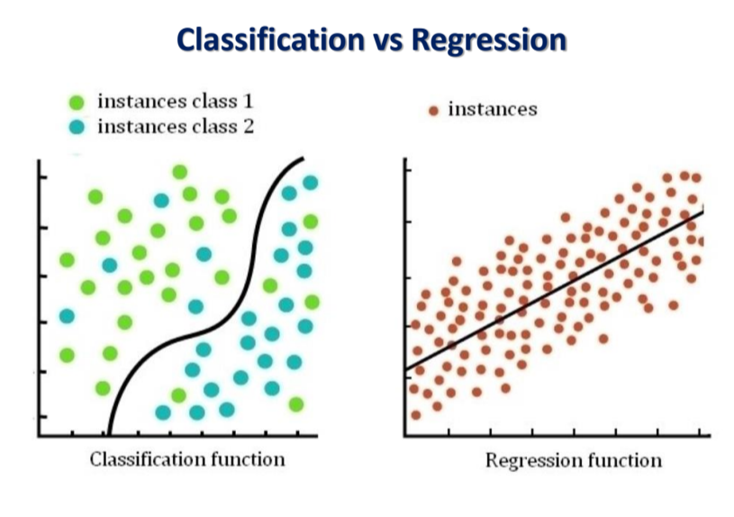
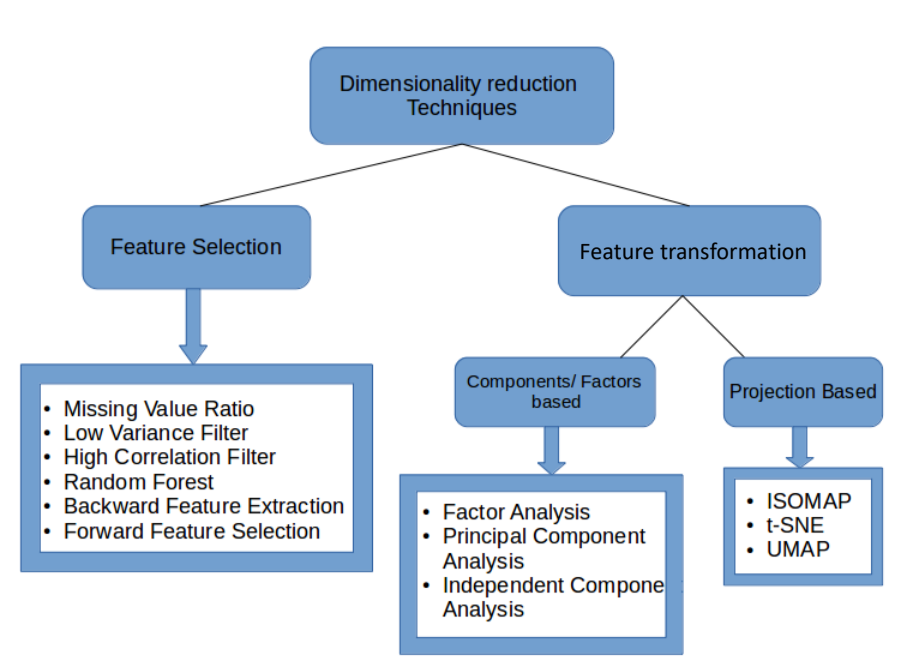
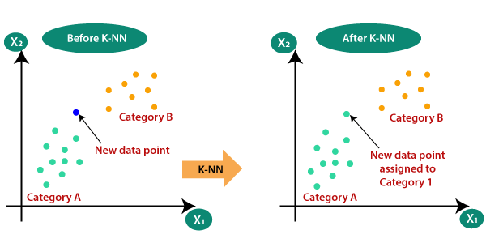

The scope of knowledge must be the concept of Machine Learning not the Deep Learning : The topic must be under these
Principal Components Analysis
Linear Discriminant Analysis
Factory Analysis
Multidimensional scaling
ANN
Regression
Clustering Algorithm
Hierarchical clustering
Gaussian Mixture Models
K nearest neigbor
Bayesian Learning
Decision Trees
Regression Trees
Random forests
SVM


1.Introduction
2.Dimensionality reduction 
3.Neural Network
4.Regression 5.Clustering algorithms
6.Bayesian Learning
7.DT3 and random forest
8.Support Vector Machines
9.Model evaluation
10.Ensemble learning


# Supervised Learning


## Supervised Learning Flow


# Unsupervised Learning


## Unsupervised Learning Flow


## Examples


# Reinforcement Learning


# Semi-Supervised Learning


## Generative vs Discriminative

- Generative (Naive Bayes): Models each class individually (the “tourist profile” and the “local profile”) and then uses that to classify. It answers, “How likely is this behavior for tourists and locals?”

- Discriminative (Logistic Regression): Directly learns the differences between classes without fully modeling each class. It answers, “Given these behaviors, which class does this person most likely belong to?”

- In short, generative models understand each class in depth, while discriminative models focus on what separates classes.

## Classification vs Regression



```
When we talk about "classes," we’re discussing the different possible outcomes or groups in a classification task.

For instance:

Binary Classification: If the task is to classify emails, the two classes could be "spam" and "not spam." Each email belongs to one of these two classes.

Multiclass Classification: If the task is to categorize news articles, classes might be "sports," "politics," "technology," and "entertainment." Each article is assigned to one of these classes.

In the context of Naive Bayes or other generative models, when we model P(X∣Y), we’re estimating the probability of each feature X (like specific words in an email) for each class Y (such as "spam" or "not spam"). This tells us, for example, which words are more likely in "spam" emails versus "not spam" emails, helping the model learn to classify new emails based on those word distributions.
```

# Steps in Machine Learning


# Dimensionality Reduction


- PCA and LDA work best on linearly separable data (data that can be separated by straight lines or planes), 
- whereas t-SNE and Isomap excel with nonlinear data structures (such as curved or complex manifolds).

## PCA (Principal Component Analysis): 
- **Purpose**: Dimensionality reduction by maximizing variance.
- **Use Case**: Suitable for linear data points; commonly used for reducing data dimensions while retaining most variance. Examples include image compression and feature reduction in machine learning.
- **How It Works**: Projects data onto new axes (principal components) that capture the maximum variance, reducing redundancy.
- **Output**: A set of uncorrelated principal components ordered by variance explained.
- **Common Algorithms to Use With**: K-Means Clustering, Linear Regression, Logistic Regression.

## LDA (Linear Discriminant Analysis): 
- **Purpose**: Supervised dimensionality reduction for maximizing class separability.
- **Use Case**: Effective with linearly separable data; used in classification problems where you need to reduce features while preserving class structure.
- **How It Works**: Projects data onto a lower-dimensional space by maximizing the ratio of between-class variance to within-class variance.
- **Output**: A set of linear discriminants that best separate classes.
- **Common Algorithms to Use With**: Commonly combined with classification models like Logistic Regression, Support Vector Machines (SVM), and Decision Trees.

## Singular Value Decomposition (SVD) :
- **Purpose**: Matrix factorization technique for dimensionality reduction.
- **Use Case**: Often applied to linear data in recommendation systems and image compression, where the data can be represented as matrices.
- **How It Works**: Decomposes a matrix into three matrices (U, Σ, V^T), isolating the most significant features.
- **Output**: Reduced-dimensional representation in terms of singular vectors.
- **Common Algorithms to Use With**: Frequently used in recommendation systems, as well as PCA and collaborative filtering algorithms.

## t-SNE (t-Distributed Stochastic Neighbor Embedding): 
- **Purpose**: Non-linear dimensionality reduction primarily for visualization.
- **Use Case**: Best for non-linear or curved data; commonly used for high-dimensional data visualization (e.g., image or word embeddings).
- **How It Works**: Preserves local relationships by converting pairwise distances into probabilities, mapping data points to a lower-dimensional space while retaining clusters.
- **Output**: A low-dimensional representation (usually 2D or 3D) for data visualization.
- **Common Algorithms to Use With**: Generally used for data exploration, especially with clustering algorithms like K-Means to interpret cluster structures.

## Isomap: 
- **Purpose**: Non-linear dimensionality reduction technique that preserves the global structure of the data.
- **Use Case**: Suitable for non-linear, curved data; often used for data that lies on a manifold, such as images or 3D object surfaces.
- **How It Works**: Creates a neighborhood graph of data points and computes geodesic distances, preserving the global geometry in lower dimensions.
- **Output**: A low-dimensional mapping of data that preserves global data structure.
- **Common Algorithms to Use With**: Often used in visualization and clustering for manifold-structured data.

### PCA VS LDA


- When we add many random features, the model might start to interpret random noise as meaningful patterns, causing overfitting. So, even though each class here comes from the same distribution, they appear more separable with more features.

## Factor Analysis 
- Purpose: Identifies latent factors that explain observed correlations between variables.
- Use Case: Generally applied to linear data in social sciences and survey analysis for identifying underlying constructs (e.g., personality traits).
- How It Works: Models observed variance as shared variance (explained by factors) and unique variance (specific to each variable).
- Output: Reduces data into a set of underlying factors, representing correlated features.
- Common Algorithms to Use With: Often used as an exploratory tool rather than with specific machine learning models but can precede clustering or classification.

### When to Use Factor Analysis:
- Reducing Redundancy: Use factor analysis when you have a lot of variables, and you want to reduce redundancy or group them based on underlying factors.
- Understanding Data Structure: When you want to understand the structure or grouping within your data, especially if it has some theoretical basis.
- Survey Analysis: Commonly used in psychology and social sciences to identify underlying dimensions in surveys and questionnaires (e.g., grouping questions based on underlying personality traits).

## Multidimensional Scaling (MDS)
- Purpose: Dimensionality reduction primarily for visualization by preserving distances between points.
- Use Case: Works well with both linear and non-linear (curved) data; used for visualizing similarity or distance relationships, like geographic or genetic similarities.
- How It Works: Preserves the pairwise distances between points in high-dimensional space when mapping them to a lower-dimensional space.
- Output: A low-dimensional representation that visually approximates pairwise distances.
- Common Algorithms to Use With: Often used as a pre-processing step for data exploration and visualization rather than with specific predictive algorithms.

# Artificial Neural Network (ANN)


## Example


# Regression

## Linear Regression
- **Purpose:** To model the relationship between one dependent variable and one or more independent variables by fitting a linear equation to the observed data.
- **Use Case:** Used with linear data points. It predicts continuous outcomes (e.g., predicting house prices based on size).
- **How It Works:** It calculates the best-fitting line through the data points by minimizing the sum of squared differences between the observed values and the values predicted by the model.
- **Output:** A linear equation (e.g., \( y = mx + b \)) representing the predicted values, where \( m \) is the slope and \( b \) is the y-intercept.
- **Common Algorithm to Use With:** Ordinary Least Squares (OLS).

## Iterative Regression
- **Purpose:** To refine regression models by iteratively improving the parameters using various optimization techniques.
- **Use Case:** Can be used with both linear and non-linear data points. It’s often applied in complex models where initial estimates need to be adjusted.
- **How It Works:** Starts with an initial set of parameters and iteratively updates them based on the residuals (differences between predicted and actual values) until convergence is achieved.
- **Output:** A set of optimized parameters for the regression model.
- **Common Algorithm to Use With:** Gradient Descent, Expectation-Maximization (EM).

## Least Squares Regression
- **Purpose:** To find the best-fitting line or curve by minimizing the sum of the squares of the residuals.
- **Use Case:** Used with linear data points, but can also be adapted for polynomial fits or other curves.
- **How It Works:** It determines the parameters of the model that minimize the squared differences between the actual data points and the predicted values. This method can be extended to multiple dimensions for multiple regression.
- **Output:** A fitted line or curve equation along with parameter estimates.
- **Common Algorithm to Use With:** Linear Least Squares Method.

## Logistic Regression
- **Purpose:** To model the probability of a binary outcome based on one or more predictor variables.
- **Use Case:** Used with binary outcomes (e.g., yes/no, success/failure). It is typically used for classification tasks rather than regression.
- **How It Works:** It uses the logistic function to constrain the output between 0 and 1, allowing for the modeling of probabilities. The model estimates the log-odds of the probability of the dependent event occurring.
- **Output:** A probability score between 0 and 1, which can be interpreted as the likelihood of the outcome.
- **Common Algorithm to Use With:** Maximum Likelihood Estimation (MLE). 

# Clustering
- Clustering depends on a similarity ( relational criterion ) that will be expressed thru a distance function


- **Purpose:** To group a set of objects or data points into clusters, such that objects in the same cluster are more similar to each other than to those in other clusters. This helps to identify inherent structures or patterns in the data.
  
- **Use Case:** Clustering is widely used in exploratory data analysis, market segmentation, social network analysis, organizing computing clusters, image segmentation, and more. It can be applied to both numerical data and categorical data.

- **How It Works:** Clustering algorithms assess the similarity between data points using a distance function (e.g., Euclidean distance, Manhattan distance, cosine similarity). The choice of distance metric can affect the formation of clusters. Based on this similarity, the algorithm groups data points into clusters. Different clustering techniques may use different approaches, such as:
  - **Centroid-based methods (e.g., K-Means):** These algorithms create clusters based on the mean (centroid) of the points within each cluster.
  - **Density-based methods (e.g., DBSCAN):** These algorithms identify clusters based on the density of data points in the region, which helps in detecting arbitrarily shaped clusters.
  - **Hierarchical methods (e.g., Agglomerative Clustering):** These algorithms create a tree of clusters, where each data point starts in its own cluster and merges based on similarity.

- **Output:** The output of a clustering algorithm is a set of clusters, with each cluster representing a group of similar data points. In some cases, the algorithm may also provide a label for each cluster, although in unsupervised learning, the clusters themselves may not have predefined labels.

- **Common Algorithms to Use With:** Some common clustering algorithms include:
  - **K-Means:** Partitions the data into K clusters by minimizing the variance within each cluster.
  - **DBSCAN (Density-Based Spatial Clustering of Applications with Noise):** Groups together points that are close to each other based on a distance measurement and a minimum number of points, identifying outliers as noise.
  - **Agglomerative Hierarchical Clustering:** Builds clusters in a bottom-up manner, merging the closest pairs of clusters iteratively.

### Key Points to Remember:
- Clustering is an **unsupervised** learning technique, meaning it does not rely on labeled output; it identifies groupings based solely on the input data's characteristics.
- The effectiveness of clustering can vary based on the choice of algorithm, distance metric, and the inherent structure of the data.

## Partitional Clustering Algorithms

### K-Means
- **Purpose:** To partition a dataset into K distinct clusters, where each data point belongs to the cluster with the nearest mean.
- **Use Case:** Commonly used with linear data points; suitable for large datasets and when the number of clusters is known in advance (e.g., customer segmentation, image compression).
- **How It Works:** The algorithm starts by randomly initializing K centroids. It then assigns each data point to the nearest centroid and recalculates the centroids as the mean of the assigned points. This process iterates until the centroids no longer change significantly.
- **Output:** A set of K clusters, each represented by a centroid, and each data point is assigned to one of these clusters.
- **Common Algorithm to Use With:** K-Means Clustering.

### Kernel K-Means
- **Purpose:** To extend the K-Means algorithm to handle non-linearly separable data by using kernel functions to project data into a higher-dimensional space.
- **Use Case:** Useful for clustering data that is not linearly separable, such as complex patterns or shapes (e.g., image recognition, pattern recognition).
- **How It Works:** The algorithm applies a kernel function (e.g., Gaussian, polynomial) to transform the data points into a higher-dimensional space. K-Means is then performed in this new space, allowing for more complex cluster shapes.
- **Output:** Clusters that can capture non-linear relationships in the data.
- **Common Algorithm to Use With:** Kernel K-Means.

### K-Medoids
- **Purpose:** To identify representative objects (medoids) within a dataset that minimize the total dissimilarity to all points in the cluster.
- **Use Case:** Useful for datasets with noise or outliers, as it is less sensitive than K-Means (e.g., market segmentation, analyzing customer behavior).
- **How It Works:** Instead of using centroids, K-Medoids selects actual data points as medoids. It assigns points to the nearest medoid and iteratively updates the medoids to minimize the overall distance within the clusters.
- **Output:** A set of clusters represented by medoids, with each data point assigned to the closest medoid.
- **Common Algorithm to Use With:** Partitioning Around Medoids (PAM).

### PAM (Partitioning Around Medoids)
- **Purpose:** To cluster data points based on medoids while optimizing the clustering process to ensure robustness to outliers.
- **Use Case:** Suitable for small to medium-sized datasets where noise and outliers are present (e.g., customer segmentation, bioinformatics).
- **How It Works:** Similar to K-Medoids, PAM selects initial medoids and iteratively refines them by evaluating all possible swaps between medoids and non-medoids to find the optimal configuration that minimizes the total cost.
- **Output:** Clusters represented by medoids and assignments of data points to these medoids.
- **Common Algorithm to Use With:** Partitioning Around Medoids (PAM).

### CLARA (Clustering LARge Applications)
- **Purpose:** To perform clustering efficiently on large datasets by using a sample-based approach.
- **Use Case:** Suitable for large datasets where full clustering would be computationally expensive (e.g., market research, large-scale social media data analysis).
- **How It Works:** CLARA takes a random sample of the data, applies PAM to this sample, and repeats the process several times, selecting the clustering with the lowest total cost. This approach provides a good approximation of the clustering in the full dataset.
- **Output:** Clusters based on medoids from the sampled data and corresponding assignments for the full dataset.
- **Common Algorithm to Use With:** PAM.

### CLARANS (Clustering Large Applications based on RANdomized Search)
- **Purpose:** To improve upon CLARA by combining the efficiency of random sampling with local optimization to find a better clustering result.
- **Use Case:** Used for large datasets and provides better accuracy than CLARA (e.g., large-scale customer data analysis, environmental data clustering).
- **How It Works:** Similar to CLARA, but instead of taking a fixed sample size, it performs a randomized search for the best medoids, evaluating local swaps to enhance the clustering quality iteratively.
- **Output:** Clusters represented by improved medoids and assignments of data points to these medoids.
- **Common Algorithm to Use With:** CLARANS.

### SLIC (Simple Linear Iterative Clustering)
- **Purpose:** To perform clustering in the context of image segmentation by creating superpixels.
- **Use Case:** Used with images to partition them into segments while preserving important visual structures (e.g., image processing, computer vision).
- **How It Works:** The algorithm divides an image into a grid of superpixels and iteratively refines the clusters based on color similarity and spatial proximity. Each superpixel is a region of similar color and texture.
- **Output:** Segmented regions of the image, or superpixels, that represent coherent segments based on color and spatial information.
- **Common Algorithm to Use With:** SLIC algorithm.

### Mean Shift
- **Purpose:** To find clusters in the data by shifting data points towards the region of maximum density.
- **Use Case:** Suitable for clustering tasks where the number of clusters is unknown and can handle arbitrary shapes (e.g., tracking objects in video, image segmentation).
- **How It Works:** The algorithm defines a window (kernel) and iteratively shifts it towards regions with higher data point density. This process continues until convergence, identifying modes in the density of data points.
- **Output:** Clusters defined by the modes of the density function, with data points assigned to the nearest cluster.
- **Common Algorithm to Use With:** Mean Shift algorithm.


## Hierarchical Clustering


### Nearest Neighbor Algorithm

- **Purpose:** To classify or cluster a data point based on the closest training examples in the feature space.
- **Use Case:** Used in classification and regression tasks; can be applied to both linear and non-linear data points (e.g., recommendation systems, pattern recognition).
- **How It Works:** The algorithm computes the distance between the new data point and all existing data points, selecting the k-nearest neighbors (often using Euclidean distance). The classification (or cluster assignment) is determined by majority voting among these neighbors.
- **Output:** A class label for classification tasks or a cluster assignment based on the nearest neighbors.
- **Common Algorithm to Use With:** k-Nearest Neighbors (k-NN).

### Divisive Hierarchical Clustering
- **Purpose:** To create a hierarchy of clusters by recursively splitting clusters into smaller sub-clusters.
- **Use Case:** Suitable for datasets where a hierarchical relationship is desired (e.g., taxonomy of species, organizational structures).
- **How It Works:** It begins with all data points in a single cluster and iteratively partitions the clusters into smaller ones based on a chosen criterion, often using distance metrics to determine the best split at each step.
- **Output:** A hierarchy of clusters represented in a dendrogram, showing how clusters are nested.
- **Common Algorithm to Use With:** Top-Down Hierarchical Clustering.

### Agglomerative (Bottom-Up) Hierarchical Clustering
- **Purpose:** To build a hierarchy of clusters from the bottom up by merging smaller clusters into larger ones.
- **Use Case:** Used for various applications requiring a hierarchy (e.g., document clustering, gene expression analysis).
- **How It Works:** The algorithm starts with each data point as its own cluster and iteratively merges the closest pairs of clusters based on a distance metric until a single cluster remains or a predefined number of clusters is reached.
- **Output:** A hierarchy of clusters visualized as a dendrogram, indicating the relationships and distances between clusters.
- **Common Algorithm to Use With:** Agglomerative Clustering.

### BIRCH (Balanced Iterative Reducing and Clustering using Hierarchies)
- **Purpose:** To efficiently cluster large datasets by incrementally building a cluster feature tree.
- **Use Case:** Suitable for large datasets where traditional clustering methods are computationally expensive (e.g., data mining, large-scale data analysis).
- **How It Works:** BIRCH constructs a tree structure (the Clustering Feature Tree) by incrementally inserting data points. Each node represents a summary of the clusters, allowing efficient clustering by only examining relevant parts of the dataset.
- **Output:** Clusters formed based on the hierarchical structure of the tree, often resulting in a set of subclusters that can be further refined using other clustering methods.
- **Common Algorithm to Use With:** BIRCH algorithm, often followed by refinement with other methods like k-Means.

### DBSCAN (Density-Based Spatial Clustering of Applications with Noise)
- **Purpose:** To identify clusters of arbitrary shape and separate noise points in the data.
- **Use Case:** Used with spatial data or when the number of clusters is unknown; effective for datasets with varying densities (e.g., geographic data, image segmentation).
- **How It Works:** The algorithm defines clusters based on the density of points in the region. It requires two parameters: epsilon (the radius around a point) and minPts (the minimum number of points required to form a dense region). Points that are closely packed together form clusters, while points in low-density regions are classified as noise.
- **Output:** Clusters of data points, with some points labeled as noise if they do not belong to any cluster.
- **Common Algorithm to Use With:** DBSCAN algorithm.

## Soft Clustering
### Gaussian Mixture Models (GMM)
- **Purpose**: To model data as a mixture of multiple Gaussian distributions, allowing for soft clustering where data points can belong to multiple clusters with varying probabilities.

- **Use Case**: Useful for applications where the boundaries between clusters are not well-defined, and overlapping clusters are common (e.g., image segmentation, speech recognition, anomaly detection).

- **How It Works**: GMM assumes that the data is generated from a mixture of several Gaussian distributions, each represented by its mean and covariance. The algorithm estimates the parameters of these distributions using the Expectation-Maximization (EM) algorithm, 
    - which consists of two steps:

    - Expectation Step (E-step): Calculates the probability that each data point belongs to each Gaussian component based on the current estimates of the parameters.
    - Maximization Step (M-step): Updates the parameters (means, covariances, and mixing coefficients) to maximize the likelihood of the data given the current assignments.
    - This process iterates until convergence is reached.

- **Output**: A set of Gaussian components, each characterized by a mean and covariance matrix, along with the probabilities indicating how likely each data point belongs to each cluster.

- **Common Algorithm to Use With**: Expectation-Maximization (EM) algorithm.


## Naive Bayes
- **Purpose**: To classify data points based on the probability of different classes, assuming independence among features.

- **Use Case**: Commonly used for text classification (e.g., spam detection, sentiment analysis), and when the dataset is large with categorical features (e.g., email filtering).

- **How It Works**: Naive Bayes applies Bayes' theorem while assuming that the features are conditionally independent given the class label. The classification rule can be expressed as:

  - 

- **Output**: A class label for each data point based on the computed probabilities.

- **Common Algorithm to Use With**: Gaussian Naive Bayes, Multinomial Naive Bayes, Bernoulli Naive Bayes (depending on the nature of the features).

# Decision Tree


## Decision Tree
- **Purpose:** To model decisions based on input features, creating a tree-like structure that allows for classification or regression.
- **Use Case:** Used for both classification and regression tasks (e.g., customer churn prediction, loan approval).
- **How It Works:** The tree splits the data based on feature values to form branches, recursively creating sub-nodes until a stopping criterion is met. Each leaf node represents a predicted class label or value.
- **Output:** A model that classifies new instances or predicts values based on the paths from the root to leaf nodes.
- **Common Algorithm to Use With:** CART, ID3, C4.5, C5.0.

## Regression Tree
- **Purpose:** To predict continuous target variables using a decision tree structure.
- **Use Case:** Commonly used for regression tasks (e.g., predicting house prices, sales forecasting).
- **How It Works:** Similar to decision trees but focuses on predicting continuous values. Splits are made to minimize the mean squared error (MSE) between predicted and actual target values in the training data.
- **Output:** A continuous value prediction for new instances based on the average value in the corresponding leaf node.
- **Common Algorithm to Use With:** CART (used for regression).

### CART (Classification and Regression Trees)
- **Purpose:** To create decision trees for both classification and regression tasks based on input features.
- **Use Case:** Suitable for both types of tasks (e.g., classifying customer segments, predicting continuous sales figures).
- **How It Works:** Uses a binary tree structure where each node represents a decision based on a feature, and it can produce either classification trees or regression trees based on the task. It selects splits to maximize information gain (for classification) or minimize MSE (for regression).
- **Output:** A classification tree or regression tree based on the type of task being performed.
- **Common Algorithm to Use With:** Decision tree algorithms, often implemented in machine learning libraries like scikit-learn.

### Random Forest

- **Purpose:** To enhance prediction accuracy and robustness by combining multiple decision trees into an ensemble model.
- **Use Case:** Applicable for both classification and regression tasks (e.g., fraud detection, customer segmentation).
- **How It Works:** Builds a collection of decision trees using bootstrapped samples of the training data, aggregating their predictions (by averaging for regression and voting for classification). Each tree uses a random subset of features at each split.
- **Output:** A final predicted value or class label based on the aggregated results of all individual trees in the forest.
- **Common Algorithm to Use With:** Random Forest algorithm, implemented in libraries like scikit-learn.

# Support Vector Machine (SVM)


- **Purpose:** To classify data points by finding the optimal hyperplane that separates different classes in the feature space.
- **Use Case:** Commonly used for classification tasks (e.g., image recognition, text classification) and can also be adapted for regression tasks (using Support Vector Regression, SVR). SVM is effective for both linear and non-linear data points.
- **How It Works:** SVM identifies the hyperplane that maximizes the margin between different classes. The margin is defined as the distance between the hyperplane and the closest data points from each class, known as support vectors. SVM can use kernel functions to transform the input space into higher dimensions, allowing it to effectively separate non-linearly separable data. The algorithm can be summarized in two main steps:
  1. **Finding the Optimal Hyperplane:** The algorithm seeks the hyperplane that maximizes the margin between classes.
  2. **Using Kernels for Non-Linearity:** If the data is not linearly separable, SVM applies a kernel function (like polynomial, radial basis function (RBF), or sigmoid) to map the input features into a higher-dimensional space where a hyperplane can be used to separate the classes.
- **Output:** A model that classifies new instances based on which side of the hyperplane they fall on, along with the predicted class labels.
- **Common Algorithm to Use With:** SVM implementations in libraries such as scikit-learn, often with various kernel options (linear, polynomial, RBF).

### Key Features of SVM:
- **Robustness:** SVM is effective in high-dimensional spaces and performs well even when the number of dimensions exceeds the number of samples.
- **Flexibility:** The use of kernel functions allows SVM to adapt to a wide variety of data distributions.


``` flow
Supervised Learning Flow
Data Collection: Gather labeled data with features and corresponding target labels.
Data Preprocessing: Clean data, handle missing values, scale or normalize, and split into training and test sets.
Feature Selection/Engineering: Identify the most relevant features (using methods like PCA, Factor Analysis, etc.) and transform or create new features if necessary.
Model Selection: Choose a suitable algorithm based on the problem type (e.g., classification or regression).
Training: Train the model on the labeled training data.
Validation: Evaluate performance on a validation set to fine-tune hyperparameters and avoid overfitting.
Testing: Test the model on a separate test set to estimate real-world performance.
Deployment: Deploy the model to make predictions on new, unseen data.
Monitoring: Continuously monitor the model's performance over time.
Common Algorithms: Linear Regression, Decision Trees, Support Vector Machines, Neural Networks.

Unsupervised Learning Flow
Data Collection: Gather data without labels.
Data Preprocessing: Clean, scale, or normalize the data, as with supervised learning.
Dimensionality Reduction (optional): Use techniques like PCA, Factor Analysis, or t-SNE to reduce data complexity.
Model Selection: Choose an unsupervised algorithm based on the problem type (e.g., clustering, dimensionality reduction).
Training: Apply the model to find patterns in the data (e.g., clusters or associations).
Evaluation: Evaluate clustering using metrics like silhouette score or visual inspection. Since there are no labels, evaluation often requires domain knowledge.
Analysis/Interpretation: Interpret the results, like identifying clusters or patterns.
Deployment: If the model serves a purpose (e.g., customer segmentation), deploy the results or the clustering process.
Common Algorithms: K-Means Clustering, Hierarchical Clustering, DBSCAN, t-SNE for visualization.
```
