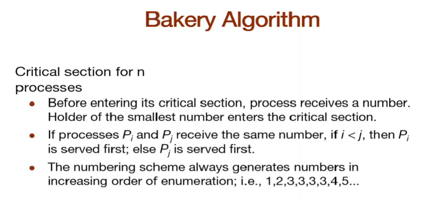
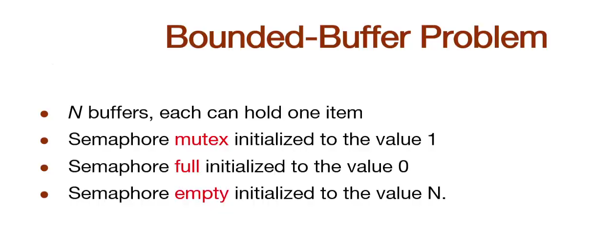
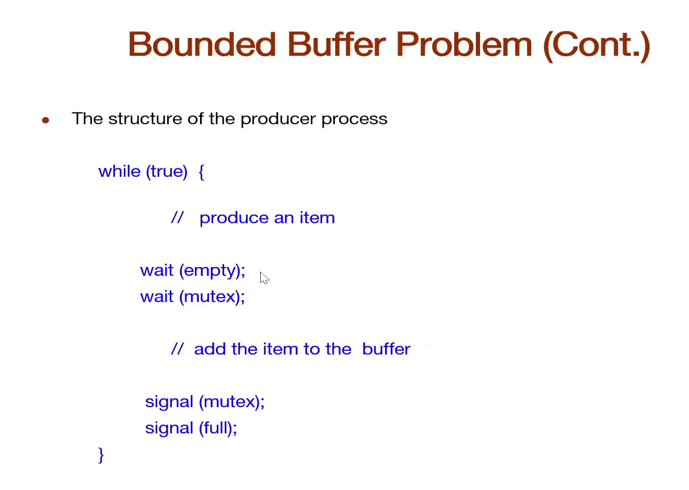
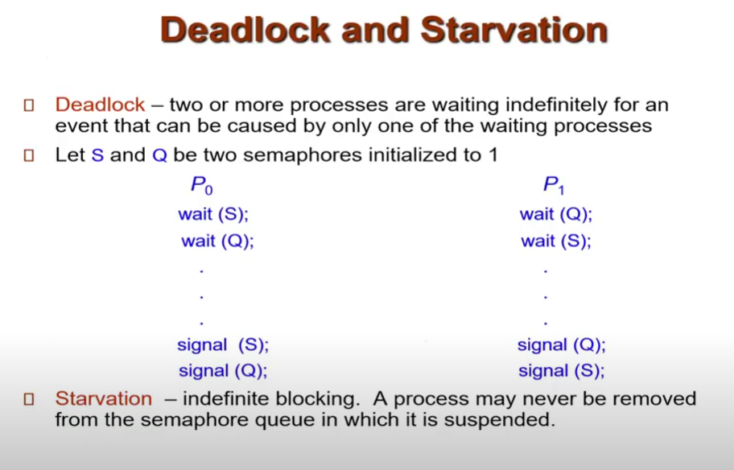
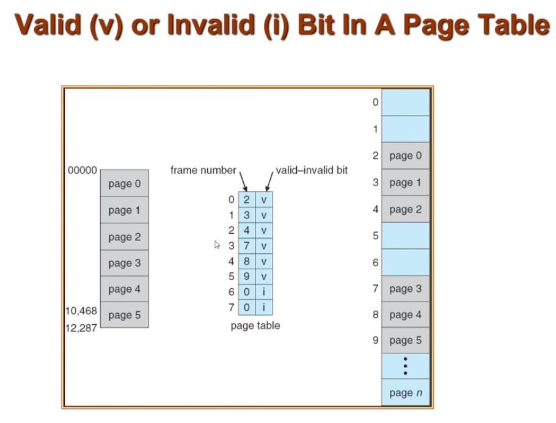

<style>
img {
  width: 400px;
}
</style>

# Message Passing

/Interprocess_Communication.png)
IPC facility provides two operations :
- send(message)
- recieve(message)

***Messages can be passed in one direction or bidirectional**

## Synchronization
- Message passing can be blocking (synchronous), or non blocking(asynchronous)

### Blocking
- blocking send
    - Sender block until the reciever said it recieves the message
- blocking recieve
    - when reciever goes to read message, if the message not arrived it waits til the message arrives(waiting for ACK)

### Non Blocking
- Sender might not care if the reciever recieve the messages or not
- non blocking send
    - sender send message and continue
- non blocking recieve
    - reciever recieve a valid message or null

## Pipes
- One way communication
- State which one is sender and which one is reciever
- takes an array of two integers. It fills in the array with two file descriptors that can be used for low-level I/O.

/Creating_Pipe.png)
/Read_Write.png)


/Fork_and_Pipe.png)
- Parent has to create the pipe first, before forking
- So the child can get the pipe too


/Fork_and_Pipe2.png)
- Both Parent and Child has write and read ends
- Sender closes read end while reciever close the write end
``` C
pipe.c

#include <stdio.h>
#include <stdlib.h>
#include <unistd.h>
#include <string.h>
#include <sys/wait.h>
#define SIZE 1024
#define READ_SIZE 5
int main(int argc, char **argv)
{
  int pfd[2];
  int nread;
  int pid;
  char buf[SIZE];
  char buf_read[READ_SIZE+1];
  if (pipe(pfd) == -1)
  {
    perror("pipe failed");
    exit(1);
  }
  if ((pid = fork()) < 0)
  {
    perror("fork failed");
    exit(2);
  }
  if (pid == 0)
  {
    /* child */
    close(pfd[1]);
    while ((nread = read(pfd[0], buf_read, READ_SIZE)) != 0) {
      printf("child read %s\n", buf_read);
    }
    close(pfd[0]);
  } else {
    /* parent */
      close(pfd[0]);
      strcpy(buf, "hello world, hello mars, hello universe");
      //sleep(2);
      /* include null terminator in write */
      write(pfd[1], buf, strlen(buf)+1);
      //write(pfd[1], buf, strlen(buf));
      close(pfd[1]);
      wait(NULL);
  }
  exit(0);
}
```

/No_backslash.png)
/No_backslash2.png)
- If you don't +1 for the back slash, it will take the last char of the previous line

## fd 0 1 and 2 are reserved by os 
- ***fd is file descriptor**
- 0 -> stdin
- 1 -> stdout
- 2 -> stderr

/Pipe_Example.png)
- | is pipe
- in "ls | wc", the pipe redirects the output of ls to wc then wc will count them
- pass data with stdin (fd1) to stdout (fd2) through pipe with fd3 and fd4
- ***fd1 is stdout, fd0 is stdin**

/wc.png)
- 39 lines / number of files
- 66 words / 
- 568 characters

/Filename_with_Space.png)
- 5 lines (5 files)
- 6 words
- 37 characters
- use -l (lines) instead of -w (words), because words may read one file as two if the file name contains a space

## dup2 function
/dup2.png)
- use dup2 to join fd1 to fd3 adn fd4 to fd0
- dup2 is dupto not duptwo

``` C
dup2.c

#include <stdio.h>
#include <stdlib.h>
#include <unistd.h>

int main(void)
{
  int pfd[2];
  int pid;

  if (pipe(pfd) == -1)
  {
    perror("pipe failed");
    exit(1);
  }
  if ((pid = fork()) < 0)
  {
    perror("fork failed");
    exit(2);
  }
  if (pid == 0) // child
  { 
    close(pfd[0]); // close read end
    dup2(pfd[1],1 ); // dupe write end
    close(pfd[1]); // close og write end
    execlp("ls", "ls",NULL); // exec ls
    perror("ls failed"); // error if exec fails
    exit(3);
  } else {        // parent
    close(pfd[1]); // close write end
    dup2(pfd[0], 0); // dupe read end
    close(pfd[0]); // close og read end
    execlp("wc", "wc",NULL); // exec wc with data from child
    perror("wc failed");
    exit(4);
  }
  exit(0);
}
```

``` C
twopipe.c
#include <stdio.h>
#include <stdio.h>
#include <stdlib.h>
#include <unistd.h>
#include <string.h>

#define SIZE 1024

int main(int argc, char **argv)
{
  int pfd1[2];
  int pfd2[2]; 
  int nread;
  int pid;
  int status;
  char buf[SIZE];

  if (pipe(pfd1) == -1) {
    perror("pipe failed");
    exit(1);
  }
  if (pipe(pfd2) == -1) {
  perror("pipe failed");
  exit(1);
  }
  if ((pid = fork()) < 0) {
    perror("fork failed");
    exit(2);
  }
  if (pid == 0) {
    /* child */
    close(pfd1[1]);
    close(pfd2[0]);
    while ((nread = read(pfd1[0], buf, SIZE)) != 0) {	
      printf("child read %s\n", buf);
    }
    close(pfd1[0]);
    strcpy(buf, "I am fine thank you");
    write(pfd2[1], buf, strlen(buf) + 1);
    close(pfd2[1]);	
  } else {
    /* parent */
    close(pfd1[0]);
    close(pfd2[1]);
    strcpy(buf, "How are you");
    /* include null terminator in write */
    write(pfd1[1], buf,strlen(buf)+1);
    close(pfd1[1]);
    while ((nread = read(pfd2[0], buf, SIZE)) != 0) {
      printf("Parent read %s\n", buf);	 
    }
    close(pfd2[0]);
  }
  exit(0);
}
```

# Shared memory
- Two processes share one memory
- Uses the shared memory to exchange data

- Process that creates a shared memory is called server
- Process that usese the shared memory is called client

- There's no protection on the access from other processes
- Can only forced them to only read / write (give them access to only some operation)

## Race condition
- processes race each other to update the daata
- prevent with synchronization

## shared mem functions
- shmget() 
    - return shm id
- shmat() 
    - shared mem attatch
    - use to links shared mem to existing storage space
- shmad() 
    - shared mem detatch
    - use to detatch shared mem to existing storage space
- shmctl() shared mem control
    - remove shared memory

### flow of server and client
- ***Server should perform these tasks before the clients**
- calls shmget to get the shmid then attatch the client's/server's address to the shared mem with the key(shmid). 
- Do some task
- Detatch the shm from the space
- (only server do this) calls shmctl() to remove shared memory

## key
- (key is int redefined as key_t)
- a key is then generated with ftok()
- A unique key can be generated with IPC_Private() (garunteed to get a unique key)
- IPC can only be used in the same family of process, (parent, child). Other processes can't access them
- If not parent / chile, has to use ftok()

/key.png)

## ftok()
/ftok.png)
/ftok2.png)
- . is the path to the current directory
- some other process can get this key with the path to this directory

## Permissions
/perm.png)
- permission can be separated into 3 groups
- - --- --- --- separate into (the first one just sayys if it's directory or not)
    - perm for owner
    - perm for user in the same grouup as the owner
    - perm for other users
- "---"
    - perm for read, write and execute
/perm2.png)
- can be represented as an octadecimal

## shmget()
/shmget.png)
- (0666) means allow r/w to all processes that can access this shm
    - 0666 is from the permission of the file
    - rw- rw- rw-
    -  6   6   6 
    - 0666 means everyone on the system can read and write to this file
    
/chmod.png)
- change mode to 666 with chmod

/Ex_shmget.png)
- use IPC_PRIVATE
- 4 bytes of mem (integer sized) as shared mem
- mode 0666

## shmat()
/shmat.png)
- use the shm address created by system (send null ptr, like in adlx)
- use the flags when it is created (send null ptr, like in adlx)
- can use other flags / addr but in this class we only use this, like using macro SHM_RDONLY predefined by system.


``` C
shm_parent_child.c

#include  <stdio.h>
#include  <stdlib.h>
#include  <sys/types.h>
#include  <sys/ipc.h>
#include  <sys/shm.h>
#include <sys/wait.h>
#include <unistd.h>

void  ClientProcess(int []);

void  main(int  argc, char *argv[])
{
     int    shm_id;
     int    *shm_ptr;
     pid_t  pid;
     int    status;
     
     if (argc != 5) {
          printf("Use: %s #1 #2 #3 #4\n", argv[0]);
          exit(1);
     }
     
     shm_id = shmget(IPC_PRIVATE, 4*sizeof(int), IPC_CREAT | 0666);
     if (shm_id < 0) {
          printf("*** shmget error (server) ***\n");
          exit(1);
     }
     printf("Server has received a shared memory of four integers...\n");
     
     shm_ptr = (int *) shmat(shm_id, NULL, 0);
     if ( shm_ptr == NULL) {
          printf("*** shmat error (server) ***\n");
          exit(1);
     }
     printf("Server has attached the shared memory...\n");
     
     shm_ptr[0] = atoi(argv[1]);
     shm_ptr[1] = atoi(argv[2]);
     shm_ptr[2] = atoi(argv[3]);
     shm_ptr[3] = atoi(argv[4]);
     printf("Server has filled %d %d %d %d in shared memory...\n",
            shm_ptr[0], shm_ptr[1], shm_ptr[2], shm_ptr[3]);
            
     printf("Server is about to fork a child process...\n");
     pid = fork();
     if (pid < 0) {
          printf("*** fork error (server) ***\n");
          exit(1);
     }
     else if (pid == 0) {
          ClientProcess(shm_ptr);
          exit(0);
     }
          
     wait(&status);
     printf("Server has detected the completion of its child...\n");
     shmdt((void *) shm_ptr);
     printf("Server has detached its shared memory...\n");
     shmctl(shm_id, IPC_RMID, NULL);
     printf("Server has removed its shared memory...\n");
     printf("Server exits...\n");
     exit(0);
}

void  ClientProcess(int  share_mem[])
{
     printf("   Client process started\n");
     printf("   Client found %d %d %d %d in shared memory\n",
                share_mem[0], share_mem[1], share_mem[2], share_mem[3]);
     printf("   Client is about to exit\n");
}
```

<!-- / -->

# Process synchronization
- To prevent Consumer to get the outdated / duplicated data
- Prevent race condition, but may lead to deadlock

## Producer
/producer.png)
- Write data from first slot, until the last slot. After that start at first slot again
- write data forever
- count data added to buffer
- prevent lost data of the consumer

## Consumer
/consumer.png)
- Check count with buffer size before reading to prevent reading duplicated data

## Race Condition
- Condition that more than one process update data at the same time. Result might be incorrect based on the last process that edit the data
- so the incrementation and decrementation don't get fucked when updating with multiple processes at the same time
/race_cond.png)
- Incorrect result, register 2 read the unchanged value of register 1

## Critical Section Problem


### Mutual Exclusion
- Only allow 1 process to access the critical section at the same time
- From toilet exmaple, only one person can use the toilet at the same time

### Progress
- Alg is A->B->C
- A no want toilet
- Other can't toilet
- You should only consider the process that needs the critical section
- only the one who wants to use the toilet

### Bounded waiting
- Process that is waiting will only wait in a limited time and not indefinitely
- A->B->C
- After A, A can't go back in again til everyone else go in

> Complete solution should pass all 3, but if can't should at least pass the mutual exclusion
> If your alg doesn't pass the progress, it won't pass bounded waitning

### Peterson's Solution

- Complete solution that pass all 3 conditions
- Can only use on 2 processes

## Bakery Problem

- Give out some numbers in ascending order
- Lower number go first
- Similar to how bank queue works, but there might be chances that two or more process can get the same queue number
- 
## Bakery Algorithm

- pass mutex
  - Clear on which process can use the critical section
- pass progress
  - Choose only progress who get queue number, so only process that wants to use the critical section
- pass bounded waiting
  - If someone finishes, they have to queue again
- We don't use this, both have busy waiting problem

## Busy waiting problem
- `Solved with Semaphore`
  - a semaphore can be used to block a process that is not ready. 
  - Instead of busy waiting, the process waits on the semaphore, and when the resource is available, the semaphore releases the process, allowing it to proceed.
- A process continuously checks for a condition to be true
- During this time, the process is actively using the CPU, even though it's not doing any productive work.
- This is inefficient because the CPU could be used for other tasks instead of spinning in a loop, checking for a condition to change.

## Semaphore

- Semaphore is an integer
- two kinds of operation, wait() and signal()
  - Different from parent wait for child, totally different thing
  - wait and signal are atomic operation. When wait and signal are running, OS will not interrupt
- Pass mutual exclusion, progress
- Pass bounded waiting depends on OS implementation of wake up, if wake up is implemented in a way that


- Marble, jar and toilet
  - When you want to go to toilet, check if marble in jar
  - toilet on first floor, jar on second floor, you dont want to go downstairs to find out there's someone using the bathroom
  - If marble in jar, toilet free
  - Wehn you go toilet, take marble, and put it back when u done
  - More toilet = more marble, if there's still marble, there's available toilet

### Two types of semaphore


# **We use binary semaphore to solve the critical section problem**
- Because we want only one process to use the critical section at a time

## Semaphore implemntation with no busy waiting


- block sends the process to waiting queue
- wake up sends process in waiting queue to ready queue

## How to solve bounded buffer problem with semaphore

- mutex is binary semaphore
- full and empty are counting semaphore
- OS provide Semaphore for us. We apply it ourself

- Producer take marble from empty jar and put it in full jar to tell Consumer that the reource is ready

- Consumer side check full jar first, if it's available
- If available use it and put it back to empty jar

## Reader-Writer Problem
- Related to DB
- DB might allow one process to allow writing data at a time
- Might have reader while writing, bad
- If the writer is writing, readers can't read

### Writer process structure
/writer.png)
- Check if there's reader. If not, write

### Reader process structure
/reader.png)


# Exam might ask how u use semaphore to solve these
- no framework, guideline
- You have to think of how to use the semaphore urself

## Diner philosopher problem
/diner_philosopher.png)
- 5 chopsticks, 5 people
- To eat, need a pair (2chopsticks)
- when philisopher want to eat, pick left and right chopsticks to make pair
- If the left chopstick is being used by another philosopher, the current philosopher has to wait
- Use semaphore to solve this
- We don't have enough resource for the process
- ***Use semaphore to prevent 2 philosophers to hold same chopstick at the same time**

/diner_philosopher_code.png)
- wait(chopstick[i]) : wait left chopstick
- wait(chopstick[(i + 1) % 5]) : wait right chopstick
- signal(chopstick[i]) : take left chopstick and eat
- signal(chopstick[(i + 1) % 5]) : take right chopstick and eat
- Get deadlock because if everyone picks left chopsticks, they will wait for right chopstick from eachother

/bad_semaphore.png)
- Signal before wait, adding extra marble to the jar


- sem_init(&mutex, 0, 1)
  - 0 means this mutex will only be used by the threads created by this process only (shared among threads by this process)
- Linux and mac have to use named semaphore

- sem_init to sem_open
- sem_destroy to sem_close and sem_unlink


- binary semaphore (mutex lock)


- semaphore is not used to allocate resource
- Just to ensure that no philosopher has the same chopstick(resource)

## Monitor

- OOP
- Use struct for combining data in a single unit
- Only one process active in the monitor means garunteed mutual exclusive
- easier to use then semaphore
- flexibility
- ***No deadlock** but starvation may occur


/soln2dining.png)
/soln2dining2.png)
- Fixed deadlock
- But new problem
- Starvation
  - Some process may wait forever

# Java synchronization


## Synchronized method
- When a thread calls a synchronized method, the thread will be the owner of the lock (A lock will occur automatically, and released when the sync method is done executing)
- public synchronized void method(){}
- other thread can't call the synchronized method within this object while one is calling


- The entry set is the same as the entry queue of the monitor in C
- Use wait and notify instead of wait and signal


- when lock owner calls wait, the object will be unlocked and continue to wait queue

### Notify method

- Wake up thread in wait set and it will go back to entry queue 
- Can't choose which thread to be waken up from the wait set (**Bounded waiting**)
- Depends on JVM


- by producer to send data


- by consumer to read data

### yield() is not the same as wait()
- yield() : I'm not working and allow other thread to work
- you might think that using yield() instead of wait()
- but yeild doesn't release the lock
- consumer won't be able to call the object anyway, object is still locked
- wait release the lock and let other process continue


- acquire is wait
- release is signal
- (this is just the implementation, java now has built-in sephamore)
***Java < 5 doesn't provide semaphore**


- one sync method can be called at a time


- Java allows only synching a block and not the whole method

### Ex.1

- output = 8
- already synchronized
- +1 -1

### Ex.2

- sync the whole method
- output = increment increment decrement decrement or decrement decrement increment increment 5
- depends on who runs first
- process will lock til that one is done

### Ex.3

- Only sync the increment and decrement part of the method
- output = 
  - increment increment decrement decrement 5 or
  - decrement decrement increment increment 5 or
  - decrement increment decrement increment 5 etc.


- A = 0
- B = 0
- C = 0
- D = wait() : count == buffersize means buffer is full, so wait
- E = notify() : After done the process, signal(java synchronization is notify()) other process
- F = wait()
- G = notify()

# Deadlock Management

## Deadlock and Starvation

## Deadlock 
- Two or more processes that are waiting indefinitely for an event that is caused by one of the waiting process
- Both of them are waiting for each other
- Deadlock example
  - 

### Bridge Crossing Example

- OS doesn't handle deadlock on user level process

## Starvation
- Some process was denied access indefinitely because a process with higher priority is running

### Deadlock Condition

- If 4 of these conditions are met, deadlock will occur
1. Mutex 
  - Allow only 1 process to use the resource at a time
2. Hold and Wait
  - A process that is holding at least one resource is waiting for another resource
3. Resource Allocation must not be no preemtion
  - no preemption = If OS allocate resource to some process, OS can't take it back by itself. The process has to voluntarily release the resource itself
4. Circular wait
  - P0 wait for P1, P1 wait for P2, P2 wait for P0

> You might think, if OS can prevent one of the condition, it can prevent all deadlock from occuring. Will tell later 💀💀💀

# Resource Allocation Graph

- Show which resource is given to which process
- 1 Instance of R1 and R3
- 2 Instances of R2 
- 3 Instances of R4


- Rectange is resource
- Circle is process
- P -> R is request edge
- R -> P is assignment edge

## How do we use the Graph?
- We detect the cycle in the Graph
- Ex.

- This graph contain cycle P1 -> R1 -> P2 -> R3 -> P3 -> R2 -> P1
- Graph may have cycle but no deadlock 

- **In this example, If P2 done, it release R1 and P1 can get R1**
- **If P4 done, it release R2 and P3 can get R2**

- But no cycle = no deadlock

## Methods to handle deadlock
- Dedalock Prevention : Make sure the system never enter deadlock State
- Allow deadlock then recover
- Ignore it (Most Os ido this)

### Deadlock Prevention 
- If we prevent one condition, deadlock will neve occur
  
**1. Prevent Mutex**
  - OS can't prevent this, it depends on resource type.
    - Some resource type's nature doesn;t allow non mutex (allowing multiple resource to access it at the same time)]
  - Ex. Critical Section only allow one process to use it, or else deadlock

**2. Prevent Hold and wait**
  - OS must garuntee that the process will have all the resources it needs before entering ready State(starting execution)
  -  If a process cannot acquire all the resources at once, it is forced to wait and it might starve to death
  - Also **low resource utilization**
    - `Hoarding Resources`
      - When a process holds all the resources it needs, even if it doesn't use them immediately, it prevents other processes from accessing those resources.
    - Ex. Process A might request a large number of resources upfront, but it only needs some of them at later stages of its execution. While waiting to use these resources, they remain reserved and unavailable to other processes, even though they could have been used productively by other tasks.
   
**3. Prevent No Preenption**
  - OS might set condition, If a process holding a resource needs(requests) another resouce and has to wait, the process must release the resource first
  - This doesn't garuntee that the process won't starve. OS can't garuntee that when the process releases the resource, it will get it back.
  - Preempted resource has to roll back the Tx or it will cause problem. 

**4. Prevent Circular wait**
  - The number assigned by OS is based on statistic. If processes usually use resource disk before printer, OS will assign lower number to disk than to printer

  - If OS can't get lower number resource, OS won't get higher number resource
    - 
    - edge from Printer will be removed
    
  - `This leads to a problem`
    - There may be minority process that use printer before disk, It won't get the resource from printer and starve instead
    - Only work on majority of the processes, bot won't work irl

### Deadlock Avoidance
- OS requires additional information on which resource will each process needs
- OS will use the info to **allocate resource** in a way that avoid deadlocks. 
- By examining the current and future needs of processes, the system avoids unsafe states where circular-wait conditions and deadlock could occur.
- Sometimes the process doesn't know which resource it needs yet (wait for user input)
- Ex. Process doesn't know which printer will the user use

- Introducing `claim edge` : P1 -> R1 means P1 might need R1 in the future

- deadlock might occur if P1 ask for R2 

- avoid deadlock by switching to claim edge

> Big O needed to check if there's a cycle in the graph is O(n^2) `Impractical`

#### Banker's Algorithm

- An example of Deadlock Avoidance Algorithm
- Huge overhead, he no teach

### Deadlock Detection
- use wait for graph or deadlock detection alg
- our class will only focus on wait for graph


- OS convert resource allocation to wait for graph
- find walk from process to process
- Then detect cycle in wait for graph
- OS don't do this because finding cycle is still O(n^2)
- OS needs to detect it often so bad performance
- OS might terminate one of the processes at a time til deadlock is solved
- **Recover system after detecting deadlock**

#### Recover system after detecting deadlock
`Process Termination`
- Which order do we abort the processes?
  - Priority of the process
    - Low priority first
  - How long process has computed, and how much longer to completion.
    - Abort newer process first, older one already does lots of works, also might finish soon
  - Resources the process has used.
  - Resources process needs to complete.
  - How many processes will need to be terminated.
  - Is process interactive or batch?

`Resource Preemption`
- Select a victim to minimize cost
- Rollback to some safe state then restart the process and give resource back to OS
  - Cost time
- Starvation, some process might always be victim 

# SO, OS say fuck it I see nothing. Ur problem.

# Real Memory Management

## Binding of Instruction and Data to Memory
- Address binding of instructions and data to memory address can happen at 3 different stages

### Compile Time

### Load Time

### Execution Time

## MMU (Memory Management Unit)
- HW device that map virtual to physical address

## Logical vs Physical Address
- Logical add = virtual add
  - generated by cpu
- physical add
  - address seen by memory unit
- Logical add may not be same as physical add
- Ex. First byte in cpu might be 0 while first byte in physical add might be 1400


# Linking


## Static Linking
```
a.o - 10MB (machine code)
libraryA = 20 MB
a.exe = 30 MB

b.o - 20 MB 
libraryA = 20 MB
b.exe = 40 MB

If we load these 2 program in memory, memory required is 70 MB
We load the lib 2 times
```

## Dynamic Linking
- Uses stub instead of compiling the library into the executable
- 
```
a.o = 10MB (machine code)
stub = 2 MB
a.exe = 12 MB

b.o - 20 MB 
stub = 2 MB
b.exe = 22 MB

libraryA = 20 MB

When you run a, a.exe will take 12 MB of memory
A calls a function in the libraryA
Stub will check if the library is in memory or not
If not, library eill be loaded into the Memory

When you run b, b.exe take 22 MB of Memory
then stub will check. Found library
not load
```

## Contigous scheme
  - Program must be loaded into 1 place
  - OS doesn't use this anymore
  
### Fixed Partition
- Type of Contigous
- The way OS assign memory address to the process
- Main memory is partitioned; one partition/job

- Partition jobs
- Might partition based on size
- jobs with size <=5 go to partition 1
- jobs with size <=10 go to partition 2 


#### Base and limits


#### Internal Fragmentation

- Problem of Fixed Partition
- Internal Fragmentation, if each partition has 4 MB left, ur new load is 6 MB, Can't load to memory


### Variable Partition

- Fix problem in fixed partition
  - No space wasted initially
  - Internal fragmentation impossible
- Have more problem
  - `External fragmentation` can occur when processes removed
    - Leave holes too small for new processes
    - Eventually no holes large enough for new processes
- Disadvantages:
  - Fully utilizes memory only when the first jobs are loaded Subsequent allocation leads to memory waste or external fragmentation
  - Have to load process to adjacent area in the memory
  - **If no have to load to adjacent area, these two problem wont happen**


#### How do we solve External Fragmentation
- Coalescing
  - If you have 2 adjacent holes, combine them into one hole for larger space
  - 
  - If holes are not adjacent, doesn't work
- Compaction
  - Move the process to adjacent area
  - 
  - Processes must stop and wait for OS to do Compaction
- These are not practical

### Memory Placement Strategies
- If OS has to choose this hole, this hole or this hole, choose one of these three Strategies
- First fit
  - Doesn't care about process allocation
  - Place(load) first process in the first hole(partition) that has sufficient size as fast as possible
  - 
- Best fit
  - Allocate best way to have least unused location afterwards
  - 
- Worst fit
  - Allocate process to the largest hole that can fit the process
  - 


## Non-Contigous scheme
  - Program can be loaded into seperate part of the memory space
  - Better than contigous scheme
  - OS nowadays use this
  - First one is paging

### Paging (Not pegging)
- **Physical mem is divided into fixed sized blocks called `frames`**
- Logical mem(your program) is divided into fixed sized blocks called `pages`
- page size and framae size are the same
- they always come in power of 2 Eg. 2^2, 2^4, 2^8
- To run prog of size n pages, mem must have at least n free frames to load the prog
- no need to be adjacent, n free frames can be anywhere on mem
- Use page table to map page and frame (translate logical to physical address)
- Still have Internal Fragmentation problem
  - Happens only on the last page of your program
  - Eg. If ur prog has 42 bytes, page size is 4 bytes
  - How many pages will there be in ur program?

- 32 bits OS => Mem size for prog is 4GB (from 2^32 = 4GB)
- 64 bits OS => Mem size for prog is 2^64 =16 exabytes (EB)=16,777,216 terabytes (TB)

#### Address Translation Scheme

- Ex.1
- m = 5 bits
- 2^5 = 32 bytes
- page size = 4
- 2^2 = 4
- n = 2
- m - n = 5, 5 - 2 = 3
- You can have up to 2^3 = 8 pages in your program

- Your prog has 32 bytes, 4 bytes in 8 pages
- I buy 32 chairs, I put 4 chairs in 8 rooms

- Ex.2
- OS has 8 bits, m = 8
- Page size is 8 bytes
- 8 = 2^3, n = 3
- 3 bits for page offset
- 8 - 3 = 5 bits for page number
- 2^5 = 32 32 pages in your program

### Paging HW


- Ex.3
- 1|2
- Want data in page number 1 and page offset 2
- chairs c0, c1, c2.....c7
- Room1 : c0, c1, c2, c3
- Room2 : c4, c5, c6, c7
- when calling, say I want second chair in room 2, which is c5. instead of calling c5

- Ex.4
- 
- 32 byte mem and 4 byte page
- 1|1
- 
- 4 char in a page
- page 1 is in frame 6 of the physical address
- 6 * 4 + 1 = 25
- f is in byte 25 in mem

### Implementation of Page Table

- Page-Table base register (PTBR) points to the page table
- Page-Table length register (PTLR) is the size of page table
  
#### How many time do we hacve to access mem to get to the data
- Page Table is in memory
- Have to access mem 2 times to get the data
- Access page table to find out what frame (where)
- Access the memory to get data


### TLB 
- associative memory or translation look-aside buffers

- If page is found in TLB (TLB hit) we can acccess the page and main mem
- If not, access the page table
- Good if high TLB hit rate

#### Effective Access Time

- Ex.1
- TLB = 0.1 micro second
- epsilon = 0.1
- Hit raitio = 80%
- alpha = 0.8
- EAT = 2 + 0.1-0.8 = 1.3 micro second

- episilon = better EAT time
- Increase EAT by using faster TLB and try to make higher hit ratio

Ex.2


## Memory Protection
- Protect data by adding valid invalid bit
- 
### VAlid, Invalid bit 

- if valid can access the page

### Shared pages


- data must be loaded to different frame

## Structure of page table

### Hierarical paging
- Break up the logical address space into multiple page tables
- A simple technique is a two-level page table

#### Two level page table\
<!--  -->

 

> Physically OS manage memory with paging, Logically OS use segmentation

## Segmentation


- Segment memory logical address
- Convert logical to physical address


Ex.

- Segment 1 offset 300, look at base. 6300 means start at 6300, + 300 = 6600
- If go over limit, invalid

> In the past we use segmentation with paging

- Logical add divided into Segment page and offset
- Each segment divided into pages


> Nowadays OS only use paging. Segments are created only logically in OS

# Virtual memory Managenent
- Separate logical mem from physical mem

## Demand Paging
- Bring page to mem

- Lazy swapper - load the page only when needed

> OS has Swapper to swap the page

## Valid-invalid bit

## Page fault 
- page that program need is not in mem
- When page fault occur
  - Get empty frame
  - Swap page into frame
  - Reset tables
  - Set validation bit = v
  - Restart the instruction that caused the page fault

### Page fault handling


## Pafe Replacement


- Replace page that will not be used for longest period of time
  - check forward, have to see the next input
- Optimal give best page fault rate
- But hard to implement / Can't be implemented

- Least Recently used
- Worse than Optimal but better than fifo

### Global vs Local Replacement
- Global replacement 
  - Page of prog A can replace page of prog B
  - Hard to calculate page fault rate because the page can be replaced by other programs
- Local replacement 
  - Page of prog A can't replace page of prog B

## Thrashing
- process is busy swapping page in and out
- process don't have enough page, page fault rate high because it's always full
- OS will continue loading pages and get page fault

## How OS know thrashing occur?
### Working set model
- memory has X free frame. limit amount of frame can be in working set in time frame 1
- 

- OS know which page we need at time t1.
- OS decide prepare / allocate x page that can be worked on at a time.
- Then switch in a batch of x pages until reaching time 2


