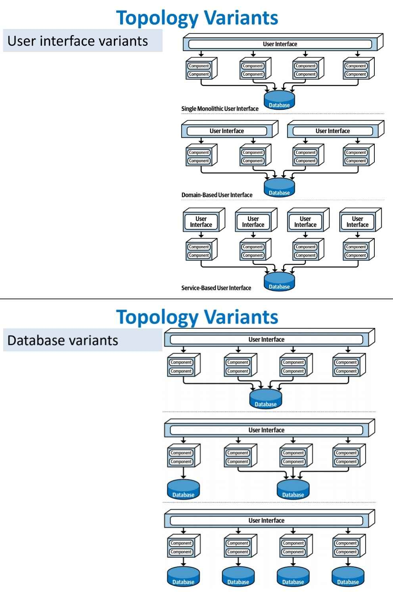
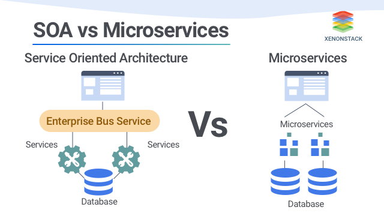
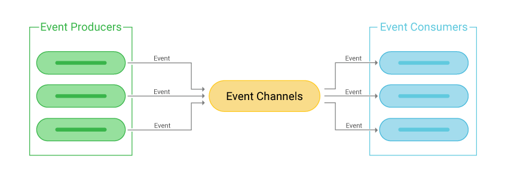

# Architecture Style

## Pipeline and filter
- Filters connected in 1 direction via pipes

## Microkernel
- Core System + Plug-in componenets

## Service-Based
- 

## Service-Oriented
- No duplicated services

## Microservices
- Share nothing

## Event-driven
- 

## Space-based
- eliminates the central database by distributing memory and processing across multiple nodes.
- Dynamic amt of processing unit