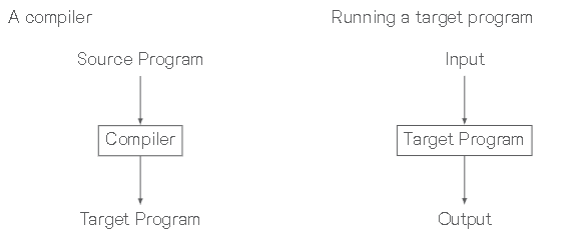
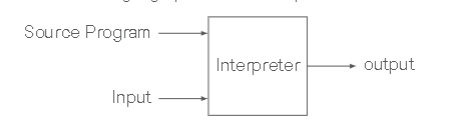

## Compiler
- Translate program from source language to target language(binary)
  - Understand both language's form, syntax, content

## Interpreter
- Unlike compiler, an interpreter executes the code line by line / 

### What an Interpreter Does:
- `Reads the Source Code`: It takes the program's source code written in a high-level language (e.g., Python, JavaScript).
- `Parses the Code`: The source code is broken into smaller pieces (tokens) for analysis.
- `Executes the Code`: Each line or instruction is translated and immediately executed. This is done one step at a time.
- `Handles Errors During Runtime`: If an error occurs, the interpreter stops execution and reports the error without continuing further.
