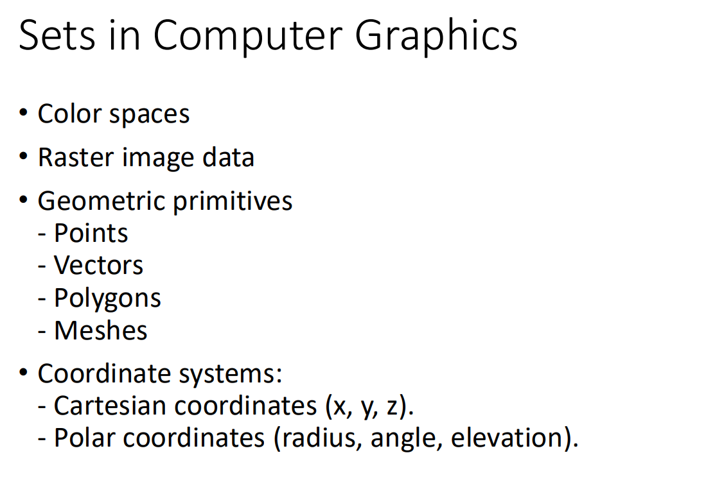
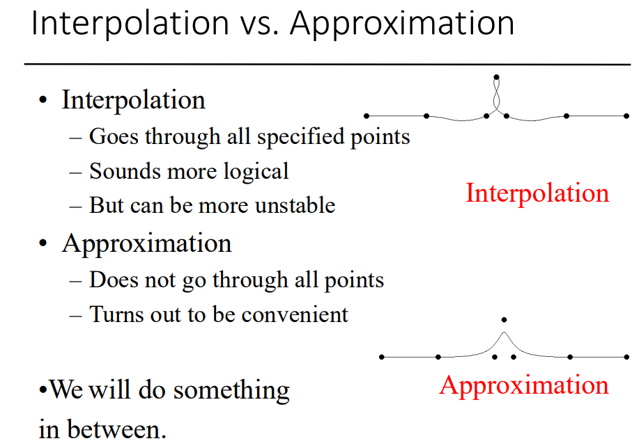
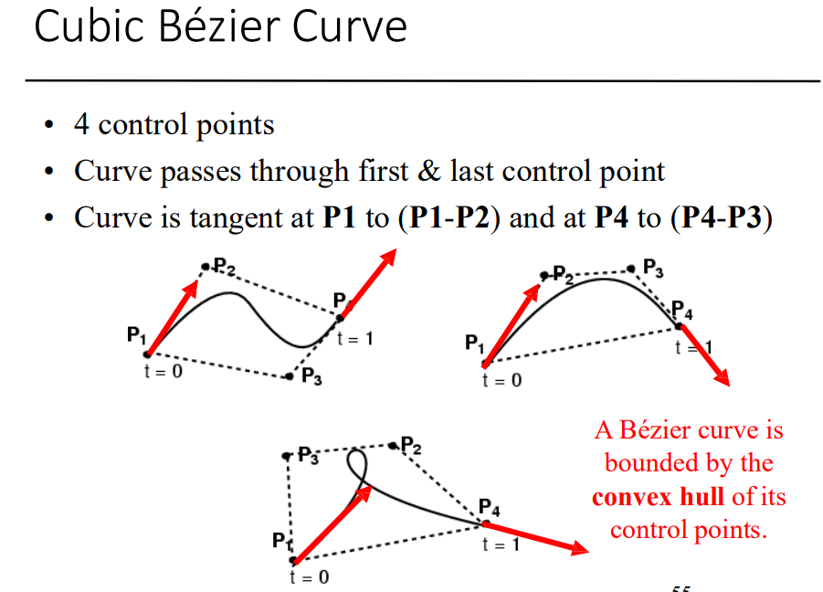

> `anti aliasing` : make object sharp, even with lower screen resolution

> `voxel` : 3d equivalent of pixel

> `Rastering` : convert 3d object into 2d view plane for calculations


# Lecture 2

## Sets in Com graphics


### Properties of set


# Skipping lots of basic math shits

### Global and local frame


- Basically just position based on entire scene or individual object.

# Lecture 3
## Opengl

- GLUT
  - Windowing toolkit (key, mouse handler, window events)
- GLU
  - Viewing –perspective/orthographic
  - Image scaling, polygon tessellation
  - Sphere, cylinders, quadratic surfaces
- GL
  - Primitives - points, line, polygons
  - Shading and Colour
  - Translation, rotation, scalingViewing, Clipping, Texture
  - Hidden surface removal

### Command format


### Creating objects

- glBegin(object type) with points inside
  - GL_POINTS Each vertex is displayed as one pixel
  - GL_LINES Takes successive pair of vertices(lines are disconnected)
  - GL_LINE_STRIP Successive vertices are connected
  - GL_LINE_LOOP Polyline are closed

### Simple, Convex
- 
  - edge(line) cross each other, not simple (last one)
- 
  - GL_POLYGON only works correctly with convex shapes.
  - Non-convex shapes need to be broken down into triangles.

### Tessellation

- Break objects into smaller shapes (mostly triangles in com graphics because triangle has the lowest vertice count, so it's the most optimal shape)

### Commands
Here's a concise summary of the GLUT and OpenGL commands you shared:

### **GLUT Initialization and Window Management Commands**
1. **`glutInit(int *argc, char **argv)`**  
   - Initializes GLUT and processes command-line arguments.  
   - Must be called before any other GLUT functions.  
   - Example: `glutInit(&argc, argv)`

2. **`glutInitDisplayMode(unsigned int mode)`**  
   - Specifies display mode: color model (RGBA or color-index), single/double buffer, and optional buffers (depth, stencil, accumulation).  
   - Examples:  
     - Double-buffered RGBA with depth: `glutInitDisplayMode(GLUT_DOUBLE | GLUT_RGB | GLUT_DEPTH)`  
     - Single-buffered RGB: `glutInitDisplayMode(GLUT_SINGLE | GLUT_RGB)`

3. **`glutInitWindowPosition(int x, int y)`**  
   - Sets the position of the upper-left corner of the window on the screen (in pixels).  
   - Example: `glutInitWindowPosition(0, 0);`

4. **`glutInitWindowSize(int width, int height)`**  
   - Sets the size of the window (in pixels).  
   - Example: `glutInitWindowSize(500, 500);`

5. **`glutCreateWindow(char *title)`**  
   - Creates a window with the specified title and an OpenGL context.  
   - Returns a unique identifier for the window.  
   - Example: `glutCreateWindow("Sierpinski Gasket");`

6. **`glutDisplayFunc(void (*func)(void))`**  
   - Registers the display callback function to redraw the window content.  
   - Example: `glutDisplayFunc(displayCallbackFunction);`

7. **`glutMainLoop(void)`**  
   - Starts the event processing loop.  
   - Once entered, it does not exit, and all windows created are rendered.

### **OpenGL Rendering and Buffer Commands**
1. **`glViewport(GLint x, GLint y, GLsizei w, GLsizei h)`**  
   - Sets the viewport rectangle (in pixels) for rendering.  
   - `(x, y)` specifies the lower-left corner, and `w:h` defines the aspect ratio.  
   - Example: `glViewport(0, 0, 500, 500);`

2. **`glFlush()`**  
   - Ensures all OpenGL commands in buffers are executed immediately.  
   - Especially useful for single-buffered windows to force drawing.

### **Key Notes**
- **Buffers:**  
  - Single-buffering: Draws directly to the screen.  
  - Double-buffering: Uses a back buffer for rendering to reduce flickering.  

- **Callback Functions:**  
  - Registered with GLUT (like `glutDisplayFunc`) to handle specific events (e.g., window updates).

### OpenGL syntax
- Functions:
glFunction: glBegin, glClear, glVertex, …
- Constants:
GL_CONSTANT: GL_2D, GL_LINE
- Datatypes:
GLtype: GLbyte, GLint, GLfloat

#### Example
```
glClearColor(1.0,1.0,1.0,0.0);                     // Background color
glMatrixMode(GL_PROJECTION);                      // Set transformation
glLoadIdentity;
gluOrtho2D(0, 200, 0, 150);
glClear(GL_COLOR_BUFFER_BIT);                      // Clear background
glColor3f(1.0, 0.0, 0.0);                      // Set color to red

glBegin(GL_LINES);                      // Draw line
  glVertex2i(180, 15);                      // - first point
  glVertex2i(10, 145);                      // - second point
glEnd;                      // Ready with line
glFlush;                      // Send
```

## Orthogonal view


## Matrix meaning in different operation


## Bezier curve and spline

### Curve


### Creating curve with a Spline
```
A spline is a smooth curve that is constructed by interpolating or approximating a set of points called control points. The purpose of using splines is to create a smooth, flexible curve that can pass through or near a set of specified points, or even be influenced by them to form a desired shape.
```
- Specified by a few control points
  - Good for UI
  - Good for storage
- 

### Control point
- user specified points to guide the curve
- 

### Tessalation
-  It is easy to rasterize mathematical line segments
into pixels
- OpenGL and the graphics hardware can do it for you
   - But polynomials and other parametric functions are harder
- 
- 

### Interpolation vs Approximation



### Cubic bezier curve

- Interpolate first and last one, while approximate the others
  - 


- verify t = 0 and t = 1


- B shows how much weight, each point has on the real curve at time t
- P1 and P4 was very influential, it solely was taken as the value of the curve at the start and end. 
- P2 and P3 only influence a bit but the value at the time was not exactly.

> It is a linear combination of basis polynomials.
> The opposite perspective, control points are the weights of polynomials!!!

#### Cubic Polynomial


### Matrix vector notation


### Bernstein polynomial


- Sum of all B at time t is 1


- Already understand from before but this is the `definition` one

### How to convert Bernstein to canonical
[4x4 Matrix inversion youtube link](https://youtu.be/95dYWsZEXmM)


### Snap back to reality


### more than 4 control points

- **you will not need this in this class**

### Subdivision of a bezier curve

- This is useful for adding detail
- It avoids using nasty higher-order curves


- Works on not 0.5 too

## Recap of lecture 3`


# Lecture 4

## Raster image
- Raster data is a matrix of pixels
- pixel is picture elements
- 
- 

### Gamma color correction
- 

### Colors
- RGB color
- 
- Alpha
- 
  
**Important formula**
> The formula c = αcf + (1 - α)cb is used for blending, where cf is the foreground color and cb is the background color. 

### Image storage formats


### Bayer mosaic pattern
- 

## Ray Tracing
- Ray tracing is an image-order algorithm for rendering 3D scenes.
- It works by generating rays from a viewpoint through each pixel of an image plane and finding the nearest object that intersects each ray.
- The color of the pixel is then determined by the object's material properties and the lighting in the scene.
- Ray tracing can be used to create realistic images of 3D scenes,including effects such as shadows, reflections, and refractions