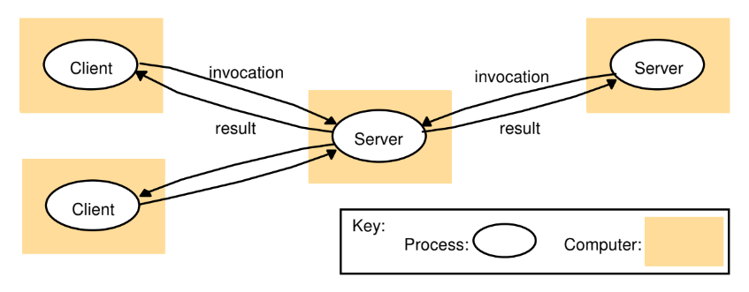

# 29 / 11 / 2024

# Chapter1
# Characterization of Distribution System
- "A distributed application is one in which hardware and software components are located at networked computers. They communicate and coordinate their actions only by passing messages"

### tightly-coupled system
- Homogeneity
  - Systems are close together

### Loosely-coupled system
- Heterogeneity
  - Can have one in chiangmai and one in KMITL
- Autonomy
- Still work together as one whole system

## Computers connected by a network may be spatially separated by distance
- Leads to :
  - Concurrency
    - Should work concurrently
  - No global clock
    - Computer within the networks cannot accurately synchronize their clocks
  - Independent failure
    - Anyone of the components can fail independently
- Desire to shared resource
  - Software : Disks, Printers
  - Hardware : Files, Databases, data objects of all kinds
- Example :
  - Internet
  - Mobile Computing

## Resource Sharing
- Client
- Server
- Remote Invocation
  - Like google search, when you search it will invoke google search remotely
- Will come back later on chapter2

## Challenge
1. Heterogeneity
  - Networks
    - Different networks implements based on common internet protocols
  - Computer Hardware
    - asd
  - OS
    - asd
  - Programming Languages
    - Different languages across the service
- Use middleware too help heterogeneity
  - Program that provides programming abstraction
2. Openness
   - Google is open used but not open sourced
   - Open your system to connect to other people
3. Security
   - When you open your code, you need security to protect your website from the people who wants to take advantage of your app
   - Confidentiality
   - Integrity
   - Availability
   - Concealing the content of the message over the network
   - Denial of service attack - Sending of a large number of pointless requests to a service so that users cannot use it.
   - Security of mobile code – Receiving executable to run (e.g.
email attachment)
4. Scalability
   - Scalable system remains effective when there's significant increase in the number of users and resources
   - Internet is scaling up
   - When system grows
     - Cost of extending physical resources should be reasonable
     - Performance should be predicted
5. Failure handling
   - Failures should be partial
   - Distributed system provides high `availability`
   - *Techniques to handle failure*
     - Detecting
     - Masking
     - Tolerating
     - Recovery
     - Redundancy
6. Concurrency
    - Several clients may attempts to access a shared resource at the same time
    - Shared resource can be managed to take one request at a time but that will limit throughput
    - Should be managed very nicely
7. Transparency
    - User don't have to know the complexity of the software
    - Networj transparency
      - Access transparency
        - Local and remote resources are accessed using identical operations
      - Location transparency
        - Users don't know where the data they are accessing is at
    - Concurrency transparency
      - Processes operate concurrenctly without interfering with other processes
    - Replication transparency
    - Failure transparency
    - Mobility transparency
    - Performance transparency
    - Scaling transparency

# Chapter 2
# System Models
## Architectural Models
- We consider
  - Patterns of placement of components (tasks)
  - Patterns of communication between components
  
## Layered Software Architecture
- 
- Software sercive layers are offered and requested by processes on the same or different computers
- Platform
  - Provides interface for services to the layer above
  - May be heterogeneous, e.g. Sun SPARC/SunOS, Pentium/Windows, Pentium/Linux, PowerPC/MacOS
- Middleware
  - processes or objects in a set of computers that interact with each other to implement communication and resource sharing support.
    - Do marshalling, Unmarshalling
      - XDR(external data representation)
  - Masks heterogeneity.
  - Provides programming model for applications and building blocks for construction of applications (e.g. remote method invocation, group communication, notification of events)

## Client-Server
- Servers maybe clients to other servers
  - Web server is client to local file server and DNS
  - Search Engine(It's crawler) is client of other Web servers.
  - 
    - White is softwar and brown is hardware

## Service provided by multiple servers
- Set of objects on which the service is based is partitioned into multiple servers:
  - A browser can access multiple Web servers.
  - A Web server maintains consistent updates of its replicas.
  - You search google on 2 pc at the same time, it will give different answers
  - 

## Proxy Servers and Caches
- Proxy is an agent, you ask things from them and they go ask servers for it so you dont need to ask the server
  - Can be security filter (firewall)
  - 

## Peer Processes
- Bit torrent
  - Large file chopped up
  - You send to friend each pieces
  - 

## Mobile Code
- Applet code is stored on Web server. Browser downloads it and runs when a link is selected.
- It gives good interactive response but is also a security threat; browser gives applet limited access to local resources.
- 
- Code(Applet code) is mobile(Downloaded on your device)

## Mobile Agent
- App is mobile
- It is a running program (code and data) that travels from one computer to another to carry out some task on someone’s behalf: 
  - To collect information
  - To install or maintain software
- It may invoke resources at each site it visits.
- There is a reduction in cost and time by local invocations, instead of remote ones (e.g. when transferring large amount of data).
- The site decides on which local resources are allowed to use based on the identity of the user on whose behalf the agent is acting.

## Network COmputer
- Typically, having application files and local software at a local computer requires the user to have technical skills to maintain.
- To reduce management cost, a network computer downloads operating system and software from a remote file server.
- Applications are run locally but the files are managed by a remote file server.
- The user can migrate from one computer to another to work.
- A disk may be used at a local computer as a cache, holding recently loaded software and data files.

## Thin Clients

# Spontaneous Networking
- You at uni, ur wifi connects to uni wifi
- You go car, ur bluetooth connects to car BT
- 