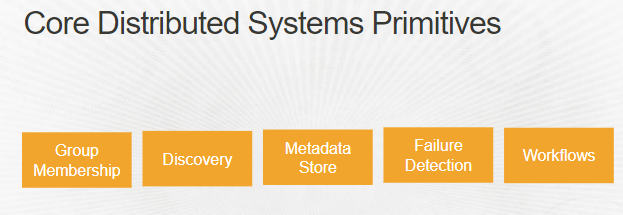
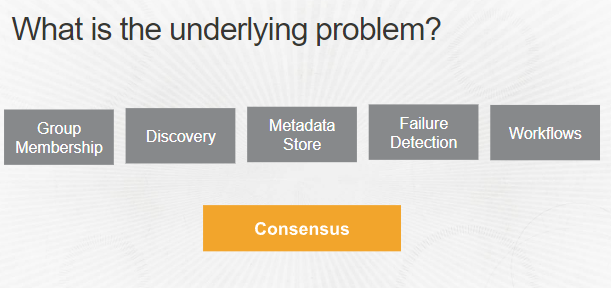
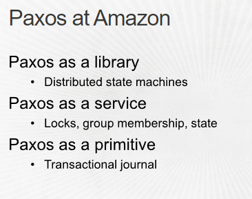
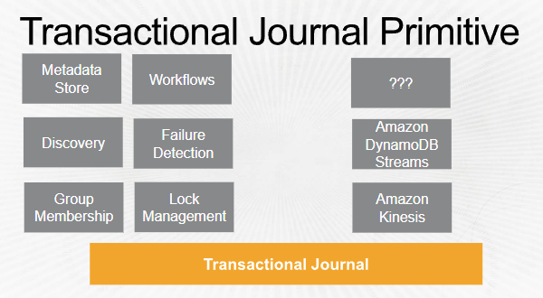
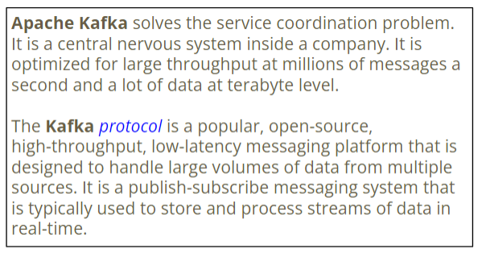
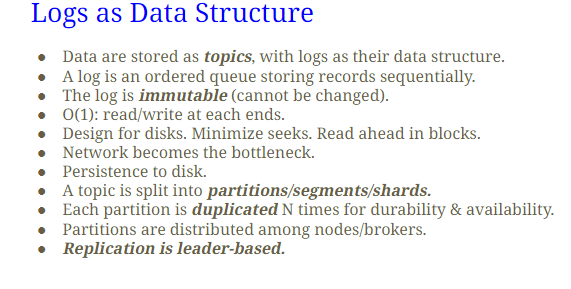
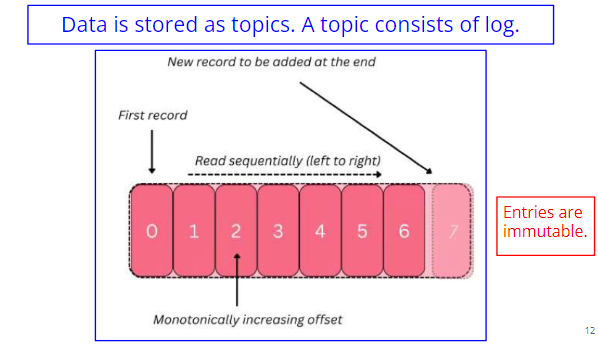
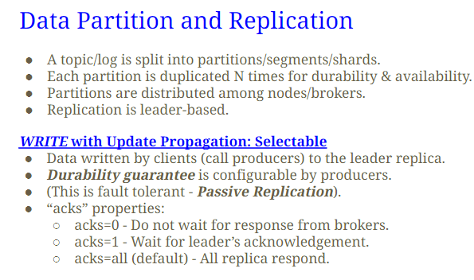
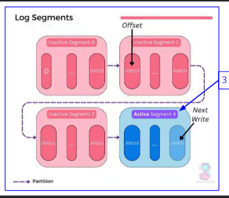

## Group membership
- Adding a new member to the group
- Removing a member from the group
- Discovering when the group membership changes
- Discovering roles within the group

## Discovery
- To look up the resources(services, either software or hardware) available for your app
- also look up other group members
- Can be a `config file`, `DNS`, `Gossip protocol`
  - DNS take long time to adapt to changes
  - DNS is static
  - Config file popular, but won't work with big system

## Metadata Store
- Store metadata
- Use amazon dynamoDB

## Failure Detection
- use heartbeat
  - if traffic all the times, all good
  - if silent, shit happens
- Use lease, not locks
  - If you lock some resources and app crash, it stays locked
  - if you lease(lock that can expire), when crash, it can unlock

## Workflow
- To execute a series of actions asynchronously
- Like a transaction, it's a long session
  - 
  - Work are stored in metadata (nowadays use cookies) and saved for you

# What is problem?

- Consensus
- Make sure to use paxos(consensus protocol) in app development
  - 
- 
  - Transactional Journal = Recovery file

# Apache zookeeper
- Distributed system needs coordination, zookeeper does that for you using hierarchical namespace
  - You have things that you want to lock, you put it in hierarchy. if things on second hierarchy is locked, all sub members are locked
- Same as how semaphore coordinate writer/reader problem in OS

# didn't listen to zookeeper

# Apache Kafka
- realtime analytic system(pipeline)
  - Data fromm multiple sources is  ingested, processed, analyzed
- Ex.
  - Financial app, analyze data and make trading decision
  - Social media, analyze and make realtime recommendation
  - IOT, analyze data and trigger real time actions
- reliable log system
  - Do replication on the logs
  - Want high performance, only lock the log that you wants to update for high performance.
- on premise deployment, inhouse

## Apache Kafka vs kafka protocol
- Apache kafka solves the service coordination problem
- Kafka protocol
- 
- 
- 

> entries of logs are immutable
- immutable because expensive to write / update. because updates/changes are propagated eagerly
- When reading the front of the queue, you can lazyly write/update at the end of the queue
  - So faster, good performance because immutable
  - Simple idea but effective

- ack = 0 means leader don't care, use for streaming servicecs where you just feed data to users
  - Like UDP
- ack = 1 means wait for

