# 29 / 11 / 2024


# Distributed Programming Model
- Programming model is either RPC or RMI
  - Remote procedure call (RPC) – Extension of conventional procedure call model 
  - Remote method invocation (RMI) – Extension of objectbased model

## Middleware layer
- RPC and RMI provides location transparency
- The protocols are independent of the transport protocols. 
  - RMI is based on request-reply protocol which can be implemented over UDP or TCP.
- Some middleware (like COBRA) allows more than 1 programming language for the app
  - by using interface definition language (IDL)
  - Difficult to write and maintain. needs 5 programmer for 5 languages

# Interface
- Specify procedure and variable that can be accessed from other modules
  - Don't access variables directly (instead, access them with getter and setter procedures)
  - Don't pass pointers as arguments or as a return to remote modules. When function ends the object might be deleted
  - For RMI, objects can be passed as arguments or returned as results of methods. Moreover, remote object references may also be passed.
- Boundary between two interface
- Allow two system to communicate
  - Ex. door
    - procedure : grab and twist door
  - Ex function
    - input variable + procedure on what to do with it before it returns

# Local Invokation vs Remote Invocation
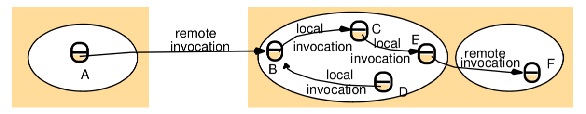
- yellow boxes are computers
- white circles are processes
- A, B, C, D, E, F are objects
- some objects in a process can receive remote invocation, others only local invocations
- Objects need remote object reference(remote address) (computer address, port, process number in order to access the service)
  - Ex. local call don't need remote adddress, only know 127.0.0.1, while remote call will need the address
- Remote interface specifies which methods can be invoked remotely
- 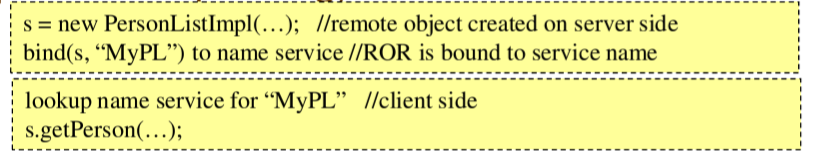

## Remote Interface
- 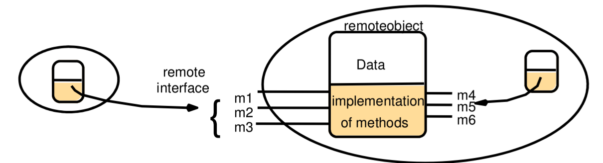
- You build a service and have 6 interfaces, you have to explicitly specify which one can be invoked remotely, which one can't. So the middleware can takecare of it.(Things like, marshall, unmarshall, XDR)

### RMI invocation semantics
- 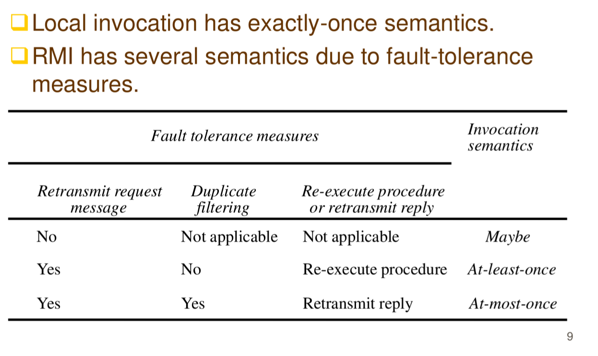
  - `Important`, stick on top of ur bed
  - Fault Tolerance Measures : How do you garuntee your invocation
  - normally, resent only like 15 times before showing request timed out
  - Duplicate filtering is from serverside. If youi repeat the request, thse server will drop the duplicated requests
  - At-least-once semantic does not work with non-idempotent operations, since they might not give same reply everytimes
  - At-most-once semantics suffers from crash failure. 
  - CORBA and Java RMI have at-most-once semantics (but CORBA allows maybe semantics if requests do not return results). 
  - Sun RPC has at-least-once semantics.

## RMI Implementation
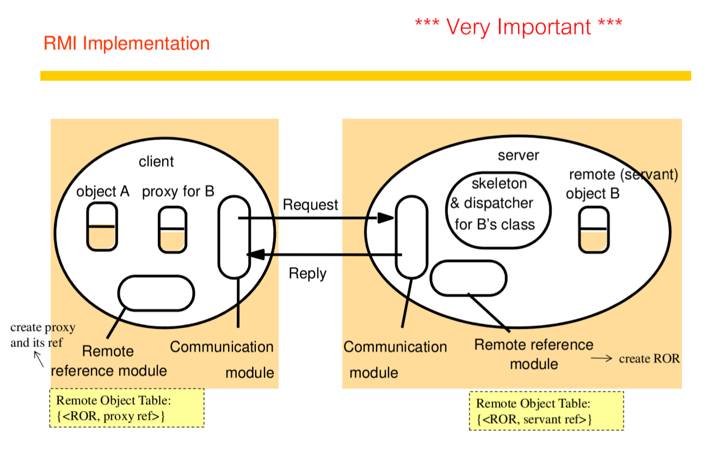
- `Important` Always on midterm
- These are middlewares to help A remotely invoke B
- A get proxy code for B, proxy initiate request and reply to B
- Remote reference module creates proxy for B
- After recieve request, server will select a dispatcher associated to wanted object and pair them
- Skeleton will mimic object A's call on B
- object B is called by the skeleton paired with A

## Remote Reference Module


## Interface Processing
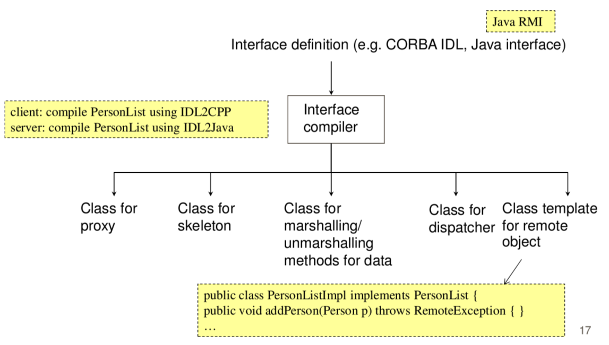
- Structure of creating an interface
- interface is send to interface compiler and generate these 5 things

### Java RMI
- 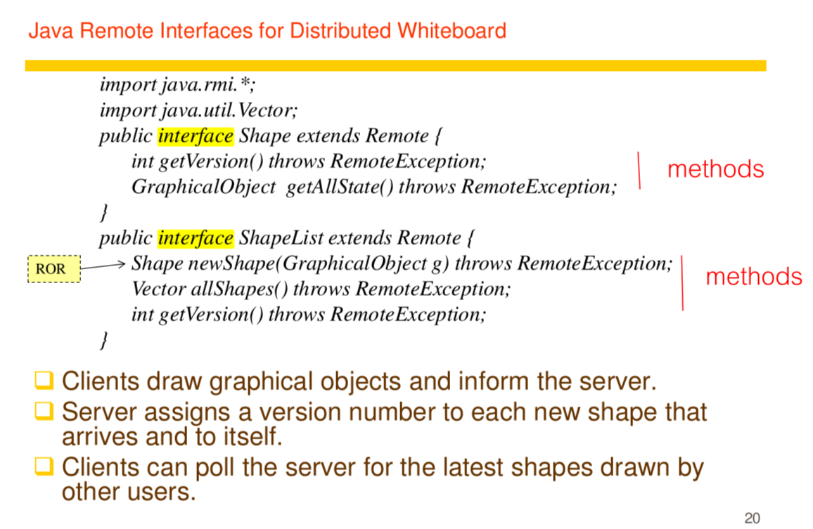
- ROR - Remote object Reference
- Parameter passing 
  - Any object that implements Serializable interface can be passed as parameters
    - A new deserialized object wiill be created in the reciever process and its method can be invoked locally
    - Primitive types are serialized when being passed. 
    - Remote object references are passed if parameters are remote objects
- 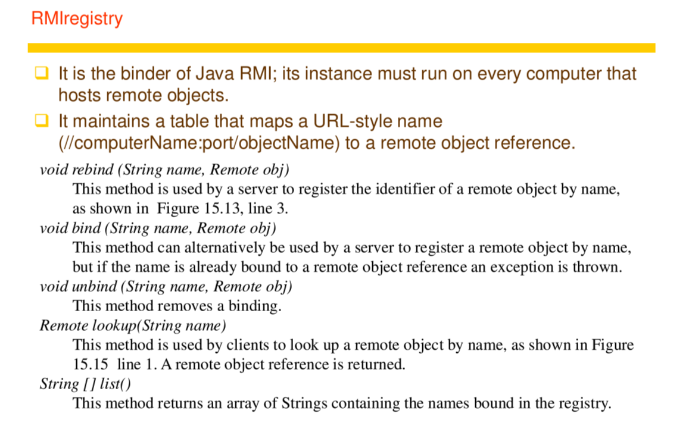
> `Programmer are people with high ego, they won't use normal vocabs. They have to invent their new words`

## Sun RPC
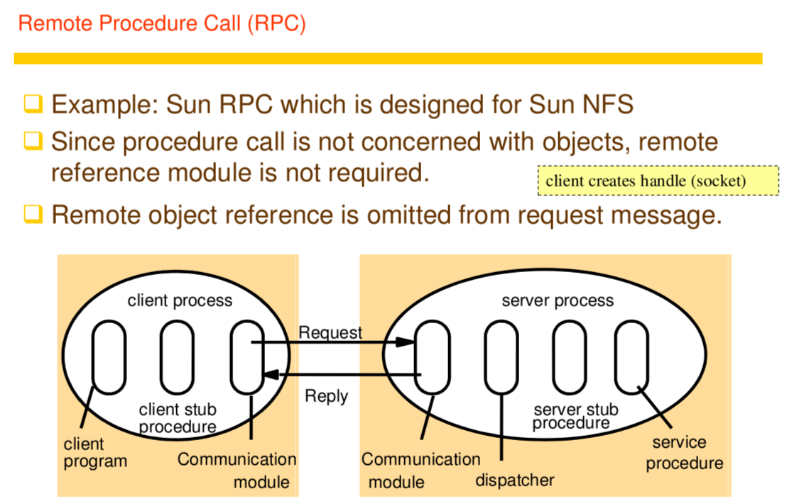
- very old, by sun microsystem
- similar to dropbox or gg drive
- one of the first RPC system
- remote procedure call use at least once

# Examples on interprocess communication
## Web service
- old, complex
- Remote invokation system to web
- 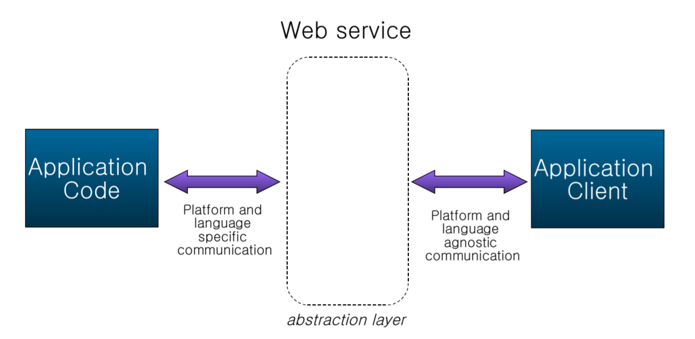
- Based on Web standards
  - HTTP/(S), XML, SOAP, WSDL, UDDI 
  - Can be implemented in any language on any platform
  - Component-like, reusable
  - Not tied to any platform / languages

- 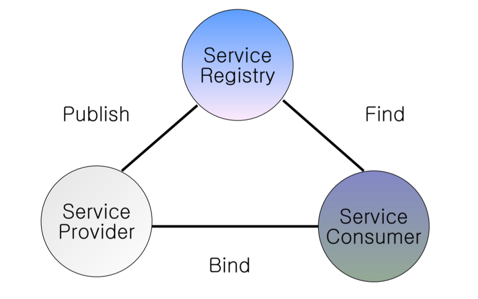
- service provider build and publish to service registry
- service consumer search from service registry and bind the found component with service provider

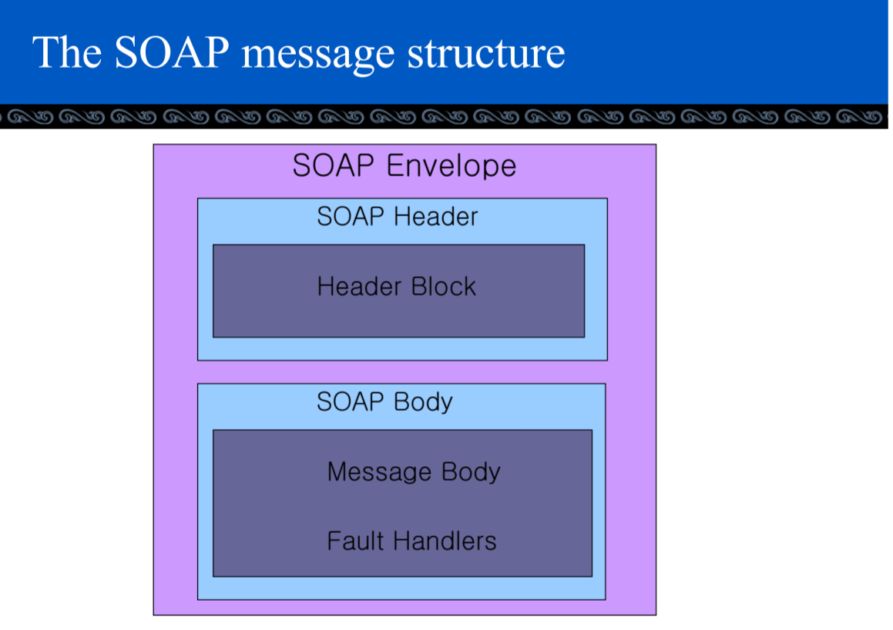
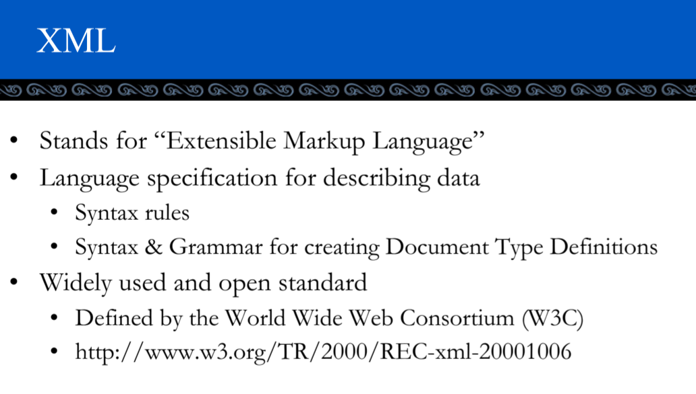
> HTML is the descriptoin of page, XML is description of data

## REST (Representational State Transfer)
```
midterm project
- pond : service
- fish : message
- fish go from pond to pond
```
- Web service is hard but with REST :
  - simple to understand
  - more home made approach to Interprocess communication(IPC)
  - used to design HTTP
  - HTTP can also be used in a non-Restful way (like SOAP)
- 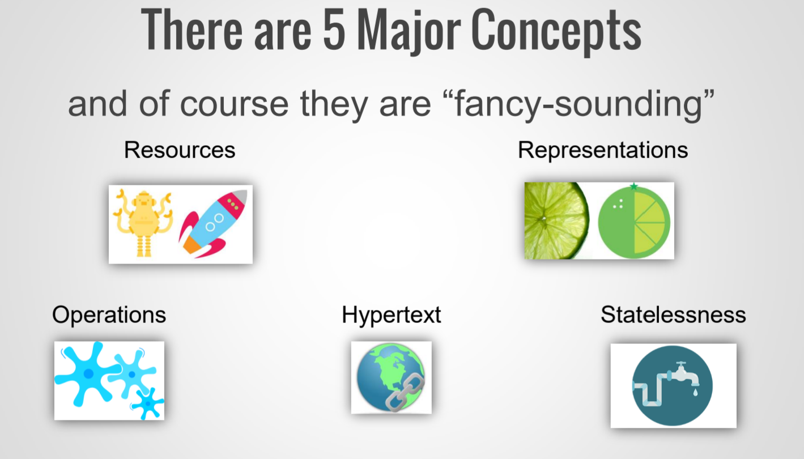
  - operation : what you do with resources
  - Hypertext : structure of the page
  - Stateless : Don't keep previous state
- Every “thing”, every “resource” gets an identifier (URL)
  - /game/robots/four-hand-george
  - /game/spaceships/destoyers/98
- 