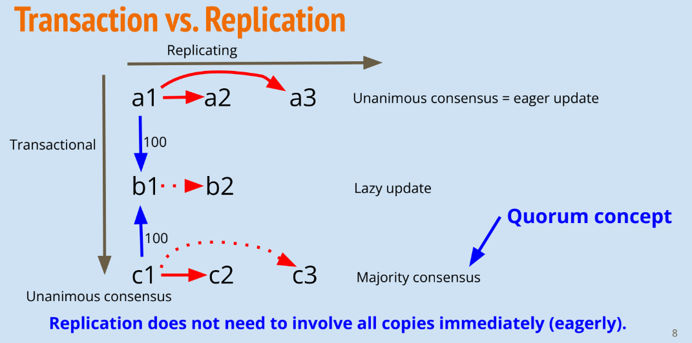
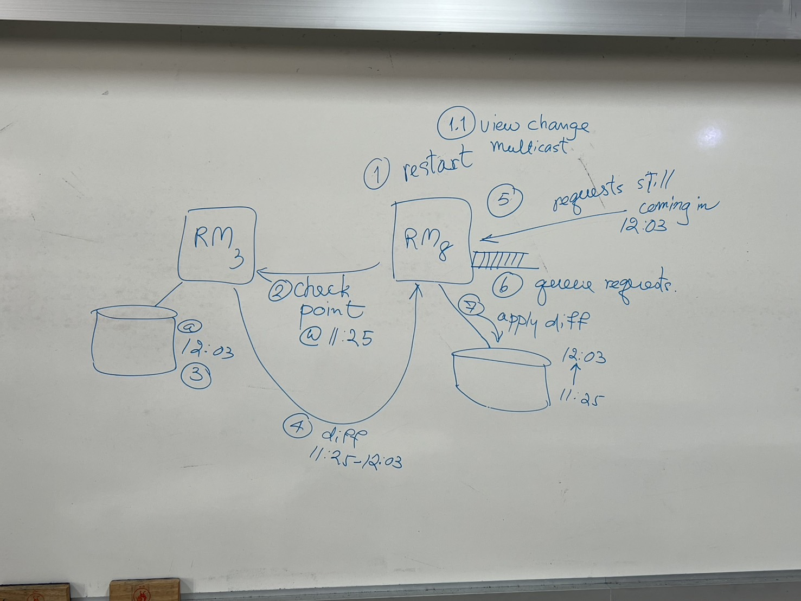
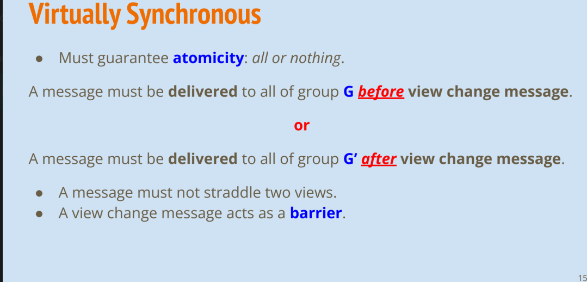
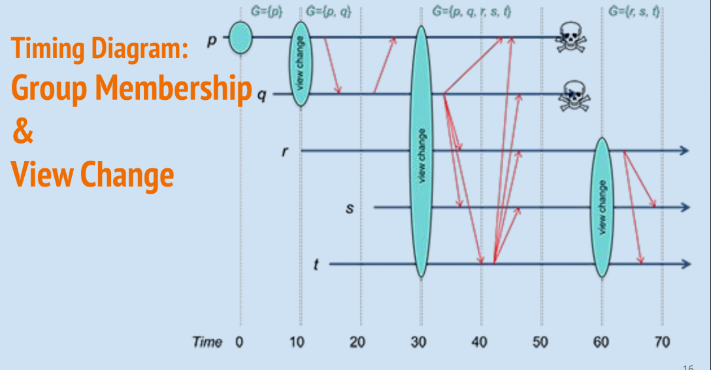
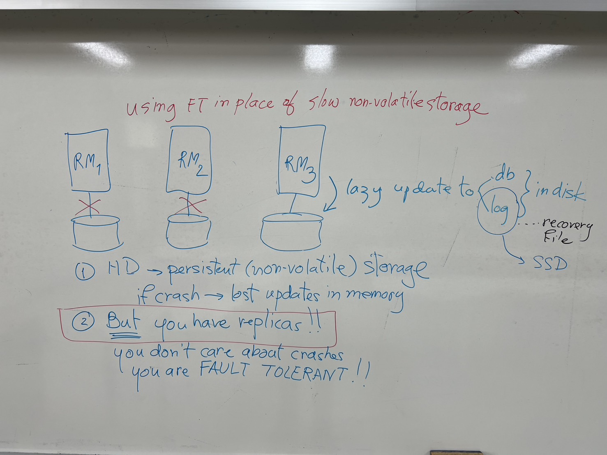

# Models of Replication

1. Transactional Replication
2. Replicated State Machine
3. Virtual Synchrony
4. Quorum / Consensus

# Current and distributed transaction
## Concurrent transactions
- use concurrency control
  - 2 phase locking
  - optimistic concurrency control
  - time stamping

## Distributed transactions
- use 2 phase commit
> Transactions are ACID: begin( ), commit( ), abort( )

# Tranasactional Replication Model
- 8 data item has to be part of the transaction
- In a transaction,  can't use majority. Have to finish the transaction with all 8 of them.
- This is eager update approach. Very expensive, very slow, prone to failure.
- 

# Virtual Synchrony
- Atomic multicast to all members of current group view.
- Atomic multicast = reliable & totally ordered.
- Group view - live processes capable of communicating.
- View change message - when a process leaves or joins the group.
- A joining process uses checkpoint request to get latest state from another process in the group.
> contain multicast group and isolate them from each other

- Must agree on atomicity

- view change protect you from inconsistency
- if after, will be delivered to another group g'

- Will be complex if r wants to send to p and q, but they died
- This method, they just kick these replicas out from the quorum(group)
- help in fault torrerant system.
- At least one replica working

## Optimization of Virtual Synchrony

- Data is replicated in memory instead of persistent storage disk
- How you speed up the system
- Disk(memory) is inexpensive, so keep DB
- SSD is expensive, you write log(recovery file)
- Lazy update may not be up to date