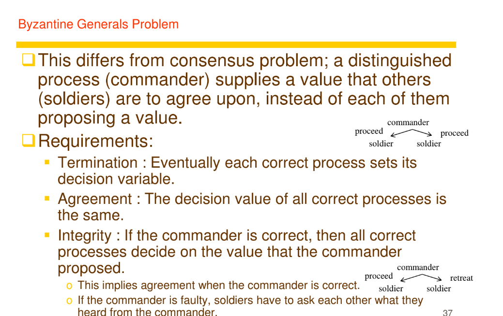

# 27 / 12 / 2024

## Total ordering with a sequencer
- when a process wants to multicast, it ask sequence number from sequencer
- have total ordering because the order will be same as the sequence
- order the messages before they are sent

## Total ordering with ISIS
- Every process that wants to multicast will send message to ask each reciever
- each reciever will propose a sequence number
- multicaster choose based on each process's local clock (time)
- `Fail if there are lots of processes`

- this example is an open ggroup (I think outsider can multicast into the group)

- each reciever (this ex is p3 and p4) has latest proposed number an dlatest agreed number
- `i is the identifier of the message`
- p3 recieve m1 before m2 so it's first in hold back queue
- p3 proposes (1, 3) already so it proposes (2, 3) to P1 and (3, 3) to P2
- on the other hand p4 recieves m2 first
- So p4 proposes (2, 4) to m2 and (3, 4) to m1
- P1 will select P4 because it's the latest proposed number

- 

- sort based on timestamp and move to delivery queue

### dont try to use this if possible
- Difficult to implement
- Prone to errors

- in DC, there's independent failure, these partial failure may leads to breaking the agreements
- Make sure agreements are reached even when there's independent error

- Crash failure : whole process crashes
- Byzantine failure : process still running after error, may send wrong message to server

- consensus : most process agree on the result
- you can either have unanimous or majority consensus
  - majority : mosts / more than half votes
  - unanimous : everyone agrees
    - difficult, if some process doesn't respond, not gonna get all vote

- everyone send vote to consensus and consensus alg chooses
- ISIS use for this kind of agreement thing (right pic)
  - P3 wants to abort, but by major consensus the other 2 (majority) wants to proceed, so P3 has to proceed

- consensus alg but byzantine failure

- 1 commander and 2 soldiers(p2 and p3)
- left side
  - p3 is the process with arbitary failure
  - p3 somehow recieves `v` but send to confirm with p2 with `u`
- right side
  - commander send different message to p2 and p3
- In both case, it's hard to debug which one is the arbitary failure
- **Magic formula** : Agreement can't be reached with N <= 3f in an unsigned environment
  - N is number of processes
  - f is failure process
  - 2 <= 3 so agreement can't be reached

- Agreement can be reached when N >= 3f + 1
- left
  - P3 fails
  - everyone can verify that p3 fails
- right
  - commander fails and give everyone different results
  - the messages becomes null

### Problem is messages rfom commander is unsigned
- Everyone can falsify the commander's message
- 

