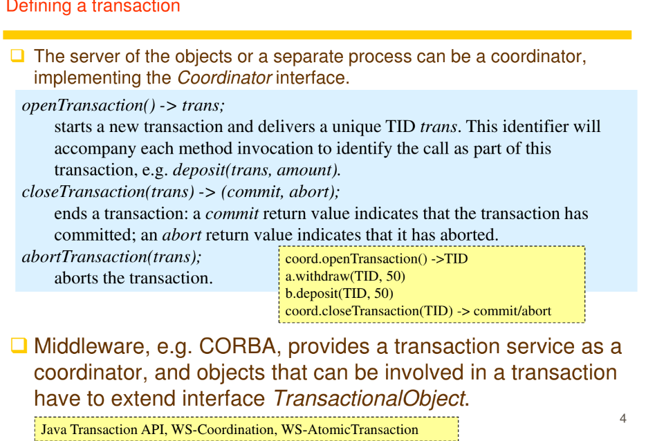
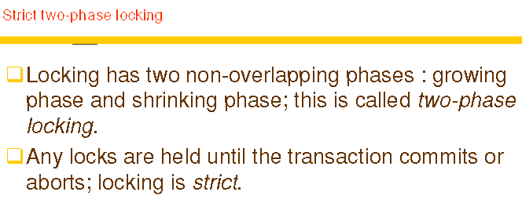

# 1/3/2025

# Transaction and Concurrency Control
> Consistent : computing 2 + 2 millions of times and it's still 4

- Sometimes clients want a sequence of seperate requests to a server to be treated as a single unit
- That single unit is a transaction
- 
  - These 4 operations are treated as 1 transaction
  - All or nothing
  - Either all 4 operations are executed successfully or everything fails and the transaction gets rolled back


- Coordinator manages transactions
- you ask coordinator to open / close / abort the transactions
- when opening, the coordinator will return the transaction (id?)
- when closing they will send commit or abort depending on hte status of the Tx
> Each Tx is not aware of other Tx, but with `middleware` it will provide coordinators to talk to each process processing Txs

#### Concurrent transactions may interfere with each other if they are not controlled properly and intermediate effects can be observed.
- Lost update
- Inconsistent retrieval
- 


- Lost update problem in DB
- Serial Execution / Sequential Execution
  - One Tx should finish before the next Tx starts


- u1 u2 t1 t2 t3 u3 
- Move u3 up
  - u1 u2 t1 t2 u3 t3
- These interleaving equivalent with serialy(sequentially) Execcuting them
- Moving u3 up again til above t1, will become serial, and you can do them separately
> In this example, you can only move u3 up and not u1 and u2 down, or else the update will be wrong

## Exam guide
```
- mention dinosaur footprint example
  - Jurassic park writer made this movie successful by making the two transaction concurrent (dinosaur's footprint millions years ago concurrent(happen same time) as archaeologist read)
  - dinosaur's write preceeds the archaeologist's read
- Concurrency control
  - make the dinosaur stop, so it does not step on the guy
  - wait for the guy to move first
  - Check the timestamp of the data
```


Process T : timestamp 18
Try to read from
Process X : timestamp 24
cannot, because monotonically cclock
can not go back in time, only increasing
So abort Process T and it start again with maybe timestamp 34

> Tx can only be committed when concurrency control say ok, there is no anomaly.


- Locking serializes the process.
- you can lock the whole DB or some part of the DB depending on granularity.
- locking only some part has overhead



- Do this castle pattern
- Prevent others to see ur temporary result(locking)


- not possible in DC where 100+ processess running at the same time
- Can only do detection


- check for cycle from time to time with wait-for graph
- kill one or more Tx to break the cycle
- It's ok to kill the Tx because the part that executed is on the tentative version, not the real database
- You may choose the oldest to kill, or the one with the most interference to another cycles


- You may use time out for the locks
- Ecah transaction can't hold the resource for more than 'x' time


- W holds lock on B
- locks on B time out
- W gets aborted
- V obtain locks on B
- V can progress til finish and unlock B and C
- then U will finish, unlock C
- T can now promote read lock to write lock and finish
- W can eb reexecuted and take C


- For system with not many conflict
- Process do whatever they want, concurrency control doesnt care. But if it create ocnflict / disobeying the concurrency control rules, then the tx will be aborted
- Don't enforce rules, just confirm that the happen-before relation is ok at the end of the Tx


