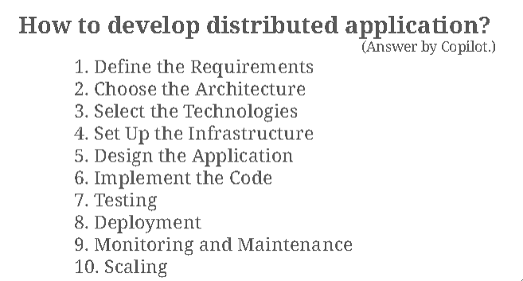
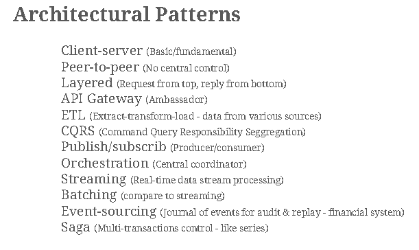
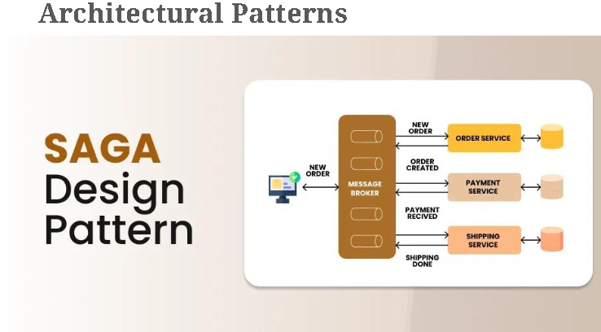
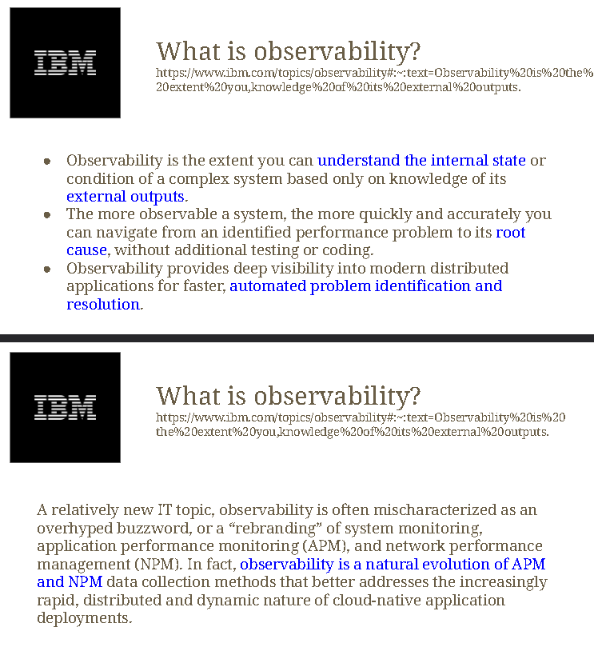
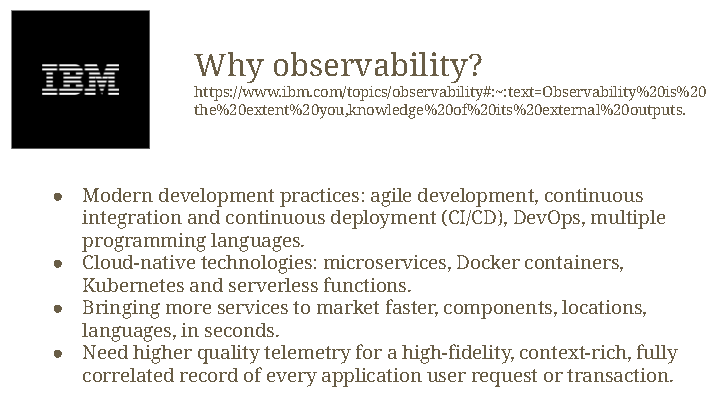
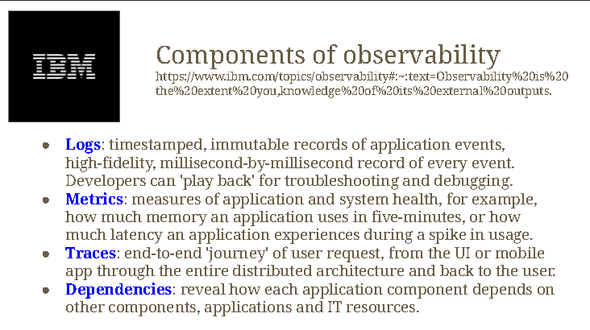
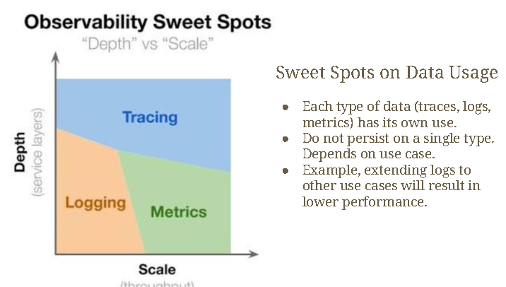

# 17 / 1 / 2025




### ETL
- Many sources of data(Databases). They have different structures. Some are relational, some are not. ETL Extract, transform and load the data into the centralized DB


- For when no have cooperating rules with other servers
- Can't undo a transaction
- Execute a new transaction to undo / compensate instead
- Bank A make a transaction to Bank B
- When the Tx is completed, it waits for ACK. If no AK sent from Bank B, Bank A make a new undo-ing transaction to revert the account back to it's original value.
- Very complex
- Very hard to design saga.
- If bro have 3 mil in account.
  - bro recieving 1 mil at 11.59am.
  - bro's interest rate supposed to be calculated on 12 pm
    - 10,000 interest / 1 mil
  - bro's Tx fails, bro lost 10,000 from the lost transaction at 12pm

```
- why can't million fish?
graphic buffer
DB size
```



> telemetry : long distance measurement


- logs : immutable, can't be changed


- Depth is how observable the app can be' 
- more depth =  more tracable