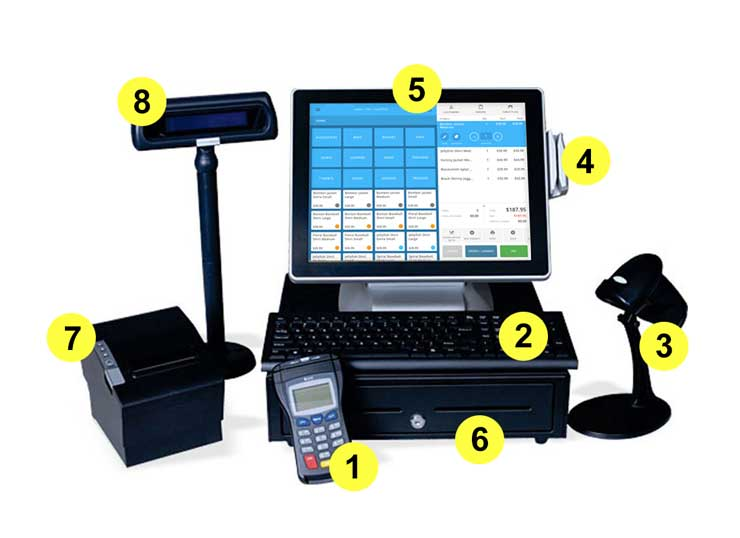

# 26 / 11 / 2024

# Course Evaluation
- Report : 30%
- Participation : 20%
- Final Exam : 50%

# What is Software
- Solution to a problem

## Think of
- What details we keep, what details is not important for users to see and we can cut.

## Build the right thing
- users get what they want (not just customers)
- who are your users
- what they want
- why they want what they want
- How do we deliver the product right
- How can we do it in time and in budget
- How can we determine what's right
    - get to know ur user and what they want

### *Communicate what you know / learned to other developers*

> users are users that interacts with the software, actually uses the app.
> customers are the one who pays for the product, (investors)

### Ex. POS

- point of sales system
- customers analyzes the area the system is located
    - how good is it working.
    - They want to know if it's worth investing

## Software Development Process / Software Development Life Cycle(SDLC)

### planning
- Inception (Formulate Ideas)
    - What are we going to do
        - very high level
    - Ex. rider app to get taxi
    - Like grab?
    - Why don't you use grab then?
- Project planning
    - Identify work plan
        - How much time
        - How much budget
    - Software Project Management Plan(SPMP)

- Sometimes idea is not bad but when time / budget is not worth it, you should stop it there
- If it suck, it suck

### Requirement Analysis
- Obtain product detail from customer
- Some project stops here too
- Requirements
- functional / non-functional

### Design

### Implementation
- Code

### Testing and Deployment
- Unit test
- System test
- Integration test

### Maintenance

## People
- Bubsiness management : Talk to customer for requirements. May not have technical knowledge
- Project Manager : Plan / Track Project
- Dev Team : Dev / Maintain
- Customers : Pays for the project
- End users : Uses the project
