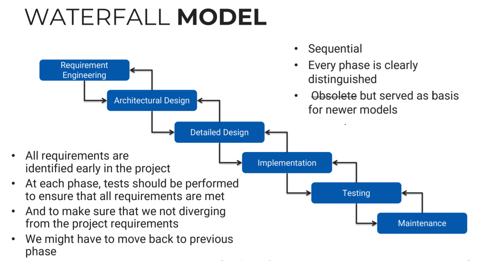
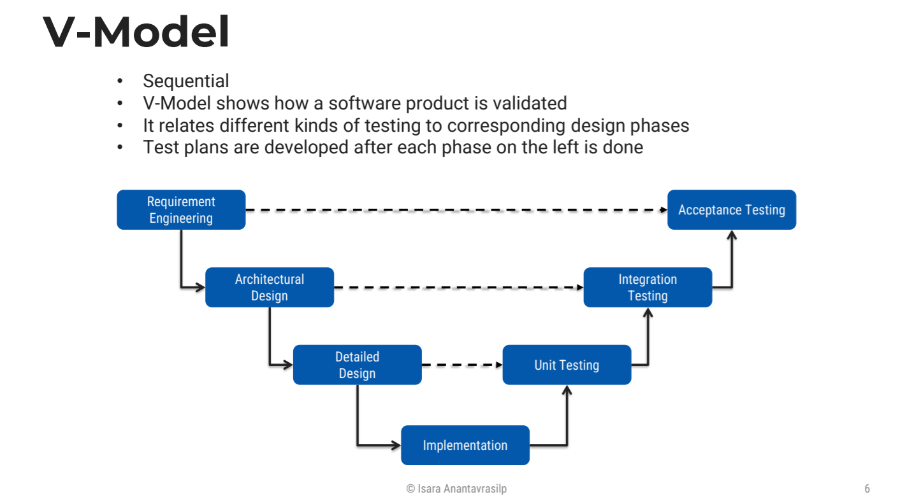
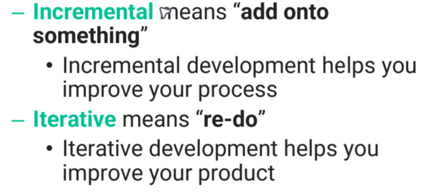
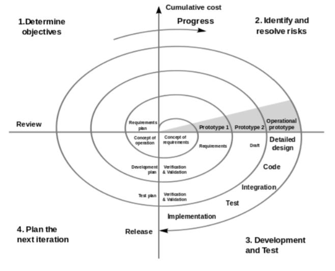

# 3 / 12 / 2024

# Sequential Models
## Cons
- Slow
- Clumsy
- no feedback til users get the result
- Can't do things in parrallel, so spend more time and cost

## Pros
- Simple
- Easy to manage
- Good for short projects

# Waterfall Model

- Can go back and forth between steps

## Requirement Engineering
- Spend very long time on this step, because coming back to this step means throwing away lots of things in other steps.
  - Cost more if this stage fucked
  - May be 8 months extended to years
    - bad
- Purpose design, talk to people
  - Everyone has to agree to the design
- there're always idiot users. Fuck them
  - [text](GR5m-uFasAA2feo.jfif)
  - If this is them, double fuck them
    - Triple
## Architectural Design

## Detailed Design

## Implementation

## Testing

# V Model

- Testing throughout the development
- Main difference from waterfall is the continous testing 

# Iterative and Incremental Models
- Start with small portions of the project
- Repeatedly adding the other portionsto the project
- 

# Spiral Model
- 
- Waterfall but risk driven