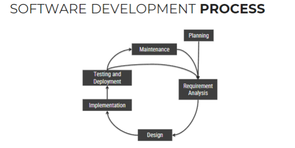
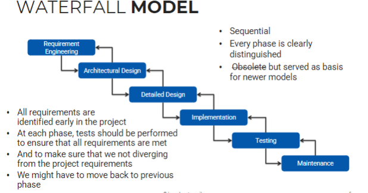
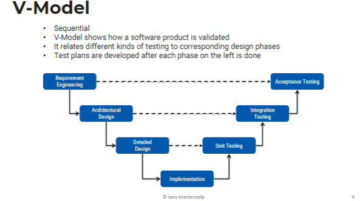

## **Summary of Lecture 2: Sequential and Iterative/Incremental Models**

#### **Software Development Process Overview**
- The software development lifecycle consists of **Planning, Requirement Analysis, Design, Implementation, Testing & Deployment, and Maintenance**.
- 
- The development process depends on the **complexity and length** of software projects.

---

### **Sequential Models**
#### Pros
- Phases are well-defined and **executed sequentially**
- We will **not proceed** to the next phase unless the **current 
one is done**
- Each phase has **specific deliverables** and **review process**
- Easy to manage and understand
- Easy to quote prices and cash-out
#### Cons
- **Requirements must be known beforehand**: 
  - Does not work with projects we don't know shit about
- **No feedback from stakeholders until testing phases**
- **Problems might not be discovered until testing**
- **Lack of parallelism**: 
  - team members must wait until other teams finish their work

1. **Waterfall Model**:
   - Follows a strict phase-by-phase approach.
   - All requirements are identified early.
   - Testing ensures adherence to initial requirements.
   - **Pros**: Simple, structured, easy to manage.
   - **Cons**: No early stakeholder feedback, problems may appear late.
  

1. **V-Model**:
   - A sequential model that emphasizes validation and verification.
   - Each design phase is linked to a corresponding testing phase.
   - **Pros**: Clear test planning, structured.
   - **Cons**: Inflexible, costly to change requirements.

---

### **Iterative and Incremental Models**
1. **Spiral Model**:
   - Combines Waterfall with a risk-driven approach.
   - Includes multiple iterations, with risk assessment at each cycle.
   - **Pros**: Risk management, adaptable, good for large projects.
   - **Cons**: Requires expertise, expensive risk analysis.

2. **Prototyping**:
   - A partial implementation to test key concepts before full development.
   - **Types**:
     - **Illustrative Prototype**: UI mockups for client feedback.
     - **Functional Prototype**: Minimal viable product, expanded over time.
     - **Exploratory Prototype**: Created to explore new ideas.
   - **Pros**: Identifies risky areas early.
   - **Cons**: Costly and complex if overused.

---

### **Software Development Risks**
- **Schedule Risks**: Delays due to poor estimation, changing requirements, or resource issues.
- **Budget Risks**: Costs exceeding estimates due to mismanagement or unforeseen expenses.
- **Operational Risks**: Problems in team management, collaboration, or workflow efficiency.
- **Technical Risks**: Issues with software functionality, new technologies, or changing requirements.

---
### **Prototyping (from the slides)**  

#### **Definition**  
Prototyping is a **risk-management technique** involving a **partial implementation** of the target product before full-scale development.  

#### **Uses of Prototyping**  
- Identifying **risky parts** of the project.  
- Understanding **customer requirements** more clearly.  
- Gathering **look-and-feel feedback** for GUI design.  

#### **Types of Prototypes**  
1. **Illustrative Prototype**  
   - Develops the **user interface** with storyboards.  
   - Can be implemented on paper or using a UI builder.  
   - Good for **early client discussions**.  

2. **Functional Prototype**  
   - Builds a **working system** with minimal functionality.  
   - More features are added incrementally.  

3. **Exploratory Prototype ("Hack")**  
   - Implements part of the system to learn more about requirements.  
   - Useful for **paradigm-breaking** projects.  

#### **Pros & Cons**  
✅ **Advantages**  
- Helps identify risks early.  
- Useful for gathering feedback before full-scale development.  
- Can clarify requirements before full implementation.  

❌ **Disadvantages**  
- Can be **expensive** and complex if not well managed.  
- Should only be built if the **development cost is low** and the expected value is high.

### **Keywords**
- Software Development Process
- Sequential Model
- Waterfall Model
- V-Model
- Iterative Model
- Incremental Model
- Spiral Model
- Prototyping
- Risk Management
- Schedule Risks
- Budget Risks
- Operational Risks
- Technical Risks