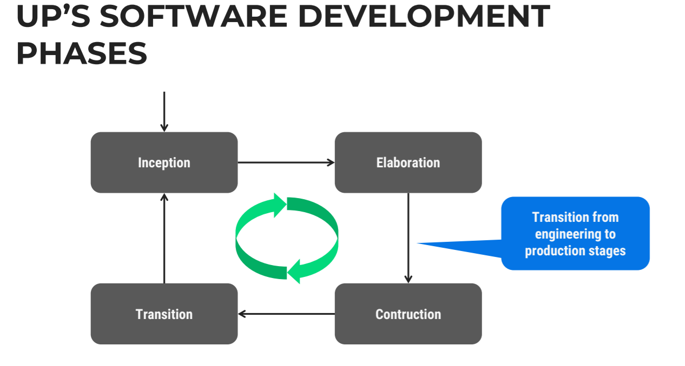
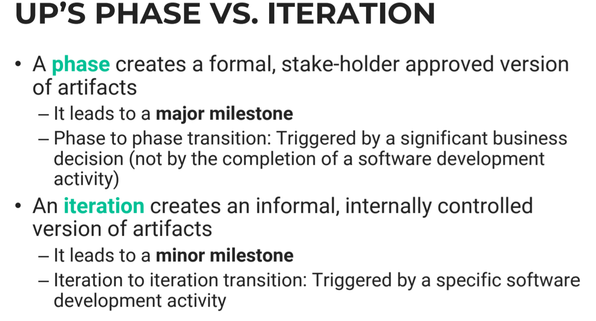
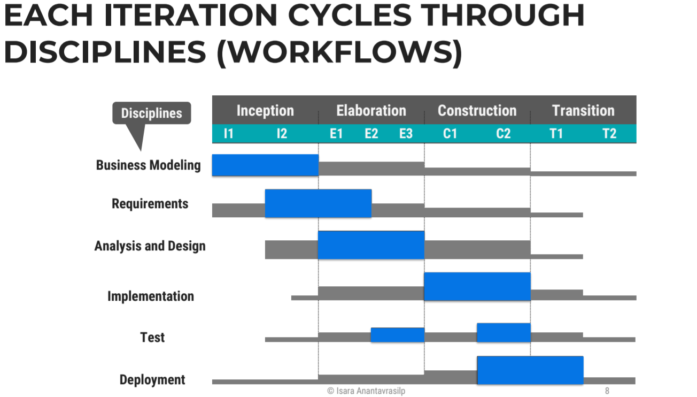
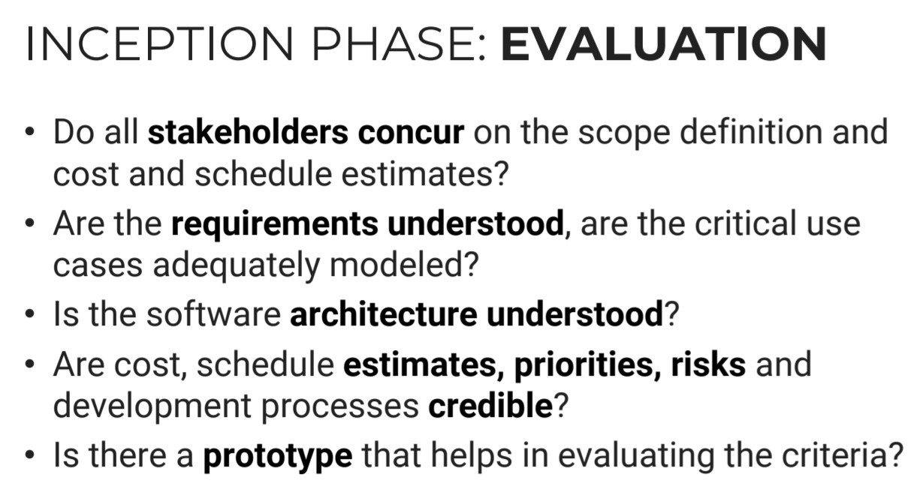
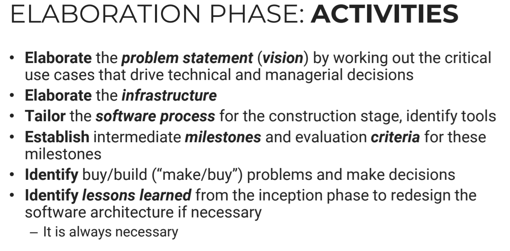
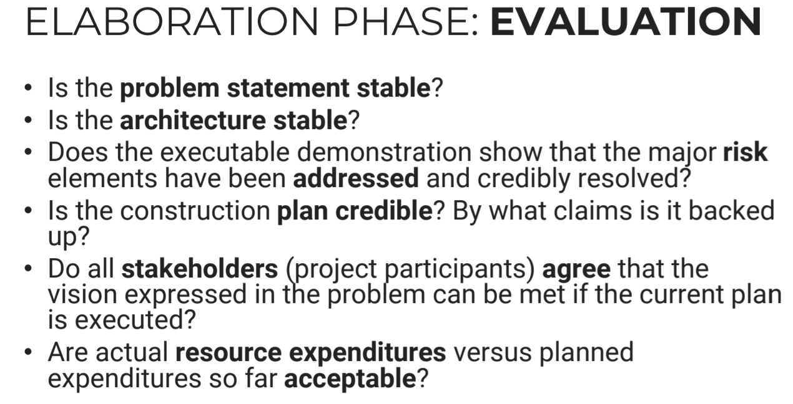
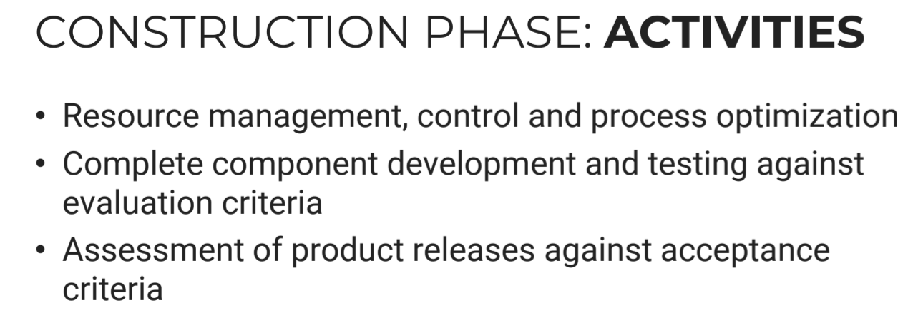
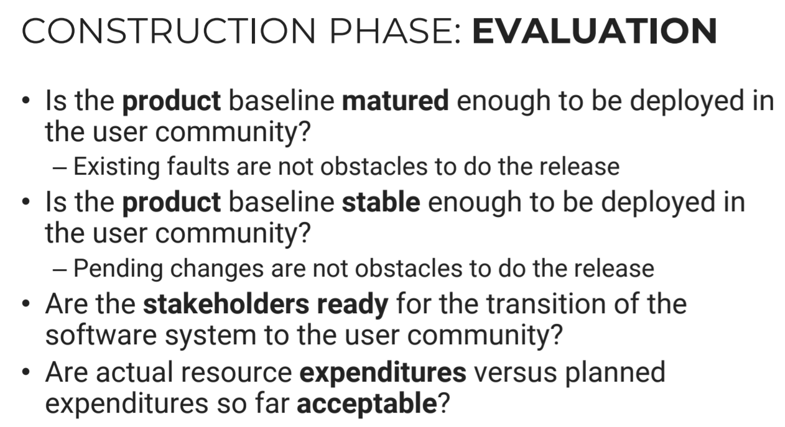

# Unified Process(UP)
- RUP - Rational Unified Process

## UP Stages
- `Engineering Stage` : focusing on design and synthesis activities
  - Inception phase 
  - Elaboration phase
- `Production Stage` : focusing on construction, test and deployment activities
  - Construction phase
  - Transition phase

- 

## Unified Process Iteration
- Each of the four phases consists of one or more iterations
- Iteration : 
  - A set of milestone activities 
  - A well-defined intermediate event
- The scope and results of each iteration are captured via
work products (or `artifacts`)




## Inceptive Phase
### Inceptive Phase : OBJECTIVES
- `Establish` the project scope 
  - Web app? Mobile app?
- `Identify` the critical `use cases` and `scenarios` ,
- Define acceptance criteria
- Demonstrate at least one candidate software architecture 
- Estimate the cost and schedule for the project
- Define and estimate potential risks

# Rember UML
```
In UML, dependancies association
A - - - - > B
A depends on B
If there's no B, A is useless

A - - - - > B
C - - - - > B
D - - - - > B
E - - - - > B
Everyone depends on B but B doesn't care
```

### Inceptive Phase : Activities
- Formulate the scope of the project
  - Capture requirements
  - Result: problem space and acceptance criteria are defined 
- Design the software architecture
  - Evaluate design trade-offs, investigate solution space
  - Result: Feasibility of at least one candidate architecture is explored, initial set of build vs. buy decisions
- Plan and prepare a business case
  - Evaluate alternatives for risks, staffing problems, plans.
### Inceptive Phase : Evaluation


## Elaboration Phase
### Elaboration Phase : OBJECTUVES
- Base(An agreed-to description of the attributes of a product, at a point in time, which serves as a basis for defining change) of SW Architecture
- Base of Problem Statement
- Base of SW project management plan
- Demonstrate that the architecture supports the requirements
at a reasonable cost in a reasonable time

### Elaboration Phase : Activities


```
### Build or Buy, is it better to build this component, or buy an existing product
- Have I seen this in the market
- Maybe you should buy it
- How big is the scale? 30 users?, 1000 users?
- How much do they pay
- If it's small, you can just buy an existing product. Better than having to maintain them
```

### Elaboration Phase : Evaluation


## Construction Phase
### Construction Phase : Objective
- Minimize cost by optimizing resources
- cheap and make it work
- Achieve adequate quality as rapidly as practical 
- Achieve useful version (alpha, beta, and other test releases) as soon as possible

### Construction Phase : Activities


### Construction Phase : Evaaluation
