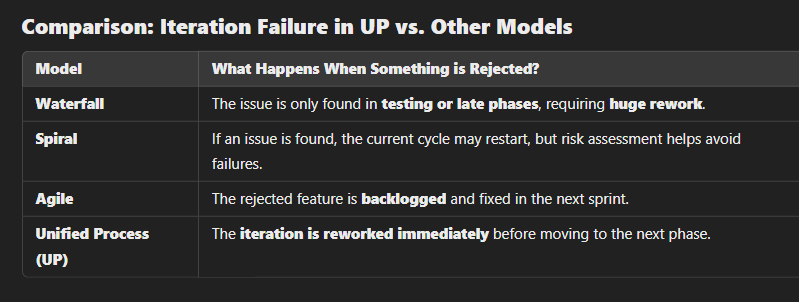

## < Start of differences 

## **Key Differences Between Unified Process and Previous Models**  

## **Is Unified Process (UP) Better?**
It depends on the project.  

✅ **UP is better than Waterfall & V-Model** for:  
- Large, complex projects with evolving requirements.  
- Projects requiring frequent feedback and risk management.  

✅ **UP is better than Spiral/Prototyping** for:  
- Teams needing **structured** iterations and **defined workflows**.  
- Projects where management, planning, and documentation matter.  

❌ **UP is NOT better for:**  
- **Small projects** (too complex, requires UP expertise).  
- Projects needing **quick, informal iterations** (Agile may be better).  

---

## **How New is Unified Process?**
- Waterfall: **1970s**  
- Spiral: **1988**  
- Unified Process: **1999** (by Booch, Jacobson, and Rumbaugh)  
- Agile: **2001** (Agile Manifesto)  

UP is **newer than Waterfall & Spiral**, but older than **Agile**. It was designed as a **structured alternative to Agile** with more emphasis on **planning and management**.  

## End of difference >

# **Summary of Lecture 3: Unified Process (UP)**  

### **Key Characteristics of Unified Process (UP)**  
- **Use-case driven**: Use cases define development activities.  
- **Iterative & incremental**: Each iteration adds new features through multiple cycles.  
- **Phased approach**: UP is divided into distinct **stages and iterations**.  

---

## **UP Stages and Phases**  

UP is divided into **two major stages**:  

1. **Engineering Stage** (Smaller, less predictable teams, focusing on design):  
   - **Inception phase**  
   - **Elaboration phase**  

2. **Production Stage** (Larger, more predictable teams, focusing on construction & deployment):  
   - **Construction phase**  
   - **Transition phase**  

Each phase consists of **one or more iterations**, with each iteration representing a **set of milestones** and **work products (artifacts)**.  

#### Phase vs iteration

---

## **UP Phases in Detail**  

### **1. Inception Phase**  
**Objectives:**  
- Define **project scope**, key use cases, and acceptance criteria.  
- Estimate **cost, schedule, and potential risks**.  
- Evaluate at least one **candidate software architecture**.  

**Activities:**  
- Formulate **project scope** and **requirements**.  
- Define **software architecture**, including design trade-offs.  
- Plan and prepare a **business case**.  

**Evaluation:**  
- Stakeholders must **agree** on scope, cost, and schedule.  
- The **architecture and requirements** should be clear.  
- A **prototype** may be used for evaluation.  

---

### **2. Elaboration Phase**  
**Objectives:**  
- Establish a **baseline for software architecture**.  
- Confirm that the architecture meets **requirements** at an acceptable cost.  
- Define a **project management plan** for the next phase.  

**Activities:**  
- Refine **problem statement** and work on **critical use cases**.  
- Set up the **software infrastructure** and tools.  
- Define **milestones and evaluation criteria**.  
- Address **make-or-buy** decisions.  

**Evaluation:**  
- Ensure **architecture stability** and **risk resolution**.  
- Confirm that the **construction plan** is credible.  
- Compare **actual vs. planned resource usage**.  

---

### **3. Construction Phase**  
**Objectives:**  
- **Minimize development costs** through efficient resource use.  
- Achieve **adequate quality** as quickly as possible.  
- Release working versions (Alpha, Beta, etc.) early.  

**Activities:**  
- Manage **resources and processes** efficiently.  
- Complete **component development and testing**.  
- Assess product releases against **acceptance criteria**.  

**Evaluation:**  
- Check if the product is **stable and ready** for user deployment.  
- Ensure **pending changes** do not block release.  
- Verify if **stakeholders are ready** for system transition.  

---

### **4. Transition Phase**  
**Purpose:**  
- Begins when the **system is built and documented**.  
- Marks the **deployment** of the software to users.  

For some projects, this phase starts a **new software version** (back to **Inception Phase**), while for others, it means **final delivery**.  

**Objectives:**  
- Ensure users can **support themselves**.  
- Finalize a **deployment baseline**.  
- Deliver the final software as **efficiently as possible**.  

**Activities:**  
- Integrate **development increments** into a **single deployment baseline**.  
- Handle **commercial packaging, production, and training**.  
- Test deployment against **acceptance criteria**.  

**Evaluation:**  
- Confirm **user satisfaction**.  
- Compare **actual vs. planned expenditures**.  

---

## **Artifacts in Unified Process**  

An **artifact** is a **work product** in a standard format (e.g., UML, Java code, documentation). **Artifact sets** are developed and reviewed together.  

The **five key artifact sets**:  
1. **Management Set**: Project planning and operational artifacts.  
2. **Requirements Set**: Vision document, requirement models.  
3. **Design Set**: Architectural models, test models.  
4. **Implementation Set**: Source code, executables.  
5. **Deployment Set**: Integrated software, documentation.  

Each artifact set is **emphasized at different UP phases**.  

---

## **Advantages & Disadvantages of Unified Process**  

✅ **Advantages:**  
- Covers **business models, project management, development, and deployment**.  
- **Widely used and mature** framework.  

❌ **Disadvantages:**  
- **Too complex for small projects** due to heavy overhead.  
- Requires **UP expertise** to tailor it effectively.  
- Going through **all workflows in each iteration** can be time-consuming.  

📌 **Note**: UP is **flexible** and can be adapted to specific project needs.  

---

## **Keywords**  
- **Unified Process (UP)**  
- **Unified Software Development Process (USDP)**  
- **Rational Unified Process (RUP)**  
- **Use-case driven development**  
- **Iterative and incremental**  
- **Inception Phase**  
- **Elaboration Phase**  
- **Construction Phase**  
- **Transition Phase**  
- **Software artifacts**  
- **Management Set**  
- **Requirements Set**  
- **Design Set**  
- **Implementation Set**  
- **Deployment Set**